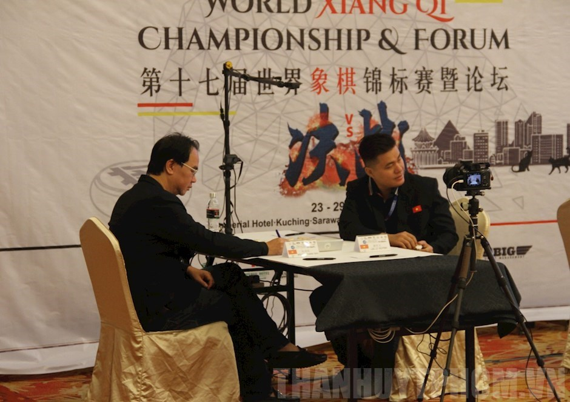
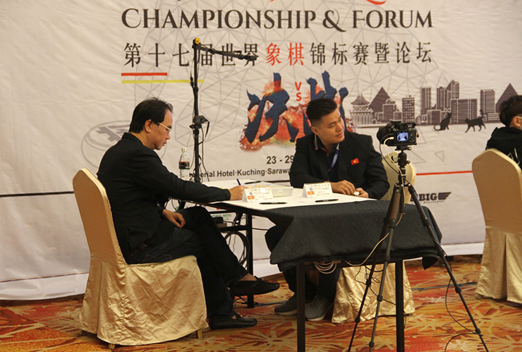
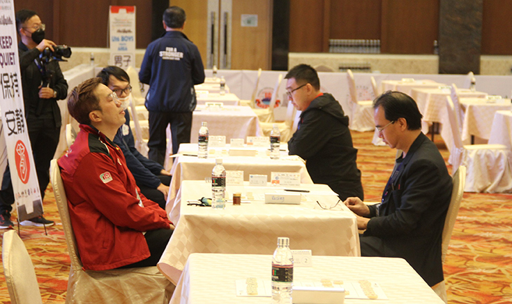

## **Với sự xuất sắc của hai kỳ thủ Nguyễn Thành Bảo và Lại Lý Huynh khi không để thua một ván đấu nào, cờ tướng Việt Nam vượt qua Trung Quốc để giành tấm HCV lịch sử tại giải vô địch thế giới 2022.**

Giải vô địch cờ tướng thế giới 2022 diễn ra từ ngày 23-29/10 tại Malaysia quy tụ hơn 10 quốc gia và vùng lãnh thổ trên thế giới về tham dự như Mỹ, Nga, Phần Lan, Nhật Bản, Thái Lan, Indonesia, Malaysia, Trung Quốc, Hong Kong, Đài Bắc Trung Hoa, Singapore, Brunei và Việt Nam.

 

  

 

Lại Lý Huynh (phải) và Nguyễn Thành Bảo (trái) giúp tuyển cờ tướng Việt Nam giành tấm HCV lịch sử. Ảnh: Phạm Thanh Trung

Ở nội dung dành cho nam, các kỳ thủ thi đấu 9 ván theo hệ Thụy Sỹ để chọn ra nhà vô địch cá nhân. Bên cạnh đó, 2 kỳ thủ nam có thứ hạng tốt nhất của mỗi đoàn sẽ được cộng thành tích, lấy làm căn cứ để xếp hạng cho nội dung đồng đội nam.

Với những màn thi đấu cực kỳ ấn tượng khi không để thua bất cứ một ván đấu nào, hai kỳ thủ Nguyễn Thành Bảo và Lại Lý Huynh đã xuất sắc giúp cờ tướng Việt Nam vượt qua 2 đối thủ sừng sỏ là Trung Quốc và Hong Kong để mang về tấm HCV lịch sử.

Trải qua 9 ván đấu, Nguyễn Thành Bảo có 4 thắng và 5 ván hòa được 13 điểm, xếp hạng 3 chung cuộc và giành HCĐ cá nhân. Lại Lý Huynh có 3 thắng và 6 hòa được 12 điểm, xếp hạng 4 chung cuộc.

Trong khi đó, đội tuyển cờ tướng Trung Quốc chỉ xếp hạng nhì ở nội dung đồng đội. Dù có nhà vô địch cá nhân Vương Thiên Nhất nhưng kỳ thủ số 2 của nước này là Vương Khếch chỉ xếp hạng 6, qua đó kém Việt Nam về chỉ số. Đứng thứ 3 là Hong Kong (TQ) với Phùng Gia Tuấn (hạng 2) và Trịnh Ngạn Long (hạng 5).

Nguyễn Thành Bảo (bìa phải) giành tấm HCĐ cá nhân. Ảnh: Phạm Thanh Trung

Đây là tấm HCV lịch sử với cờ tướng Việt Nam và đã gây chấn động làng cờ tướng thế giới bởi ở bộ môn này suốt nhiều năm qua bị sự thống trị gần như tuyệt đối của các kỳ thủ đến từ Trung Quốc.

“Trước khi lên đường sang Malaysia, chúng tôi đã đặt mục tiêu quan trọng nhất là tấm HCV đồng đội nam. Thành Bảo và Lý Huynh đã thi đấu rất xuất sắc khi không để thua bất kỳ ván nào, chơi cực kỳ nỗ lực để thi đấu sòng phẳng trong các trận đánh gặp VĐV của Trung Quốc. Thành tích này cũng có dấu ấn rất lớn của ban huấn luyện khi đưa ra chiến thuật hợp lý, phân phối sức cho VĐV suốt 9 ván đấu căng thẳng”, một thành viên BHL tuyển cờ tướng Việt Nam chia sẻ.

Phải nói thêm, tấm HCĐ của Nguyễn Thành Bảo cũng là chiến tích ngoạn mục khi đây là lần đầu tiên sau 10 năm, cờ tướng Việt Nam mới lại giành huy chương cá nhân ở giải thế giới. Ngoài ra ở giải đấu này, tuyển cờ tướng Việt Nam còn có thêm 2 tấm HCV ở U16 nữ của Đinh Trần Thanh Lam và U12 nữ của Nguyễn Trác Hoàng Thi.  

Nguồn:[https://www.24h.com.vn/the-thao/co-tuong-viet-nam-vuot-trung-quoc-gianh-hcv-lich-su-giai-vo-dich-the-gioi-c101a1409493.html](https://www.24h.com.vn/the-thao/co-tuong-viet-nam-vuot-trung-quoc-gianh-hcv-lich-su-giai-vo-dich-the-gioi-c101a1409493.html)
