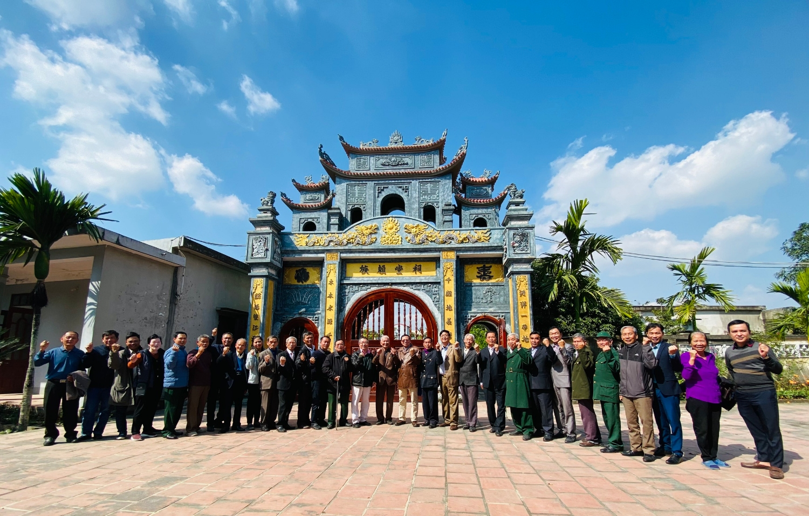

| **BAN THÔNG TIN TRUYỀN THÔNG**			**HỌ LẠI VIỆT NAM**    __________ | **CỘNG HÒA XÃ HỘI CHỦ NGHĨA VIỆT NAM**      **Độc Lập – Tự Do – Hạnh Phúc**    **________________________________________** |
| --- | --- |
| Số: 01/TB/BTTTT | *Thanh Hóa**, ngày 25*  *tháng 12*  *năm 2022* |
 

**THÔNG BÁO**  NỘI DUNG NGHỊ QUYẾT CỦA HỘI ĐỒNG GIA TỘC HỌ LẠI VIỆT NAM   NGÀY 25/12/2022  ________________

Ngày 25 tháng 12 năm 2022 tại Nhà thờ Họ Lại, xã Hà Dương *(nay là xã Yên Dương)**,* huyện Hà Trung, tỉnh Thanh Hóa, Hội đồng gia tộc Họ Lại Việt Nam (viết tắt là HĐGTHLVN) đã tổ chức Hội nghị tổng kết hoạt động năm 2022 và triển khai công việc năm 2023. Hội nghị do Chủ tịch HĐGT ông Lại Thế Tác chủ trì, báo cáo; đại biểu tham dự có 35 thành viên HĐGT đại diện các chi Họ; đại diện Hội doanh nhân Lại Việt và Ban liên lạc con cháu họ Lại VN, Ban Thông tin truyền thông họ Lại VN. Sau khi các đại biểu đã thảo luận báo cáo, Chủ tịch HĐGT Lại Thế Tác đã kết luận 04 nội dung, hội nghị đã biểu quyết ban hành Nghị quyết để làm căn cứ triển khai thực hiện, giao Ban Thông tin truyền thông thông báo Nghị quyết đến các chi họ và các tổ chức thuộc HĐGTHLVN biết, thực hiện. Thực hiện Nghị quyết của HĐGT, Ban Thông tin truyền thông xin thông báo cụ thể nội dung như sau:

**I. Đánh giá kết quả hoạt động của HĐGT họ Lại năm 2022**

Năm 2022 là năm HĐGT, các chi họ, các tổ chức trực thuộc HĐGT, con cháu của dòng họ Lại đã thực hiện và hoàn thành kế hoạch đã đề ra, làm được nhiều việc như, chú trọng kết nối các chi họ, phát triển dòng họ ngày một lớn mạnh, đặc biệt là việc tôn tạo, nâng cấp, xây dựng mới một số hạng mục công trình trong khuôn viên Nhà thờ Đức Triệu Tổ cũng như khuôn viên và Lăng mộ Đức Triệu Tổ. Kết quả đạt được này là ngay từ ngày đầu, tháng đầu của năm HĐGT đã bám sát nội dung Nghị quyết, chỉ đạo quyết liệt, sâu sát, đồng thời, HĐGT cũng đánh gia cao về tinh thần trách nhiệm, cũng như sự đóng góp quý báu về vật chất của các chi họ, các tổ chức trực thuộc HĐGT, những người con họ Lại trong nước và Quốc tế trên các cương vị công tác trong các cơ quan quản lý nhà nước, trong hoạt động kinh doanh…, cụ thể:

**1. Việc tôn tạo, nâng cấp khuôn viên Lăng mộ và Lăng mộ Đức Triệu Tổ**

Theo nguyện vọng, mong muốn của con cháu dòng họ về việc tôn tạo nâng cấp khuôn viên Lăng mộ và Lăng mộ Đức Triệu Tổ, HĐGT đã có Nghị quyết, triển khai thực hiện, ngày 14 tháng 10 năm 2021 (Dương lịch**)** đã tổ chức Lễ khởi công**,** nhờ có  bàn tay khéo léo của các nghệ nhân tài hoa cùng với sự, giám sát thường nhật, kỹ lưỡng của Ban Thường trực HĐGT, Lăng mộ được làm lễ cất nóc ngày 28 tháng 12 năm 2021. Nay công trình hoàn thành, nghiệm thu, vật liệu đá xanh nguyên khối từ khu lăng chính đến tường rào, sân lát, thể hiện được sự uy nghi, linh thiêng, xứng tầm Lăng mộ của Đức Triệu Tổ họ Lại Việt Nam.

**2. Công trình cổng chính của** **Nhà thờ Tổ**

Công trình cổng chính của Nhà thờ Tổ đã được xây dựng và tôn tạo nhiều năm trước đây, tuy nhiên, hạng mục hệ thống cánh cổng được làm bằng sắt, không cân đối với công trình tổng thể. Sau khi HĐGT có Nghị quyết và được sự ủng hộ của cộng đồng con cháu, này hệ thống cửa chính của Nhà thờ đã được thay mới hoàn toàn bằng gỗ lim, bản lề bằng đồng. Công trình cũng được hoàn thành và nghiệm thu cùng ngày Lễ cất nóc Lăng mộ Đức Triệu Tổ. Như vậy, con cháu gần xa về dâng hương kính tổ có thể chiêm ngưỡng về tổng thể kiến trúc, uy nghi, bề thế của Nhà thờ họ Lại Việt Nam.  

**3. Về công trình phụ trợ trong khuôn viên Nhà thờ Tổ**  

Công trình phụ trợ trong khuôn viên Nhà thờ như hệ thông điện sinh hoạt, cây đèn chiếu sáng, nhà vệ sinh, nơi đỗ xe ô tô, ..., do trước đây thiết kế chưa có, không phù hợp với thực tế sử dụng và bị xuống cấp, gây ảnh hưởng đến mỹ quan, khi con cháu về dâng hương kính Tổ. Tiếp thu đề xuất của cộng đồng con cháu dòng họ, HĐGT đã quyết định triển khai xây dựng mới, sửa chữa, chỉnh trang các hạng mục công trình phù trợ này và đến nay công trình đã được nghiệm thu đưa vào sử dụng, môi trường sạch, mỹ quan hơn để phục vụ con cháu mỗi khi về thăm quan.  

**II. Kế hoạch tổ chức Lễ Giỗ Đức Triệu Tổ và Tổng kết 30 năm thành lập HĐGTHLVN**  

1. Hội nghị quyết định tổ chức Lễ Giỗ Đức Triệu Tổ và tổng kết 30 năm hoạt động của HĐGT (từ ngày thành lập HĐGT cho đến nay) vào ngày 15 tháng 01 năm 2023 (Âm lịch). Về chuẩn bị nội dung báo cáo tổng kết 30 năm hoạt động của HĐGT, giao Ban Thường trực HĐGT chuẩn bị báo cáo, trình Chủ tịch (trước ngày Giỗ Tổ 01 tuần lễ) xem xét thông qua (Chương trình Lễ, Ban Thường trực HĐGT có thông báo riêng).  2. Thành lập các Ban chỉ đạo, tổ chức, hậu cần, tài chính ... thực hiện Lễ, bao gồm các ông bà có tên sau:

- Ban chỉ đạo:  + Ông Lại Thế Tác - Chủ tịch HĐGT: Trưởng Ban chỉ đạo  + Ông Lại Ngọc Thư - Phó Chủ tịch HĐGT: Phó Ban chỉ đạo  - Ban tổ chức:  + Ông Lại Quốc Tuấn - Thường trực HĐGT: Trưởng Ban tổ chức  - Ban hậu cần:  + Ông Lại Thế Sơn - Thành viên HĐGT: Trưởng Ban hậu cần  + Ông Lại Thế Mạnh - Thành viên HĐGT: Phó Ban hậu cần  + Ông Lại Thế Ba - Thành viên HĐGT: Phó Ban hậu cần

- Ban tài chính:+ Ông Lại Ngọc Long - Thành viên HĐGT: Trưởng Ban tài chính  + Ông Lại Văn Đức - Thành viên HĐGT: Phó Ban tài chính  + Bà Nguyễn Thị Linh - Phó Ban tài chính. 5. Lưu ý: Các thành viên HĐGT không có tên nêu trên, sẽ hỗ trợ Ban tổ chức và tham gia Ban lễ tân, tiếp đón khách mời và con cháu dòng họ về dự lễ.

**III. Về Tổ chức N****gày hội Mùa Xuân** **h****ọ Lại Việt Nam lần thứ 6** **và** **Lễ k****ỷ** **niệm 30 năm thành lập HĐGT****HLVN**

Hoạt động sau 30 năm xây dựng và phát triển của HĐGT, đây cũng là dịp để vinh danh sự đóng góp của HĐGT nói chung cũng như của các Thành viên HĐGT nói riêng; các tổ chức trực thuộc HĐGT; các cá nhân ... trong việc xây dựng HĐGT dòng họ và cũng là để trao gửi, giáo dục các thế hệ trẻ tiếp bước cha anh, tiếp tục xây dựng và phát triển họ Lại Việt Nam mãi trường tồn. Vì vậy, cần có 1 chương trình Lễ được chuẩn bị công phu, có nội dung, kết quả 30 năm hoạt động, cũng như ý nghĩa của Ngày hội mùa xuân họ Lại VN, cụ thể, logic xuyên suốt sự kiện. Hội nghị đã thống nhất sau khi bàn và xem xét các ý kiến đề xuất của các Thành viên HĐGT, Chủ tịch HĐGT đã kết luận cụ thể:  - Tổ chức Lễ vào 01 ngày cuối quý I năm 2023, gồm 02 nội dung: Ngày hội Mùa Xuân họ Lại Việt Nam lần thứ 6 và tổ chức Lễ kỷ niệm 30 năm thành lập HĐGT; địa điểm tổ chức tại tỉnh Thái Bình.  + Giao HĐGT họ Lại tỉnh Thái Bình chủ trì, phối hợp với Thường trực HĐGT, Ban Liên lạc cộng đồng con cháu họ Lại Việt Nam, Hội Doanh nhân Lại Việt xây dựng kế hoạch, kịch bản của 2 nội dung trên (quy mô, nội dung, dự kiến tài chính), đề xuất ngày tổ chức và trình Chủ tịch HĐGT xem xét quyết định.   + Về Lễ kỷ niệm 30 năm thành lập HĐGT, giao Ban Thường trực HĐGT thành lập Tổ dự thảo Báo cáo kết quả hoạt động sau 30 năm của HĐGT (từ ngày thành lập cho đến nay) và trình Chủ tịch HĐGT xem xét, thông qua.

**IV.** **Một số nội dung khác**  
 

1. **Về việc xây dựng P****hóng sự** **T****ổng kết 30 năm thành lập HĐGT****HLVN**

HĐGT đã đồng ý và giao Ban Thông tin truyền thông họ Lại VN xây dựng kịch bản và hoàn thành Phóng sự về Tổng kết 30 năm thành lập HĐGT dưới sự giám sát của HĐGT về nội dung; Về việc nguồn lực con người và tài chính, Ban tự huy động để thực hiện.  

**2. Về việc** **lập báo cáo tài sản của dòng họ tại Nhà thờ** **h****ọ Lại Việt Nam**  

HĐGT giao Ban Thường trực HĐGT lập báo cáo tài sản của dòng họ tại Nhà thờ họ Lại Việt Nam bao gồm: Giấy chứng nhận quyền sử dụng đất, đồ thờ, các tài sản chung của dòng họ cần được quản lý theo quy định. Báo cáo cần chi tiết, xúc tích và đầy đủ, trình của HĐGT tại phiên họp tiêp theo.  

**3. Ban hành** **văn bản hướng dẫn** **thực hiện**  **Q****uy ước của** **gia tộc** **họ Lại Việt Nam**  

HĐGT giao ban thường trực HĐGT sớm ban hành văn bản hướng dẫn thực hiện Quy ước của gia tộc họ Lại Việt nam để các chi họ, các tổ chức trực thuộc HĐGT và các con cháu dòng họ biết thực hiện. Đồng thời Ban Thường trực HĐGT phối hợp với Ban Thông tin truyền thông họ Lại VN thông tin chính xác, rộng rãi nội dung Quy ước để cộng đồng con cháu thống nhất thực hiện, đoàn kết là tiền đề cho dòng họ phát triển vững bền.  

**4. Về Báo cáo thu chi tài chính của HĐGTHLVN**  

Năm 2022, Thường trực HĐGT giao kế toán lập báo cáo tài chính, báo gồm các khoản thu, chi, công nợ từ tháng 5 năm 2022 đến ngày 25 tháng 12 năm 2022. Báo cáo này đã được đại diện thành viên Ban Kiểm soát tài chính thuộc HĐGTHLVN thẩm tra theo quy định. Riêng công nợ, HĐGT sẽ có văn bản riêng kêu gọi công đức để thanh toán công nợ sớm nhất. HĐGT đã biểu quyết thông qua nội dung này.  

Ban Thông tin truyền thông họ Lại Việt Nam xin thông báo để các chi họ, các tổ chức thuộc Hội đồng gia tộc họ Lại Việt Nam biết, thực hiện./.  
 

| ***Nơi nhận:***    - Chủ tịch, các PCT      HĐGTHLVN,    - Các TV HĐGTHLVN,    - Các chi họ, các tổ chức thuộc      HĐGTHLVN,    - Lưu: Ban TTTT. | **BAN THÔNG TIN TRUYỀN THÔNG**     **HỌ LẠI VIỆT NAM**    **TRƯỞNG BAN**        *(Đã ký)*         **Lại Xuân Cương** |
| --- | --- |
