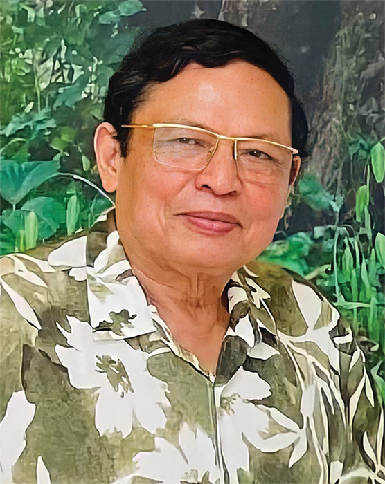
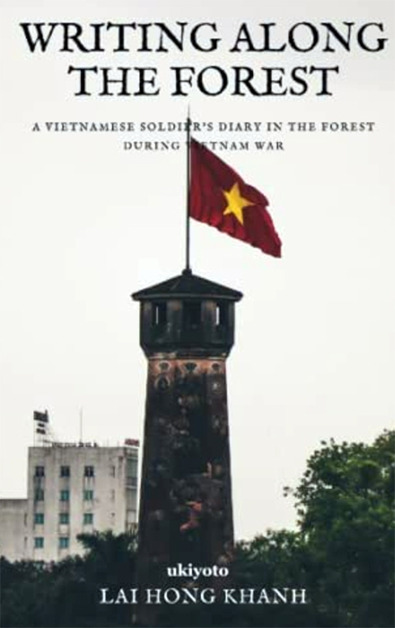

Chúng ta cùng trò chuyện với ông về niềm vui được đưa tác phẩm của mình ra khỏi biên giới Việt Nam, về chuyện viết văn khi cầm súng, và một phong cách sống cùng thơ ca.

*- Thưa nhà văn, được biết cuốn bút ký "Ghi dọc cánh rừng" của ông vừa được nhà xuất bản Ukiyoto xuất bản và phát hành trên kênh Amazon tới bạn đọc toàn thế giới, ông có thể chia sẻ cảm xúc của mình về sự kiện này? Điều gì thúc đẩy ông đưa cuốn sách này ra với thế giới?*

+ Là một người cầm bút, và trước hết là một người lính, tôi rất vui và hạnh phúc khi tác phẩm của mình được nhà xuất bản Ukiyoto của Canada chấp thuận xuất bản, giới thiệu ra thế giới qua kênh phát hành trên Amazon. Tôi nghĩ đây không chỉ là những ghi chép của riêng mình mà gói trọn tâm tư tình cảm của cả thế hệ chúng tôi trong những tháng ngày “xẻ dọc Trường Sơn đi cứu nước” thông qua cuốn sách chia sẻ với các thế hệ trước và sau! Và điều đó được thể hiện trong việc ngày 24/6/2016 tôi đã hiến tặng bản gốc viết tay tập “Ghi dọc cánh rừng” của tôi cho Bảo tàng Lịch sử quân sự Việt Nam do Thiếu Tướng Nguyễn Xuân Năng, Giám đốc Bảo tàng ký ghi nhận. Nay tác phẩm đến với bạn đọc quốc tế thì niềm vui và hạnh phúc của tác giả được nhân lên gấp bội. Xin được cảm ơn dịch giả Hưng Nguyễn, cùng Ban Biên tập NXB Ukiyoto của Canada và Nhà văn Kiều Bích Hậu đã đồng hành cùng tôi trong việc góp phần nhỏ bé vào sự nghiệp quảng bá văn học Việt Nam, để thế giới cảm nhận tâm hồn con người Việt Nam trong những năm tháng vô cùng khốc liệt với nhiều mất mát hy sinh để có được một giang sơn trọn vẹn như ngày nay!

*- Ông bắt đầu viết văn từ khi nào? Hồi đó, tác phẩm đầu tay ông viết có dựa trên thực tế chiến đấu? Và tác phẩm đó có được đăng tải trên báo chí hay không? Từ tác phẩm đầu tiên ấy, những ý tưởng tiếp theo đến với ông ra sao để tiếp tục cầm bút?*

+ Vốn là một người yêu văn chương, ham đọc sách từ nhỏ nên khi nhập ngũ thì tôi đã mang theo sách bút vào chiến trường. Ý tưởng viết xuất phát từ trong cuộc sống của một chiến sỹ trên đường vượt Trường Sơn vào chiến trường miền Đông Nam bộ chiến đấu cùng các đồng đội. Tôi vốn là một giáo viên trẻ nên luôn có óc quan sát và suy nghĩ ghi lại mỗi ngày trên suốt chặng đường ra trận từ Ninh Bình tới Tây Ninh (10/1/1970-14/4/1970) 3 tháng 4 ngày vượt bom lửa! Và những ghi chép trong suốt thời gian đó được in thành sách “Ghi dọc cánh rừng” (NXB Lao động 2002, sách được tái bản tiếp vào các năm 2005, 2006, 2007). Tác phẩm được bạn hữu, đồng đội đón nhận rất nồng nhiệt thể hiện qua những lần tái bản!

*- Là một trong số những nhà văn trưởng thành từ chiến trận, ông nhận thấy trải nghiệm của một người lính có tác động thế nào tới ngòi bút của mình?*

+ Cũng như những người cầm bút lứa chúng tôi, những ký ức chiến tranh đã tạo cho mình một tâm thế luôn vững chãi, tỉnh táo khi nhìn nhận vấn đề của các chiều kích hiện tượng, sự kiện, sự vật để những điều mình trải lòng qua thơ chạm đến sự đồng cảm đồng điệu của số đông bạn đọc. Sự đồng cảm ấy khiến mình vui và hạnh phúc.

*Bìa sách “Ghi dọc cánh rừng” của nhà văn Lại Hồng Khánh xuất bản ở Canada.*

*- Ông đã viết "Ghi dọc cánh rừng" trong hoàn cảnh thế nào?*

+ Như tôi đã nói ở trên và đúng như nhà thơ Đào Ngọc Chung đã viết trên Tạp chí văn học Tản Viên Sơn năm 2004 về tập ký này: “Ghi dọc cánh rừng” là nhật ký của một thày giáo trẻ ghi lại trên đường ra trận! Nghĩa là trong suốt chặng đường hành quân vào chiến trường cứ mỗi tối sau một ngày vượt đèo lội suối dưới tầm bom đạn địch khi tới nơi dừng chân sau khi mắc võng ngủ giữa binh trạm rừng Trường Sơn thì mình lại mở số ra ghi chép những việc diễn ra trong ngày từ buổi xuất quân tới trạm tập kết tại miền Đông Nam bộ.

*- Hiện nay, hầu như ngày nào ông cũng sáng tác một bài thơ, dựa trên những thông tin đáng chú ý trên truyền thông, mục đích của ông trong phương pháp sáng tác này là gì? Và hiệu quả mà nó mang lại?*

- Kể từ khi nhân loại trong đó có Việt Nam chúng ta phải đương đầu với đại dịch COVID - 19 thì cứ mỗi sớm dậy như một cảm quan của người đã từng là lính, đã từng làm công tác tư tưởng, văn hoá của thành phố và nay là một cán bộ hưu trí, một công dân và một nhà văn, tôi cầm bút ghi lại những gì diễn ra trong ngày mới qua truyền thông quốc gia để suy ngẫm và thể hiện cảm xúc bằng ngôn ngữ sáng tạo của thi ca! Những bài thơ được chia sẻ cùng các bạn hữu gần xa và nhận được nhiều đồng cảm thì đó là phần thưởng đối với mình. Năm 2020, tôi xuất bản tập thơ “Tinh thần Việt” (NXB Thanh Niên) nội dung về chống dịch COVID -19 được bạn đọc ghi nhận. Năm 2021 tôi in tập “Mỗi ban mai” (NXB Thanh niên), cũng là tiếp mạch về những đề tài thường nhật. Có thể những điều viết ra chưa được ủ men cho chín kỹ, còn thô mộc, nhưng bù lại nó nóng hổi sự kiện, nóng hổi sự quan tâm của cộng đồng. Tôi vẫn cứ lao động theo cái mạch này, cái tạng này của mình trong thời gian tới.

*- Trong năm qua, tác phẩm thơ Lại Hồng Khánh đã được giới thiệu trên báo chí Nga, Romania, Pakistan, Ấn Độ, Uzbekistan, và mới đây là cuốn sách đầu tiên xuất bản ở Canada. Việc nỗ lực đưa tác phẩm của ông ra với bạn đọc quốc tế có ý nghĩa với riêng ông như thế nào?*

- Tôi rất vui và hạnh phúc khi tác phẩm thơ được giới thiệu ra báo chí nước ngoài. Đây không chỉ là sự kiện về một nhà văn Việt Nam có tác phẩm ra thế giới mà chính là góp phần nhỏ của mình vào việc quảng bá văn học Việt Nam ra quốc tế. Tôi rất biết ơn đội ngũ thực hiện cuốn sách, gồm các dịch giả, người điều phối và kết nối, biên tập viên, phát hành đã làm việc rất khăng khít và quyết tâm, để các tác phẩm và cuốn sách của tôi có thể vươn xa tới bạn đọc toàn cầu.

**JyKhanh (Thực hiện)**
