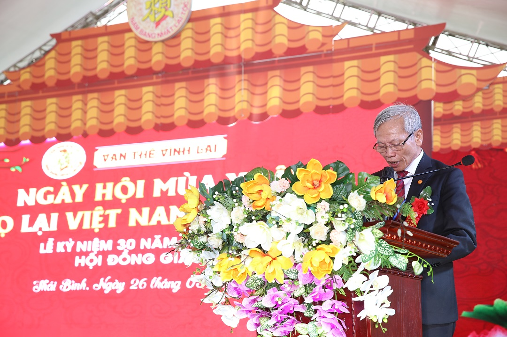

| **VẠN THẾ VĨNH LẠI**     **HỘI ĐỒNG GIA TỘC HỌ LẠI VIỆT NAM**    **________________________** |
| --- |
| *Th**ái Bình, ngày 26*  *tháng 3*  *năm 2023* |

**DIỄN VĂN LỄ KỶ NIỆM 30 NĂM THÀNH LẬP**   **HỘI ĐỒNG GIA TỘC HỌ LẠI VIỆT NAM VÀ NGÀY HỘI MÙA XUÂN HỌ LẠI VIỆT NAM** **LẦN THỨ 6**  **________________________**

 

*- Kính lạy anh linh tiên tổ!*  *- Kính thưa các vị khách quý đại diện:*  *+ Lãnh đạo Đảng, UBND, HĐND, MTTQ, các tổ chức xã hội huyện Kiến Xương, tỉnh Thái Bình,*  *+ Lãnh đạo Đảng, UBND, HĐND, MTTQ, các tổ chức xã hội xã Vũ Ninh, huyện Kiến Xương, tỉnh Thái Bình,*  *+ Lãnh đạo Đảng, UBND, HĐND, MTTQ, các tổ chức xã hội xã Yên Dương huyện Hà Trung, tỉnh Thanh Hóa,*  *- Kính thưa ông Lại Thế Thư - Phó Chủ tịch HĐGTHLVN**;** các ông, bà Ủy viên Thường trực HĐGTHLVN;* *các ông trưởng đoàn họ Lại các tỉnh cùng toàn thể* *các vị cao niên, các ông, bà, cô, dì, chú, bác, anh chị em, con, cháu, dâu, rể họ Lại Việt Nam.*  

Trong không khí tươi đẹp của xuân Quý Mão, trên quê hương 5 tấn Thái Bình, nơi thờ đức Trưởng chi Thủy Tổ Đại Tướng Quân Thái Bảo tín Quận Công Lại Thế Lạc (Ngành A) tại thôn Đông Hải, huyện Thanh Quan, nay là Đông Vinh, Đông Hưng. Hôm nay, Hội đồng Gia tộc họ Lại Việt Nam, phối hợp với Hội đồng gia tộc họ Lại tỉnh Thái Bình, đặc biệt là các chi họ Lại xã Vũ Ninh, huyện Kiến Xương, tỉnh Thái Bình long trọng tổ chức Lễ kỷ niệm 30 năm thành lập Hội đồng gia tộc họ Lại Việt Nam và Ngày hội mùa xuân họ Lại Việt Nam lần thứ 6.   *Kính lạy anh linh tiên tổ!*  *Kính thưa quý vị!*  Họ Lại là một thành viên trong cộng đồng các họ tộc Việt Nam. Căn cứ hệ thống gia Phả họ Lại Việt Nam được lưu truyền và được tu chỉnh 19 lần, đã có trên 700 năm với trên 30 đời, trên 400 chi họ sinh sống, quần cư trong cộng đồng các dân tộc Việt Nam và cụ tổ là Đức triệu Tổ Lại Thế Tiên, mất vào ngày 15 tháng Giêng năm Ất Sửu (năm 1445), an táng tại thôn Quang Lãng Đông, Tống Sơn, Thanh Hóa (nay là thôn Đông, xã Yên Dương, huyện Hà Trung, tỉnh Thanh Hóa).   Lịch sử họ Lại Việt Nam gắn liền với lịch sử dân tộc Việt Nam. Giai đoạn trước 1945, Họ Lại gắn với thời Lý, Trần, Lê, ... (Theo Đại việt sử ký toàn thư hay Việt sử lược). Đặc biệt là đã được vua Lê Huyền Tông, niên hiệu Cảnh Hưng thứ 10 (1746) Sắc tặng Họ Lại ta đôi câu đối, trên câu đối có ghi”

 *“Tử hiếu Thần Trung, Tam bách Dư Niên Quốc*  *Tả Chiêu, Hữu mục, Nhất Thập bát Công Từ”*  Hiểu nghĩa là:  *“Con hiếu, tôi trung hơn ba trăm năm giữ nước*  *Tả hòa, hữu thuận mười tám Quận Công trong từ”*

Đôi câu đối đã được thờ tại nhà thờ đức Trưởng chi Thủy Tổ Đại Tướng Quân Thái Bảo tín Quận Công Lại Thế Lạc (Ngành A).  Như vậy, các thế hệ tiền nhân đã được Vua phong tặng tới 18 vị Quận Công có công rất lớn trong quá trình dựng nước và giữ nước.  

Giai đoạn sau cách mạng tháng 8 năm 1945 đến nay:  Thời đại Hồ Chí Minh. Trong hai cuộc chiến tranh chống Pháp và Mỹ họ Lại ta có nhiều công trạng trong quá trình giữ nước và xây dựng đất nước, nhất là giai đoạn chống đề quốc Mỹ, họ Lại ta tiếp tục được ghi nhận công lao, đặc biệt là họ Lại Phù Vân, thành phố Phủ Lý, tỉnh Hà Nam Chủ Tịch Hồ Chí Minh có thư khen ngợi dòng họ Lại có thành tích trong tòng quân giêt giặc trong thời kỳ chống Mỹ cứu nước, trong thư có đoạn được ghi: *“Tôi mong rằng các Họ trong cả nước Việt Nam, Họ nào cũng như Họ Lại Phù Vân thì ta không cần phải đánh mà giặc cũng phải lui”*. Đồng thời Đảng, Nhà nước cũng đã ghi nhận công lao, trao tặng những phần thưởng cáo quý cho những thế hệ cha ông, con cháu, như các danh hiệu Anh hùng, Bà Mẹ Việt Nam Anh hùng, các liệt sỹ; bổ nhiệm trên các cương vị lãnh đạo như Bộ trưởng - Ủy viên Trung ương Đảng, Thứ trưởng, ... Chủ tịch, Bí Thư, Phó Chủ tịch, ... một số tỉnh và trên các vị trí lãnh đạo quan trọng khác của đất nước. Như vậy, khẳng định rằng những người con họ Lại trong bất cứ thời đại nào cũng nỗ lực cống hiến tài năng, trí, đức, được dân tin, dân kính, mỗi khi nhắc đến, chúng ta luôn tự hào. Tôi không thể nào nêu hết được, ...  

Tôi khẳng định rằng, chúng ta có quyền tự hào về dòng họ Lại trên đất nước Việt nam. Họ Lại ngày nay có mặt hầu hết trên mọi miền của Tổ quốc và nhiều quốc gia trên Thế giới. Song dù ở Ngành nào, Chi nào dù ở đâu đã là con cháu họ Lại chúng ta đều là con cháu một nhà, chúng ta đều là con cháu Đức Triệu Tổ Lại Thế Tiên phát tích từ Quang Lãng Đông, Tống Sơn, Thanh Hóa (nay là thôn Đông, xã Yên Dương, huyện Hà Trung, tỉnh Thanh Hóa) và con cháu đều khắc ghi:

***Nam Bang Nhất Lại Tộc***  ***Ở Việt Nam chỉ có một họ Lại***

Họ Lại Việt Nam chúng ta luôn dâng cao ngọn cờ đoàn kết trong dòng họ, người họ Lại luôn tự hào “Vạn Thế Vĩnh Lại”, có nghĩa là họ Lại Việt Nam trường tồn cùng lịch sử dân tộc và cũng luôn là bạn thủy chung với các dòng họ khác trong cộng đồng các họ tộc Việt Nam.  

*Kính lạy anh linh tiên tổ!*  *Kính thưa quý vị!*  

Để đáp ứng với sự phát triển của đất nước trong tình hình mới, các tổ chức xã hội, các dòng họ cũng luôn đổi mới về tổ chức, hoạt động cho phù hợp với thời đại để cùng phát triển. Vì vậy, Hội đồng gia tộc họ Lại Việt Nam được thành lập từ năm 1989,  đến nay đã 30 năm hoạt động. Hoạt động của Hội đồng gia tộc họ Lại là bao gồm chỉ đạo và thực hiện những vấn đề lớn quan trọng của dòng họ, như thành lập các tổ chức trực thuộc Hội đồng để tham mưu, giúp thực hiện nhiệm vụ quan trong của dòng họ: xây dựng, ban hành chiến lược, quy hoạch phát triển dòng họ; ban hành nhiều Nghị quyết, kế hoạch cụ thể từng năm, các vấn đề quan trọng của họ Lại trên toàn quốc và tại khuôn viên Nhà thờ Đức Triệu Tổ Lại Thế Tiên và Lăng mộ 30 năm qua. Hôm nay, tại Lễ kỷ niệm 30 năm thành lập Hội đồng gia tộc họ Lại Việt Nam. Tôi xin phép được báo cáo tóm tắt những kết quả đã đạt được 30 năm qua, cụ thể như sau:  

**I. Kết quả hoạt động**  1. Hội đồng gia tộc họ Lại Việt Nam được các chi họ kiến nghị thành lập năm 1989 *(mới đầu có tên là Ban Xây dựng, Hội đồng gia tộc)*, đồng thời thành lập Ban Thường trực Hội đồng gia tộc. Mục tiêu là tiếp tục duy trì được *“Tôn chỉ của Gia Tộc họ Lại Việt Nam. Tất cả các thế hệ anh em con cháu họ Lại là một cộng đồng chung một cội nguồn”*, để phát triển cùng đất nước, phấn đấu ngang bằng hoặc hơn các dòng họ khác về mọi mặt như tổ chức, kinh tế xã hội.   2. Thành lập 03 tổ chức trực thuộc Hội đồng gia tộc: Năm 2013 thành lập Ban liên lạc con cháu họ Lại VN với mục đích tiếp tục kết nối các Ngành, chi họ, cá nhân về với Tổ tiên, với Nhà thờ Đức Triệu Tổ. Năm 2017 thành lập Hội doanh nhân Lại Việt, nhằm kết nối các doanh nhân, doanh nghiệp là người con họ Lại để hỗ trợ, tương trợ lẫn nhau trong hoạt động kinh doanh, cùng phát triển. Năm 2018 thành lập Ban Thông tin truyền thông họ Lại VN, nhằm mục đính tiếp tục tuyên truyền về lịch sử dòng họ, truyền thống bảo vệ và xây dựng đất nước, kết nối các Ngành, chi họ, cá nhân trong nước và trên toàn thế giới về với Tổ tiên, với Nhà thờ Đức Triệu Tổ....  Sau một thời gian thành lập các tổ chức thuộc HĐGT Họ Lại Việt Nam đã phối hợp tổ chức thành công các sự kiện lớn của dòng Họ Lại đã được HĐGTHLVN đánh giá cao như: 5 lần tổ chức ngày hội mùa xuân HLVN, 5 lần tổ chức Hội thao dòng họ Lại, đặc biệt là năm 2018 tổ chức Lễ cầu an, cầu siêu và Giỗ tổ hàng năm.  Qua việc tổ chức các sự kiện nêu trên chúng ta thấy rằng sự kết nối trong dòng họ ngày càng sâu rộng về tinh thần đoàn kết, nhất là thế hệ trẻ.  3. Những năm gần đây, Hội đồng gia tộc họ Lại Việt Nam đã phối hợp với các địa phương thành lập Hội đồng gia tộc các tỉnh như: Thái Bình, Hà Nam, Hội đồng gia tộc các ngành Thượng Hữu Nam Vân (tỉnh Nam Định), Hội đồng gia tộc khu vực thành phố Hồ Chí Minh, Tây Nguyên,...   4. Đã chú trọng việc tuyên truyền, kết nối giữa các chi họ với ngành A, B, kể cả các cá nhân dòng họ Lại tìm về với cội nguồn, tổ tiên về với Nhà thờ Tổ.  5. Tu phả Họ Lại Việt Nam: lần thứ 18 (năm 2003) và lần thứ 19 (năm 2015)   6. Năm 2001 hoàn tất thủ tục trình các cấp và đã được Cấp Bằng di tích lịch sử - văn hóa cấp tỉnh và tổ chức đón Bằng di tích đối với Nhà thờ Đức Triệu Tổ Lại Thế Tiên   7. Năm 2020 Ban hành Quy ước dòng họ Lại Việt Nam   8. Năm 2015 Hội đồng gia tộc họ Lại Việt Nam chỉ đạo Ban liên lạc con cháu họ Lại Việt Nam lập và đã phê duyệt quy hoạch tổng thể Nhà thờ Đức Triệu Tổ Lại Thế Tiên và Lăng mộ   9. Duy trì Giỗ Tổ hàng năm vào ngày 15 tháng Giêng Giỗ Tổ - Đức triệu Tổ Lại Thế Tiên, để con cháu trong dòng họ về thắp hương kính Tổ, điều này đã thực sự trở thành ngày có ý nghĩa rất lớn, không chỉ tuyên truyền về lịch sử dòng họ Lại, mà còn giáo dục cho con cháu hướng về cội nguồn tiên tổ, gìn giữ lễ giáo Gia phong, con cháu tự hào, yêu quê hương, đất nước Việt Nam hơn..   10. Trực tiếp chỉ đạo từ chủ trương đến việc triện khai thực hiện 18 công trình nâng cấp, xây dựng mới trong khuôn viên Nhà thờ Đức Triệu Tổ Lại Thế Tiên và Khu Lăng mộ Đức Triệu Tổ, nay đã hoàn thành, nghiệm thu đưa vào sử dụng, xin tổng hợp, nêu tóm tắt sau:  a) Về chuộc đất thuộc khuôn viên theo sơ đồ các cụ tổ tiên ghi lại và mua thêm đất ngoài khuôn viên, cụ thể:   Năm 2010 chuộc lại một phần đất xung quanh Nhà thờ theo sơ đồ các cụ tổ tiên ghi lại. Năm 2014 mua đất ngoài khuôn viên làm bãi đỗ xe ô tô. Năm 2015 – năm 2017 mua lại một phần đất phía nam Nhà thờ để xây Cổng Tam Quan. Năm 2017 – năm 2018 mua mới và chuộc lại một phần đất phía Đông của Nhà thờ, để xây Nhà thờ Mẫu, Tổ Cô, Bà Mẹ Việt Nam anh hùng.  b) Về Xây dựng các công trình  - Năm 1990 xây tường bao khuôn viên Nhà thờ Đức Triệu Tổ.   - Nâng cấp và xây dựng mới Lăng mộ Đức Triệu Tổ Lại Thế Tiên: Năm 1998 – 1999 (lần thứ nhất) bằng bê tông cốt thép. Năm 2020 – năm 2021 (lần thứ 2) xây dựng mới hoàn toàn bằng đá xanh và khuôn viên Lăng mộ.  - Năm 2001 - 2002 xây dựng mới hạng mục công trình Nhà làm việc của Hội đồng gia tộc. Nay là Nhà Lưu niệm dòng họ Lại   - Xây dựng đường ô tô: Năm 2007 xây dựng mới đường bê tông dài 300 mét trước cống chính Nhà thờ. Năm 2022 xây dựng mới đường của thôn vào Nhà thờ. Năm 2022 phối hợp với chính quyền địa phương nâng cấp đường đoạn dài 1.800 mét từ Lăng mộ Tổ về thôn Đông, phía trước Nhà thờ Tổ họ Lại (đóng góp với xã kinh phí xây dựng)  - Năm 2007 xây nhà Bia ghi Tên nhứng người con họ Lại là các bậc Tiền nhân, Bà Mẹ Việt Nam anh hùng, các Liệt sỹ; Thư khen ngợi của Chủ Tịch Hồ Chí Minh đối với dòng họ Lại Phù Vân, thành phố Phủ Lý, tỉnh Hà Nam có phong trào tòng quân trong thời kỳ chống Mỹ cứu nước và xây Nhà làm việc của Hội đồng  - Năm 2010 xây dựng Nhà Bái Đường; xây tường bao.  **-** Năm 2012 xây lại Hậu Cung chính của Nhà thờ; đúc tượng các cụ: Đức Triệu Tổ Lại Thế Tiên, Lại Thế Lạc, Lại Xuân Không  - Năm 2019 đổ bê tông bãi đỗ xe ô tô; xây dựng nhà ăn  - Năm 2015 – năm 2016 lát gạch toàn bộ sân trong khuôn viên và dựng Núi Non Bộ   - Năm 2017 – năm 2018 xây Nhà thờ Mẫu, Tổ Cô, Bà Mẹ Việt Nam anh hùng; xây dựng để điều chỉnh tường bao khuôn viên Nhà thờ Tổ.  - Năm 2022 xây dựng công trình vệ sinh; lắp hệ thống nước sạch; lắp các cây đèn điện chiếu sáng trong khuôn viên Nhà thờ và cải tạo hệ thống mương trước cổng chính có lắp bê tông chảy ra hướng Trạm bơm   - Năm 2022 Hội đồng gia tộc họ Lại Việt Nam cũng đã lên kế hoạch xây dựng mới hạng mục công trình nhà Truyền thống dòng họ Lại và mái che phía trước Nhà Bái đường trong khuôn viên Nhà thờ Tổ, dự kiến khởi công vào cuối năm 2023.  11. Hội đồng gia tộc họ Lại Việt Nam chỉ đạo xây dựng mới các công trình khác:  - Năm 2002 xây dựng mới hạng mục công trình Lăng mộ ông bà, cụ Lại Thế Khanh  - Năm 2022 phối hợp với các cơ quan từ xã đến tỉnh Thanh Hóa đầu tư công trình xây dựng mới Nhà thờ và khuôn viên cụ Lại Thế Khanh.  Hiện nay, đối với các công trình thuộc Hội đồng gia tộc họ Lại Việt Nam chỉ đạo, quản lý đã được Thường trực Hội đồng gia tộc tổng hợp, kiểm kê đầy đủ những tài sản hiện có, chủ yếu là các công trình trong khuyên viên của Nhà thờ Tổ, Lăng mộ Đức Triệu Tổ. Đồng thời việc xây dựng quỹ của Hội đồng gia tộc được huy động từ các nguồn: thu từ các nguồn như kinh phí đóng góp từ Hội Danh nhân Lại Việt, các chi họ; công đức của cá nhân, doanh nghiệp; cũng như chi phí cho xây dựng và cho việc tổ chức các sự kiện và công việc của Họ đã công khai và đã được Ban kiểm soát thuộc Hội đồng gia tộc thẩm định theo chỉ đạo của Hội đồng gia tộc.  

**II.** **Dự kiến những hoạt động của Hội đồng gia tộc trong thời gian tới**  1. Năm 2023 Hội đồng gia tộc họ Lại Việt Nam đã có chủ trương sớm ban hành văn bản hướng dẫn thực hiện Quy ước gia tộc họ Lại Việt Nam và tuyên truyền để các chi họ, các tổ chức và cá nhân biết thực hiện.  2. Hội đồng gia tộc họ Lại Việt Nam sẽ giao đại diện Hội đồng đến làm việc với các ngành, chi họ để tiếp tục đẩy mạnh việc tuyên truyền về truyền thống, lịch sử dòng họ. Thành lập Ban Tu Phả để cập nhật đầy đủ, chính xác các thông tin từ các chi họ, ngành để kết nối về Nhà Thờ Đức Triệu Tổ. Tiếp tục thực hiện việc Tu phả Họ Lại Việt Nam lần thứ 20 theo quy định tại Quy ước gia tộc họ Lại Việt Nam.  3. Đối với việc quản lý các nhà thờ hiện có, cũng như các nhà thờ sẽ được nâng cấp, xây dựng mới, để thờ các bậc tiền nhân, người có công với đất nước thuộc các chi họ địa phương đang quản lý. Hội đồng gia tộc họ Lại Việt Nam sẽ phối hợp với Hội đồng gia tộc họ Lại các tỉnh tổng hợp, theo dõi, thống nhất quản lý các nơi thờ tự các bậc tiền nhân họ Lại được Nhà nước và các địa phương từ cấp tỉnh (hay huyện) vinh danh, đồng thời khuyến khích, động viên con cháu các chị họ trên cả nước tài trợ, công đức để có kinh phí xây dựng, từ tạo nơi thờ tự tổ tiên ngày càng khang trang.  4. 30 năm qua hoạt động của Hội đồng gia tộc họ Lại Việt Nam đã chỉ đạo hiệu quả từ chủ trương đến thực hiện trong tất cả các lĩnh vực công việc của dòng họ, đặc biệt là đã chỉ đạo các tổ chức thuộc Hội đồng như Ban Thường trực hội đồng, Ban liên lạc con cháu họ Lại VN, Hội doanh nhân Lại Việt, Ban Thông tin truyền thông phối hợp với các địa phương tiếp tục tổ chức Ngày hội mùa xuân họ Lại VN, Hội thao dòng họ Lại, Giỗ Tổ hàng năm. Hội đồng gia tộc họ Lại VN sẽ tiếp tục tăng cường sự chỉ đạo, kiện toàn hệ thống tổ chức từ Hội đồng gia tộc họ Lại Việt Nam, các tổ chức thuộc Hội đồng gia tộc ho Lại VN đến Hội đồng gia tộc các địa phương, ..., liên tỉnh, theo quy định tại Quy ước Gia tộc họ Lại Việt Nam. Để các tổ chức này có bộ máy hoàn chỉnh, chất lượng, cũng như sự phối hợp chặt chẽ có hiệu quả hơn trong hoạt động.  5. Tiếp tục hoàn thiện chỉnh trang và xây mới các công trình thuộc khuôn viên Nhà thờ Đức Triệu Tổ khi đủ điều kiện.  *Kính lạy anh linh tiên tổ!*  *Kính thưa các vị đại biểu khách quý!*  Thay mặt Hội đồng gia tộc họ Lại Việt Nam xin trân thành cám ơn chính quyền địa phương, thôn Đông và xã Yên Dương, huyện Hà Trung, tỉnh Thanh Hóa về việc phối hợp, giúp đỡ có hiệu quả Hội đồng gia tộc họ Lại Việt Nam trong quá trình chỉ đạo, thực hiện để hôm nay có những con đường vào Nhà thờ Đức Triệu Tổ Lại Thế Tiên được thuận lợi, môi trường trong sạch, đẹp và đồng thời xin cám ơn UBND, HĐND và các đơn vị chức năng của huyện Hà Trung và UBND, HĐND, Sở Văn hóa - Thể thao - Du lịch và các cơ quan, ban ngành tỉnh Thanh Hóa trong việc Cấp Bằng di tích lịch sử - văn hóa cấp tỉnh Nhà thờ Đức Triệu Tổ Lại Thế Tiên (năm 2001) và việc đầu tư công trình xây dựng mới Nhà thờ cụ Lại Thế Khanh và các hạng mục phù trợ, công trình đã được khánh thành cuối năm 2022. Xin cám ơn Hội đồng gia tộc các chi họ một số địa phương cũng như Ban trị sự của Ngành, các tổ chức trực thuộc Hội đồng gia tộc họ Lại Việt Nam: Ban liên lạc con cháu họ Lại VN, Hội doanh nhân Lại Việt và Ban Thông tin truyền thông họ Lại VN và các thành viên Hội đồng gia tộc họ Lại VN đã triển khai các chủ trương, tổ chức tốt các sự kiện của Hội đồng gia tộc họ Lại VN. Xin cám ơn những đóng góp, từ các tổ chức thuộc Hội đồng gia tộc họ Lại Việt Nam cùng với các chi họ, các doanh nghiệp, gia đình, cá nhân đã công đức để có kinh phí xây dựng công trình nâng cấp và xây dựng mới tại khuyên viên Nhà thờ Đức Triệu Tổ Lại Thế Tiên và Lăng mộ nói riêng, cũng như các công trình của dòng họ Lại nói chung trong 30 năm qua. Hội đồng gia tộc họ Lại Việt Nam cũng xin cám ơn Hội đồng gia tộc họ Lại tỉnh thái Bình; Đảng bộ, UBND, MTTQ, các tổ chức xã hội huyện Kiến Xương và Đảng ủy, UBND, MTTQ, các tổ chức xã hội, các chi họ Lại xã Vũ Ninh, huyện Kiến Xương, tỉnh Thái Bình đã tạo điều kiện tốt nhất để Ban chỉ đạo, các tiểu ban, tổ chức thành công Lễ hội hôm nay.  

Thành Kính gửi đến các quý vị đại biểu, các vị khách quý lời chúc sức khoẻ, hạnh phúc và thành đạt!  Chúc các vị cao niên cùng ông, bà, cô, dì, chú, bác, anh chị em, con, cháu, dâu, rể họ Lại Việt Nam trong nước và nước ngoài mạnh khoẻ, đoàn kết, thân ái. Chúc cho sự đoàn tụ của Đại gia tộc chúng ta ngày thêm bền vững, phát triển và hạnh phúc.  Chúc lễ kỷ niệm 30 năm thành lập HĐGTHLVN và Ngày hội mùa xuân Họ Lại lần thứ 6 thành công tốt đẹp.  
 

**Xin trân trọng cảm ơn !**
