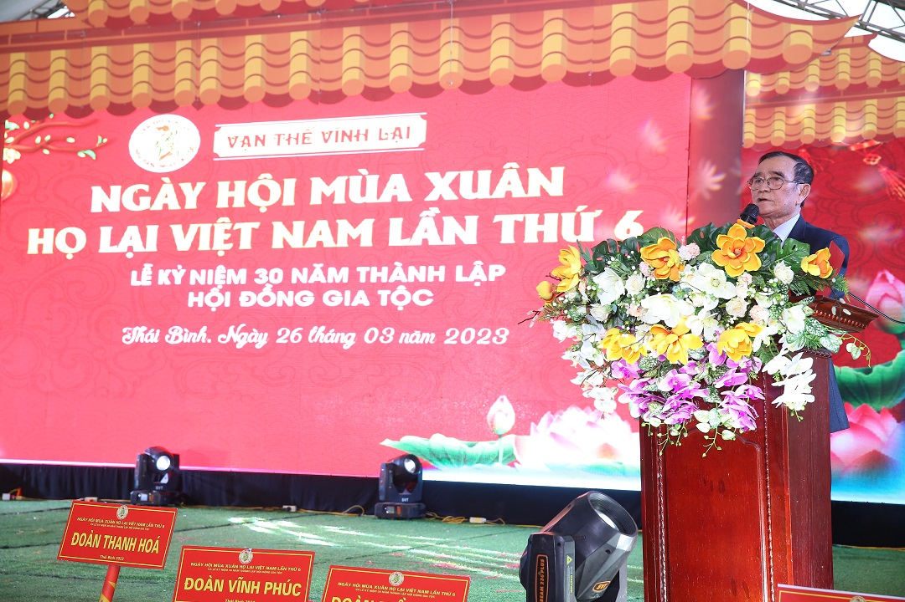

**DIỄN VĂN KHAI MẠC LỄ KỶ NIỆM 30 NĂM THÀNH LẬP HĐGT VÀ NGÀY HỘI MÙA XUÂN HỌ LẠI VIỆT NAM LẦN THỨ 6**

**____________**

*Kính lạy anh linh tiên tổ,  Kính thưa các ông, bà lãnh đạo địa phương,  Thưa các thành viên HĐGT Họ Lại Việt Nam,  Thưa các ông trưởng đoàn họ Lại các tỉnh cùng toàn thể các vị cao niên, các ông, bà, cô, dì, chú, bác, anh chị em, con, cháu, dâu, rể họ Lại Việt Nam.*  

Hôm nay, trong tiết trời tươi đẹp của xuân Quý Mão, trên quê hương 5 tấn Thái Bình, nơi thờ đức Trưởng chi Thủy Tổ Đại Tướng Quân Thái Bảo tín Quận Công Lại Thế Lạc. Hội đồng Gia tộc họ Lại Việt Nam, phối hợp với Hội đồng gia tộc họ Lại tỉnh Thái Bình, long trọng tổ chức “Lễ kỷ niệm 30 năm thành lập Hội đồng gia tộc họ Lại Việt Nam và Ngày hội mùa xuân họ Lại Việt Nam lần thứ 6” tại các chi họ Lại xã Vũ Ninh, huyện Kiến Xương, tỉnh Thái Bình. Đây là một ngày hội văn hóa lớn của cộng đồng con cháu Họ Lại Việt Nam, được tổ chức 2 năm 1 lần luân phiên giữa các tỉnh, đặc biệt năm 2023 này diễn ra nhân dịp kỷ niệm 30 năm thành lập HĐGT Họ Lại Việt Nam.  

Thay mặt ban chỉ đạo, tôi xin nhiệt liệt chào mừng và kính chúc các vị lãnh đạo địa phương, quý vị khách quý, các thành viên HĐGT Họ Lại Việt Nam, HĐGT Họ Lại các tỉnh, các ông trưởng đoàn họ Lại các tỉnh cùng gần 3000 các vị cao niên, các ông, bà, cô, dì, chú, bác, anh chị em, con, cháu, dâu, rể họ Lại Việt Nam có mặt tại đây và hàng trăm ngàn người đang theo dõi trực tuyến luôn mạnh khỏe, hạnh phúc, an khang. Chúc cho cộng đồng con cháu họ Lại Việt Nam luôn đoàn kết, thương yêu, đùm bọc để phát triển vững bền góp phần xây dựng quê hương, đất nước giàu mạnh.  

Thưa quý vị!  

Ông cha ta thường nói, chim có tổ, con người có tông, con cháu nhớ về cội nguồn:

*"Cây có gốc mới nở ngành xanh ngọn*  *Nước có nguồn mới bể rộng sông sâu*  *Người ta nguồn gốc từ đâu*  *Có tổ tiên trước rồi sau có mình"*

Trong giây phút hân hoan này, với truyền thống uống nước nhớ nguồn và lòng biết ơn vô hạn chúng ta thành kính tưởng nhớ tới cửu huyền thất tổ của Họ Lại Việt Nam, tổ mẫu, tổ cô, các vị tiền nhân đã có công sinh thành, dưỡng dục, xây dựng và bảo tồn các giá trị văn hóa tốt đẹp để cháu con hôm nay được kế thừa và phát triển.  

Chúng ta cũng tưởng nhớ và bày tỏ lòng biết ơn sâu sắc đối tới Bác Hồ kính yêu, vị cha già của dân tộc, tới các mẹ Việt Nam Anh Hùng, các liệt sỹ, thương bệnh binh của dòng họ Lại nói riêng và của đất nước nói chung đã cống hiến, hy sinh vì sự nghiệp giải phóng dân tộc, xây dựng và bảo vệ Tổ quốc để chúng ta hôm nay có được độc lập, tự do, sống trong hòa bình và hạnh phúc.  

Thưa quý vị!  

Thay mặt ban chỉ đạo sự kiện, tôi xin gửi lời cảm ơn sâu sắc tới các đồng chí lãnh đạo địa phương đã nhiệt tình ủng hộ và hỗ trợ chúng tôi trong công tác chuẩn bị để tổ chức “Lễ kỷ niệm 30 năm thành lập Hội đồng gia tộc họ Lại Việt Nam và Ngày hội mùa xuân họ Lại Việt Nam lần thứ 6” hôm nay được diễn ra theo kế hoạch.  

Tôi cũng xin cảm ơn HĐGT Họ Lại Việt Nam đã tin tưởng giao nhiệm vụ, xin cảm ơn HĐGT Họ Lại Thái Bình đã chỉ đạo sát sao trong thời gian qua, xin cảm ơn sự tham gia nhiệt tình, trách nhiệm và những đóng góp quý báu của các chi họ Lại xã Vũ Ninh, huyện Kiến Xương, tỉnh Thái Bình, các thành viên trong ban tổ chức, các nhà tài trợ cho công tác chuẩn bị để ngày hội văn hóa dòng họ được đông vui, đoàn kết và ý nghĩa hôm nay.  

Thưa quý vị,  

Với phương châm: “ Đoàn kết – Phát Triển – Vững Bền”, Lễ kỷ niệm 30 năm thành lập Hội đồng gia tộc họ Lại Việt Nam và Ngày hội mùa xuân họ Lại Việt Nam lần thứ 6 thể hiện bản lĩnh, tinh thần gắn kết anh em một nhà và quyết tâm đi lên của của dòng họ vì mục tiêu góp phần dân giàu, nước mạnh, dân chủ, công bằng, văn minh của cả đất nước.  Với định hướng chiến lược, quy hoạch phát triển dòng họ đúng đắn của HĐGT, khát vọng phát triển mạnh mẽ và quyết tâm thực hiện tới cùng, cộng đồng con cháu Họ Lại Việt Nam chúng ta nhất định sẽ lập nên nhiều thành tựu phát triển mới vì một tương lai vững bền góp phần xây dựng đất nước phồn vinh, hạnh phúc, cùng tiến bước, sánh vai với các cường quốc năm châu, thực hiện thành công tâm nguyện của Chủ tịch Hồ Chí Minh vĩ đại và ước vọng của toàn dân tộc.  

Với niềm tin sâu sắc đó, thay mặt Ban chỉ đạo, tôi xin tuyên bố khai mạc lễ Mít ting: “ Kỷ niệm 30 năm thành lập Hội đồng gia tộc họ Lại Việt Nam và Ngày hội mùa xuân họ Lại Việt Nam lần thứ 6”.  

Kính chúc các vị khách quý, toàn thể đại tộc mạnh khỏe, hạnh phúc và thành công.  

**Xin trân trọng cảm ơn!**
