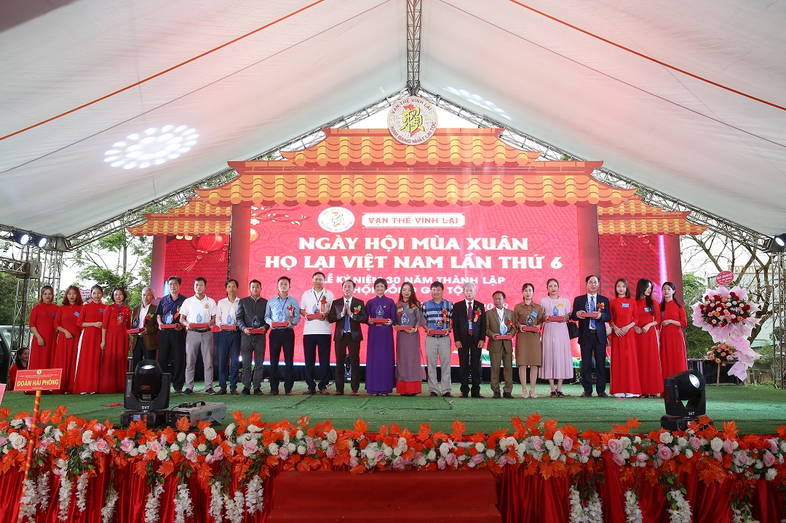
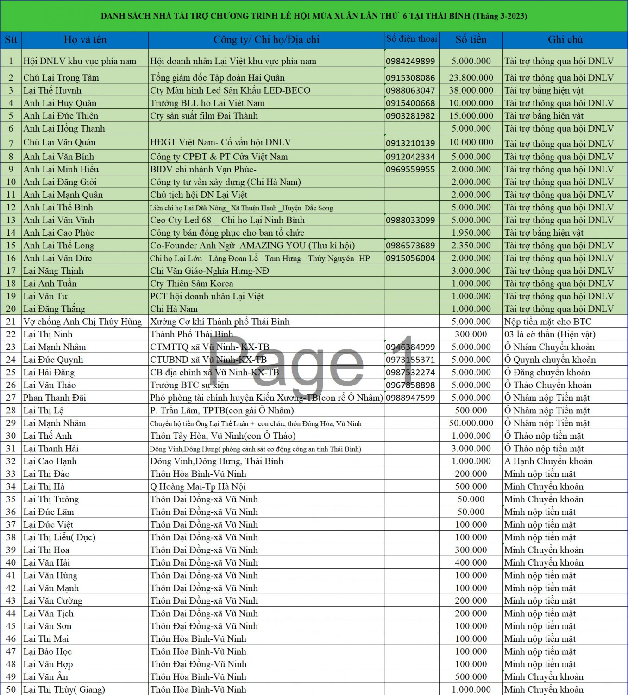
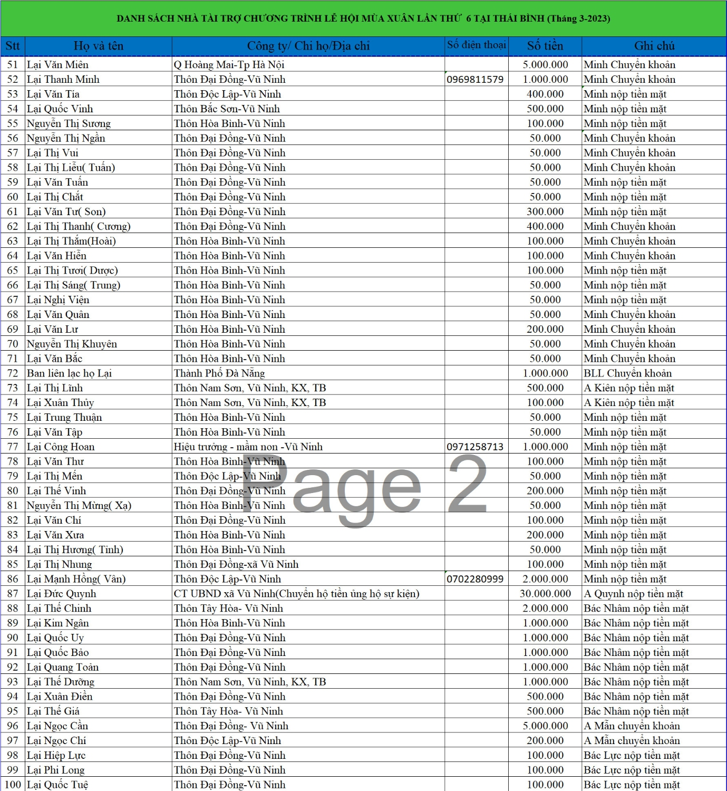
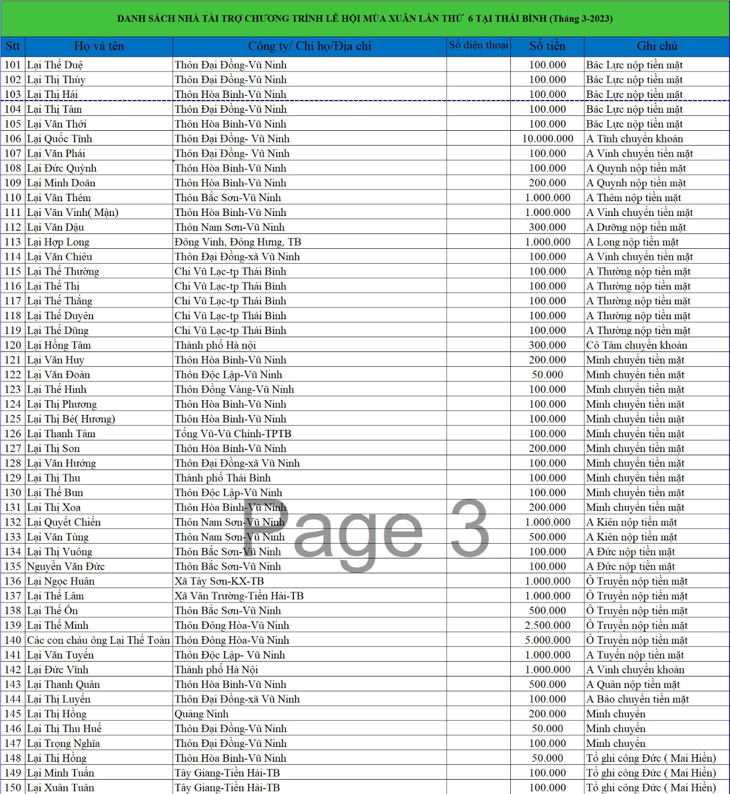
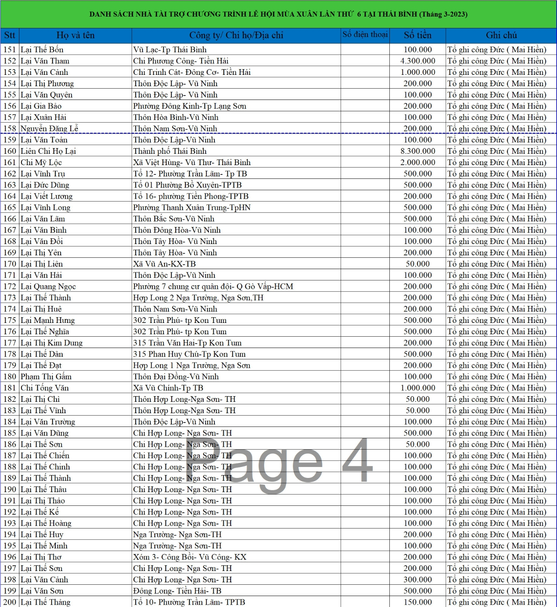
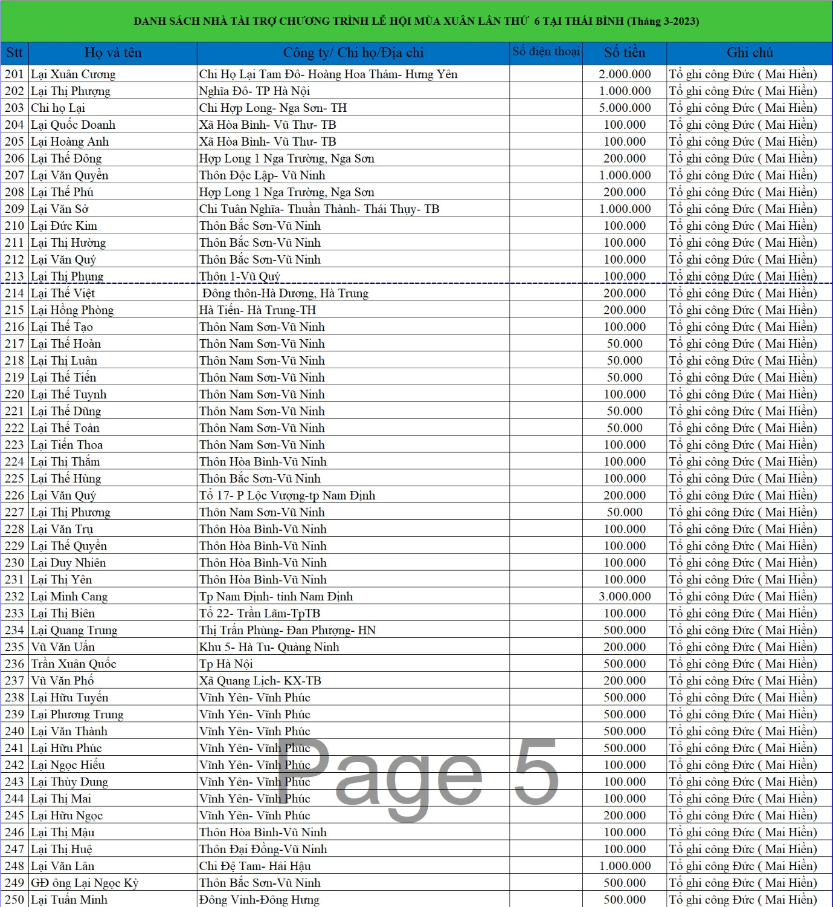
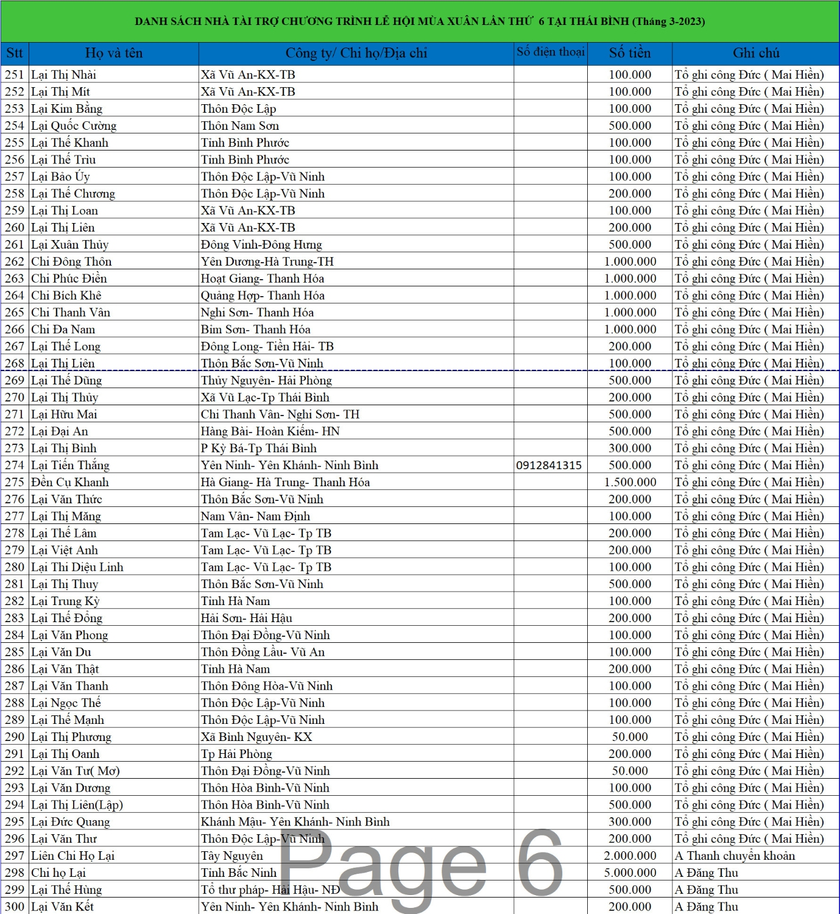
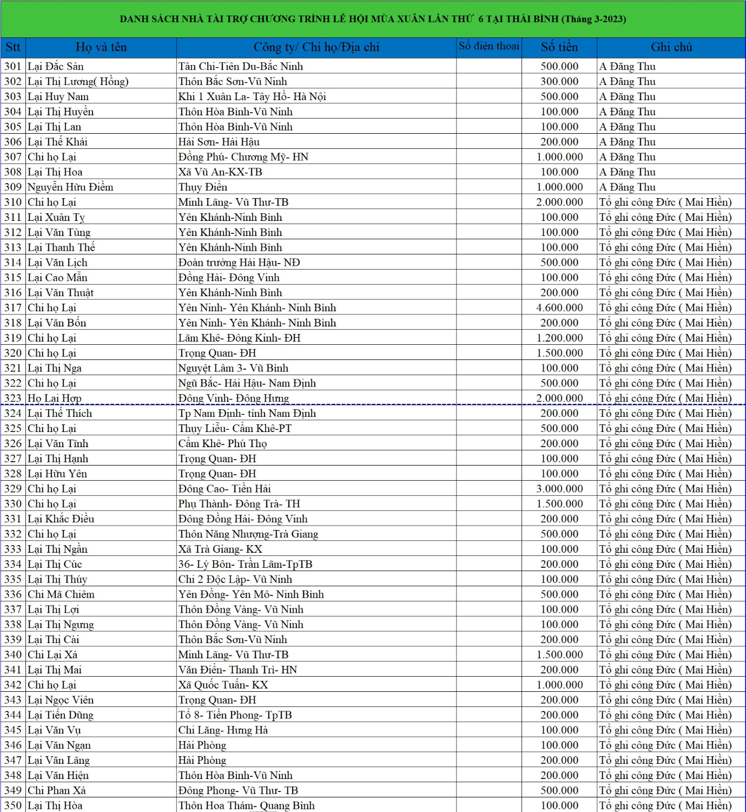
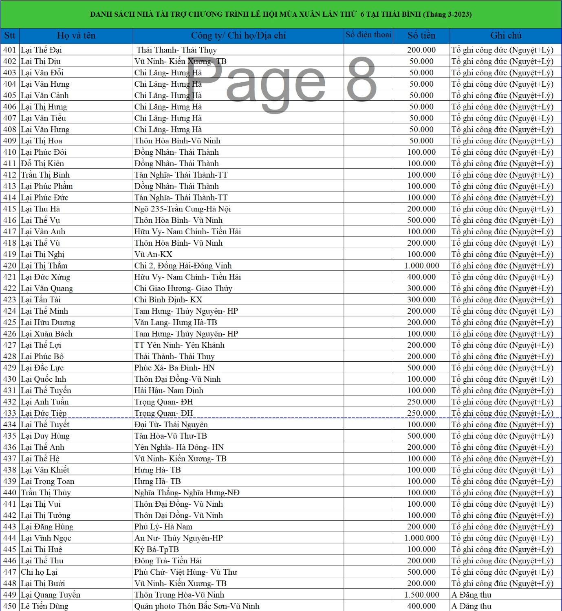
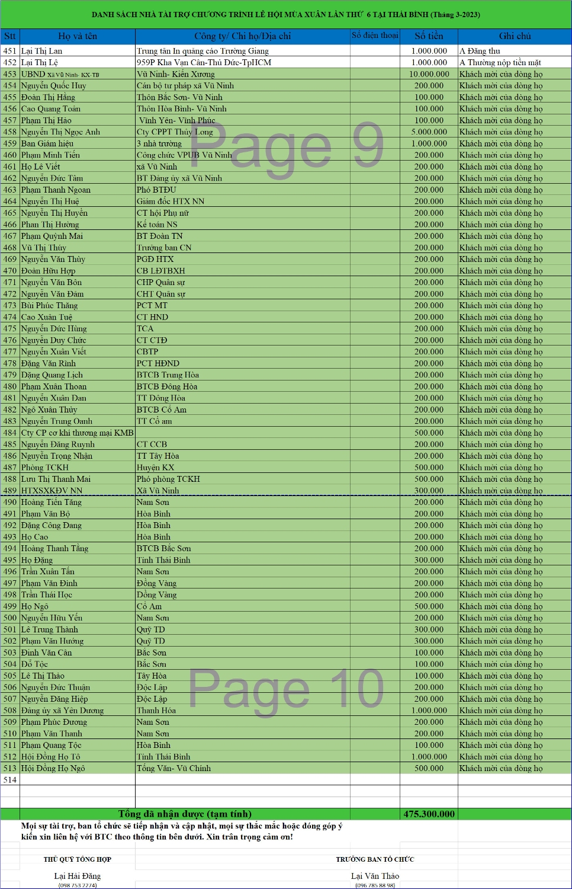

**LỜI CẢM ƠN NHÀ TÀI TRỢ SỰ KIỆN**    **NGÀY HỘI MÙA XUÂN HỌ LẠI VIỆT NAM LẦN 6**   **VÀ LỄ KỶ NIỆM 30 NĂM THÀNH LẬP HĐGT**

--------------------

Kính thưa: Các tổ chức, cá nhân, doanh nhân, doanh nghiệp (nhà tài trợ)  Trong hai ngày 25 và 26 tháng 3 năm 2023, Được sự cho phép của Huyện ủy, UBND Huyện Kiến Xương, Phòng văn hóa thông tin huyện Kiến Xương, Đảng ủy HĐND UBND Xã Vũ Ninh, HĐGT Họ Lại Việt Nam, sự chỉ đạo sát sao của HĐGT Họ Lại Tỉnh Thái Bình, Ban tổ chức đã phối hợp với Hội doanh nhân Lại Việt, Ban liên lạc, Ban truyền thông Họ Lại Việt Nam long trọng tổ chức: “Ngày hội mùa xuân Họ Lại Việt Nam lần 6 và Lễ kỷ niệm 30 năm thành lập Hội đồng gia tộc”.  

BTC vinh dự được đón tiếp các Quý vị đại biểu đại diện Lãnh đạo các cơ quan trên địa phương và đơn vị, doanh nghiệp, phóng viên báo, đài đến dự và đưa tin về buổi Lễ. Tại buổi lễ, chúng tôi còn nhận được những lẵng hoa tươi thắm chúc mừng và sự quan tâm về vật chất, tinh thần của các cơ quan, khách mời, các cá nhân, tổ chức doanh nghiệp có nguồn gốc Họ Lại Việt nam; đặc biệt là sự ủng hộ kinh phí cho chương trình. Chính sự quan tâm, đồng hành của Quý vị đã giúp cho BTC có thêm nguồn kinh phí để tạo nên một sự kiện thành công tốt đẹp, một ngày hội văn hóa đoàn kết cho cộng đồng con cháu Họ Lại Việt Nam.  

HĐGT họ Lại Việt Nam cùng các thành viên trong BTC sự kiện xin tri ân và trân trọng gửi lời cám ơn chân thành nhất về sự quan tâm, giúp đỡ của Quý vị, đặc biệt là các cá nhân, tổ chức, doanh nhân, doanh nghiệp là con cháu trong họ đã góp phần vào chương trình. Chúc quý vị ngày càng phát triển và thành công trên mọi lĩnh vực hoạt động của mình.  

BTC tin tưởng và hy vọng rằng, trong thời gian tới cộng đồng con cháu họ Lại chúng ta tiếp tục phát huy tinh thần: “ ĐOÀN KẾT-PHÁT TRIỂN-VỮNG BỀN” để xây dựng dòng họ ngày một hưng thịnh. BTC mong tiếp tục nhận được sự quan tâm, đồng hành của cộng đồng trong các sự kiện sau này của dòng họ.  

BTC sẽ nỗ lực sử dụng đúng mục đích, đạt hiệu quả và thường xuyên công khai thông tin trên các kênh truyền thông chính thức của dòng họ:

* Website: [https://holaivietnam.com/](https://holaivietnam.com/)  * Fanpage: [https://www.facebook.com/holaivietnam](https://www.facebook.com/holaivietnam)  * Group Facebook: [https://www.facebook.com/groups/HoLaiVietNam](https://www.facebook.com/groups/HoLaiVietNam)  

Xin trân trọng cám ơn!  
 

 

 

