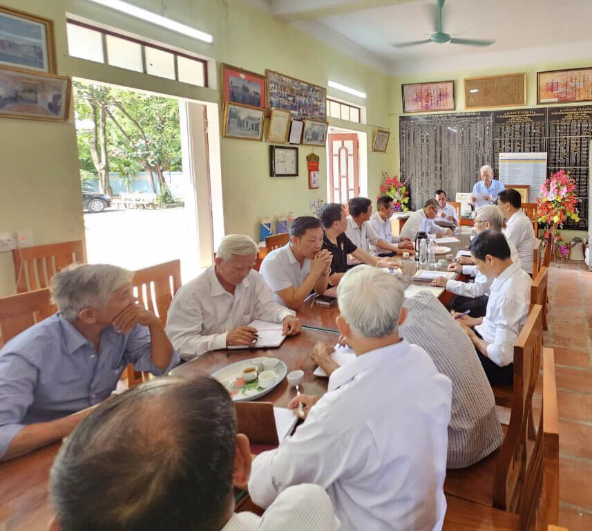

| **BAN THÔNG TIN TRUYỀN THÔNG**    **HỌ LẠI VIỆT NAM**    __________ | **CỘNG HÒA XÃ HỘI CHỦ NGHĨA VIỆT NAM**      **Độc Lập – Tự Do – Hạnh Phúc**    **________________________________________** |
| --- | --- |
| Số: 01/TB/BTTTT | *Thanh Hóa**, ngày 04* *tháng 6*  *năm 2023* |

**THÔNG BÁO**  NỘI DUNG NGHỊ QUYẾT CỦA HỘI ĐỒNG GIA TỘC HỌ LẠI VIỆT NAM   NGÀY 04/6/2023

________________

Ngày 04 tháng 6 năm 2023 tại Nhà thờ Họ Lại, xã Yên Dương*,* huyện Hà Trung, tỉnh Thanh Hóa, Hội đồng gia tộc Họ Lại Việt Nam (viết tắt là HĐGTHLVN đã tổ chức Hội nghị sơ kết hoạt động 06 tháng đầu năm 2023 và triển khai các hoạt động, công việc của những tháng còn lại theo kế hoạch năm 2023. Hội nghị do ông Lại Thế Tác - Chủ tịch HĐGTHLVN chủ trì, đọc báo cáo; đại biểu tham dự có 40 thành viên HĐGTHLVN đại diện các chi Họ; Hội doanh nhân Lại Việt; Ban liên lạc con cháu họ Lại VN và Ban Thông tin truyền thông họ Lại VN (viết tắt là Ban TTTT). Sau khi các đại diện các tổ chức báo cáo, hội nghị đã thảo luận nội dung các báo cáo, Chủ tịch HĐGTHLVN đã kết luận 04 nội dung lớn, Hội nghị đã biểu quyết ban hành Nghị quyết để làm căn cứ triển khai thực hiện, giao Ban Thông tin truyền thông thông báo Nghị quyết đến các chi họ và các tổ chức thuộc HĐGTHLVN và cá nhân liên quan biết, thực hiện. Thực hiện kết luận của HĐGTHLVN, Ban TTTTT xin thông báo cụ thể nội dung Nghị quyết như sau:  **I. Đánh giá kết quả hoạt động 06 tháng đầu năm 2023 của HĐGTHLVN**  Năm 2023, ngay từ ngày đầu, tháng đầu, HĐGTHLVN đã lên kế hoạch cho hoạt động, công việc cụ thể, quyết liệt chỉ đạo đến các chi họ, các tổ chức trực thuộc HĐGTHLVN, con cháu của dòng họ Lại để triển khai thực hiện Nghị quyết của HĐGTHLVN ngày 25/12/2022 (Thông báo số 01/TB/BTTTT ngày 25 tháng 12 năm 2022 của Ban TTTT). Căn cứ các báo cáo tại Hội nghị của các tổ chức: Ban Thường trực HĐGTHLVN, Ban TTTTT, Ban liên lạc con cháu họ Lại VN, Hội doanh nhân Lại Việt, HĐGT họ Lại tỉnh Thái Bình. HĐGTHLVN đánh gía cao tính chuyên nghiệp trong công tác truyền thông, sự phối kết hợp, tính đoàn kết, tinh thần trách nhiệm trong triển khai thực hiện công việc giữa các tổ chức và phối hợp với hai địa phương tỉnh Thái Bình và tỉnh Thanh Hóa thực hiện thành công hai sự kiện lớn như: tổ chức Lễ Giỗ Đức Triệu Tổ và Tổng kết 30 năm hoạt động của HĐGTHLVN tại Nhà thờ Đức Triệu Tổ Lại Thế Tiên: HĐGTHLVN đã đón tiếp các con cháu dòng họ Lại trên khắp các tỉnh thành trên toàn quốc về dâng hương kính Tổ trong 03 ngày kể từ ngày 13/01/2023 (âm lịch), trong đó ngày 15/01/2023 (âm lịch) HĐGTHLVN tổ chức nghi Lễ giỗ Tổ và báo cáo tổng kết 30 năm hoạt động của HĐGTHLVN. Đối với việc Tổ chức Ngày hội Mùa Xuân họ Lại Việt Nam lần thứ 6 và Lễ kỷ niệm 30 năm thành lập HĐGTHLVN tại xã Vũ Ninh, huyện Kiến Xương, tỉnh Thái Bình đã thành công tốt đẹp như mong muốn. Như vậy, trong thời gian ngắn chúng ta đã thực hiện hai sự kiện lớn thành công, đáp ứng từ 3 đến 5 ngàn người về tham dự, nhưng đảm báo công tác an toàn, an ninh, nhất là an toàn thực phẩm và kết quả mãn nhãn, tăng tình đoàn kết giao lưu giữa các chi họ, giữa người họ Lại với nhau, những người họ Lại tìm về cội nguồn, Tiên Tổ. Tuy nhiên, trong quá trình diễn ra hai sự kiện, những việc cụ thể, Ban tổ chức có thể chưa đáp ứng hết được mọi nhu cầu và còn có những sơ xuất cần rút kinh nghiệm trong việc triển khai những sự kiện tiếp theo. Đồng thời, trong 06 tháng qua HĐGTHLVN cũng đã chỉ đạo sát sao, giải quyết một số việc quan trọng được quy định tại Quy ước dòng họ Lại Việt Nam, như kêu gọi cộng đồng con cháu luôn hướng về dòng họ nâng cao tình đoàn kết, có ý thức xây dựng cho các tổ chức thuộc dòng họ, HĐGTHLVN ngày càng phát triển, bền vững.  **II. Triển khai thực hiện nhiệm vụ 06 tháng cuối năm và phấn đấu hoàn thành kế hoạch năm 2023 của HĐGTHLVN**  ***1. Về triển khai một số công trình***   a) Xây dựng mới Nhà truyền thống của dòng họ Lại VN và mái che phía trước Nhà Bái đường trong khuôn viên Nhà thờ Tổ Lại Thế Tiên:  HĐGTHLVN giao Ban Thường trực HĐGTHLVN, trước mắt triển khai xây dựng: Bản thiết kế; dự toán công trình, báo cáo HĐGTHLVN xem xét, quyết định hình thức huy động kinh phí xây dựng. Việc triển khai xây dựng các công trình này khi có đủ kinh phí.  b) Mở rộng khuôn viên Nhà thờ cụ Đức Trưởng chi Thủy Tổ Đại Tướng Quân Thái Bảo tín Quận Công Lại Thế Lạc (Ngành A) tại xã Đông Vinh, huyện Đông Hưng, tỉnh Thái Bình:  HĐGTHLVN giao Ban Thường trực HĐGTHLVN chủ trì, phối hợp với HĐGT tỉnh Thái Bình làm việc cụ thể với chi họ Lại đang quản lý Nhà thờ, thờ cúng cụ Lại Thế Lạc để có phương án cụ thể triển khai dự án, báo cáo HĐGTHLVN xem xét quyết định.  ***2. Một số nội dung chỉ đạo của HĐGTHLVN và xem xét, cho ý kiến một số kiến nghị cụ thể của cá nhân và các tổ chức trực thuộc HĐGTHLVN***  a) Thực hiện các quy định tại Quy ước dòng họ Lại VN, HĐGTHLVN có chỉ đạo HĐGT họ Lại tại các tỉnh, thành phố, khu vực và các chi họ, Ban Trị sự (gọi chung là HĐGT họ Lại các địa phương) thuộc dòng họ Lại VN như sau:  - Đối với HĐGT họ Lại tại các tỉnh, thành phố, khu vực nếu đã có HĐGT thì rà soát kiện toàn tổ chức. Đối với các tỉnh, thành phố, khu vực chưa thành lập được HĐGT tại địa phương mình, nay căn cứ vào thực tế, tổ chức Hội nghị hoặc Đại hội để thành lập HĐGT tại địa phương mình theo quy định của Quy ước dòng họ Lại VN, giúp cho việc thống nhất triển khai hoạt động của dòng họ.  - Đối với và các chi họ, Ban Trị sự thuộc dòng họ Lại VN hiện có, sẽ rà soát, kiện toàn tổ chức của mình theo quy định của Quy ước dòng họ Lại VN giúp cho việc thống nhất triển khai hoạt động của dòng họ.  Sau khi thực hiện việc kiện toàn hay thành lập mới tổ chức theo chỉ đạo của HĐGTHLVN. HĐGT các địa phương có báo cáo gửi về HĐGTHLVN, kèm theo danh sách giời thiệu Thành viên, số lượng thành viên tham gia HĐGTHLVN, những Thành viên được giới thiệu, phải là người có đủ các điều kiện, tiêu chuẩn phù hợp với quy định tại Quy ước dòng họ Lại Việt Nam.

2. Đối với các tổ chức trực thuộc HĐGTHLVN

- Ban Thông tin truyền thông xây dựng phương án kiện toàn tổ chức theo quy định tại Quy ước dòng họ Lại Việt Nam, báo cáo HĐGTHLVN; cho phép Ban tự kêu gọi các nguồn tài trợ để có kinh phí hoạt động, báo cáo việc thực hiện tại hội nghị tổng kết thường niên của HĐGTHLVN.  - Ban Liên lạc cộng đồng con cháu họ Lại Việt Nam xây dựng phương án kiện toàn tổ chức, chịu trách nhiệm trước HĐGTHLVN về việc tổ chức và quản lý các hoạt động của Ban trên phạm vi toàn quốc, dự thảo Quy chế hoạt động của Ban, báo cáo HĐGTHLVN theo quy định tại Quy ước dòng họ Lại Việt Nam.   - Đối với Hội Doanh nhân Lại Việt: Đồng ý Hội tổ chức Đại hội theo quy định tại Quy chế hoạt động của Hội, báo cáo kết quả đại hội lên HĐGTHLVN. Về đề nghị HĐGTHLVN khen thưởng đối với các cá nhân, tập thể đã có thành tích trong hoạt động nhiệm kỳ Đại hội lần thứ nhất, Hội lập danh sách, kiến nghị hình thức khen thưởng, báo cáo Thường trực HĐGTHLVN xem xét, quyết định.   c) Đối vời kiến nghị của ông Lại Công Hiệp - Phó Chủ tịch HĐGTHLVN *(Tin nhắn gửi đến máy điện thoại của ông Lại Quốc Tuấn - Ủy viên Thường trực HĐGTHLVN) báo cáo với nội dung:*  *“Anh đang được điều trị bệnh cao Huyết Áp và tim mạch (hẹp ĐM vành đã được đặt 3 sten). Anh đề xuất anh em dòng họ Lại ở miền Nam Việt Nam nên tìm 01 người có tâm, đức, không màng danh lợi đứng ra làm công việc của dòng họ Lại ở đây, chứ bệnh của anh bác sỹ điều trị nói cần yên ổn không nên không được tham gia vào những chuyện ồn ào”*  Căn cứ kiến nghị nêu trên của ông Lại Công Hiệp, tại Hội nghị HĐGTHLVN đã thảo luận và lấy ý kiến biểu quyết, kết quả 100% Thành viên HĐGTHLVN dự họp nhất trí kiến nghị của ông Lại Công Hiệp. Như vậy ông Hiệp được rút khỏi danh sách Thành viên HĐGTHLVN và không giữ chức danh Phó Chủ tịch HĐGTHLVN để nghỉ chữa bệnh.  d) Về báo cáo của ông Lại Tuấn Anh, báo cáo HĐGTHLVN kết quả ngày gặp mặt, giao lưu của các con cháu họ Lại tại khu vực thành phố Hồ Chí Minh (ngày 20/5/2023). Tại Hội nghị các ý kiến của Thành viên HĐGTHLVN đánh gia cao những hoạt động của các con cháu hướng về dòng họ. Đồng thời Ban Thường trực HĐGTHLVN đề nghị HĐGTHLVN tiến hành bỏ phiếu lấy phiếu tín nhiệm đối với ông Lại Tuấn Anh tham gia làm Thành viên HĐGTHLVN, kết quả 100% Thành viên HĐGTHLVN tham dự Hội nghị đồng ý. HĐGTHLVN giao ông Lại Tuấn Anh chịu trách nhiệm phối hợp với các tổ chức thuộc HĐGTHLVN, nhất là Trưởng Ban Liên lạc cộng đồng con cháu họ Lại Việt Nam - Lại Huy Quân nghiên cứu thành lập Phân ban liên lạc cộng đồng con cháu họ Lại Việt Nam khu vực thành phố Hồ Chí Minh và các tỉnh miền Nam trực thuộc Ban Liên lạc cộng đồng con cháu họ Lại Việt Nam, báo cáo HĐGTHLVN.   **III. Về công tác tổ chức**  ***1)*** ***HĐGTHLVN*** ***biểu quyết với hình thức giơ tay bầu bổ sung 11 thành viên*** ***HĐGTHLVN*** ***để duy trì hoạt động dòng họ, gồm các ông có tên sau:***

| **Số TT** | **Họ và Tên** | **Chi họ, tỉnh** |
| --- | --- | --- |
| 01 | Lại Thế Sáu | Thành phố Thanh Hóa |
| 02 | Nguyễn Thùy Linh | Kế toán HĐGT |
| 03 | Lại Hữu Mai | Tĩnh Gia, tỉnh Thanh Hóa |
| 04 | Lại Tuấn Anh | Thành phố Hồ Chí Minh |
| 05 | Lại Thế Thảo | HĐGT tỉnh Thái Bình |
| 06 | Lại Hữu Long | HĐGT tỉnh Thái Bình |
| 07 | Lại Thế Phúc | HĐGT tỉnh Vĩnh Phúc |
| 08 | Lại Thế Vĩnh | HĐGT tỉnh Hà Nam |
| 09 | Lại Đăng Giỏi | HĐGT tỉnh Hà Nam |
| 10 | Lại Đình Đại | Hải Châu Thừa Thiên Huế uế |
| 11 | Lại Thế Triều | Ban Trị sự, Hải Hậu, tỉnh Nam Định |

***2)*** ***HĐGTHLVN*** ***biểu quyết với hình thức giơ tay bầu bổ sung 11 Ủy viên Ban Thường trực*** ***HĐGTHLVN*** ***để duy trì hoạt động dòng họ, gồm các ông có tên sau:***

| **Số TT** | **Họ và Tên** | **Chức vụ** |
| --- | --- | --- |
| 01 | Lại Thế Tác |  |
| 02 | Lại Ngọc Thư |  |
| 03 | Lại Văn Quán |  |
| 04 | Lại Văn Lịch |  |
| 05 | Lại Vi Nghị |  |
| 06 | Lại Quốc Tuấn |  |
| 07 | Lại Xuân Đức |  |
| 08 | Lại Xuân Cương |  |
| 09 | Lại Huy Quân |  |
| 10 | Lại Trọng Tâm |  |
| 11 | Lại Thế Sáu |  |

***3)*** ***HĐGTHLVN*** ***biểu quyết với hình thức giơ tay bầu bổ sung 05 Ủy viên Ban Thường trực*** ***HĐGTHLVN*** ***giữ chức danh Phó Chủ tịch*** ***HĐGTHLVN*** ***để duy trì hoạt động dòng họ, gồm các ông có tên sau:***

| **Số TT** | **Họ và Tên** | **Chức vụ** |
| --- | --- | --- |
| 01 | Lại Ngọc Thư |  |
| 02 | Lại Quốc Tuấn |  |
| 03 | Lại Vi Nghị |  |
| 04 | Lại Văn Quán |  |
| 05 | Lại Thế Lịch |  |

**IV.** **Một số nội dung khác**  1. HĐGTHLVN tiếp tục chỉ đạo triển khai thực hiện những nhiệm vụ, công việc nêu tại Nghị quyết của HĐGTHLVN ngày 25/12/2022 (Thông báo số 01/TB/BTTTT ngày 25 tháng 12 năm 2022 của Ban TTTT).   2. Quy định thực hiện nghi lễ, đồng phục trước, trong Lễ Giỗ Đức Triệu Tổ, tổ chức họp HĐGTHLVN  - Về việc triệu tập họp HĐGTHLVN: Ban Thường trực HĐGTHLVN chuẩn bị Báo cáo, phòng họp và điện trực tiếp hoặc gửi Giấy mời họp đến trước ngày họp 01 tuần (08 ngày) để các thành phần tham dự bố trì thời gian về dự họp đầy đủ.  - Thực hiện nghi lễ trang nghiêm ngay từ khi khai mạc ngày Giỗ Tổ, ngày họp HĐGTHLVN ...: có người đội lễ, các thành viên HĐGTHLVN phải mặc đồng phục lễ (anh Lại Huy Quân - Trưởng Ban liên lạc con cháu họ Lại Việt Nam đã tự nguyện tài trợ mua sắm đồng phục lễ), có người đọc Chúc văn khi làm lễ,...  3. Về Báo cáo của Ban tài chính (Bản báo cáo kèm theo)  và báo cáo của Ban Kiểm soát thuộc HĐGTHLVN  Ban tài chính (Bà Nguyễn Thùy Linh - Kế toán Kế toán HĐGTHLVN) báo cáo quyết toán tài chính 06 tháng đầu năm 2023 gồm 2 phần thu chi và công nợ (còn tồn đọng). Hội nghị có một số ý kiến đề nghị Ban tài chính chuẩn xác công nợ, báo cáo để HĐGTHLVN có giải pháp xử lý trong thời gian đến. Ban tài chính và Ban kiểm soát (ông Lại Xuân Đức - Ủy viên Ban Thường trực HĐGTHLVN) đã tiếp thu ý kiến, làm rõ số liệu tại hội nghị. HĐGTHLVN đã biểu quyết thông qua nội dung này.  Ban Thông tin truyền thông họ Lại Việt Nam xin thông báo nội dung Nghị quyết của HĐGTHLVN nêu trên để các chi họ, các tổ chức thuộc Hội đồng gia tộc họ Lại Việt Nam và các cá nhân liên quan biết, thực hiện./.

 

| ***Nơi nhận:***    - Chủ tịch, các PCT      HĐGTHLVN,    - Các TV HĐGTHLVN,    - Các chi họ, các tổ chức thuộc      HĐGTHLVN,    - Lưu: Ban TTTT. | **BAN THÔNG TIN TRUYỀN THÔNG**     **HỌ LẠI VIỆT NAM**    **TRƯỞNG BAN**        *(Đã ký)*         **Lại Xuân Cương** |
| --- | --- |
