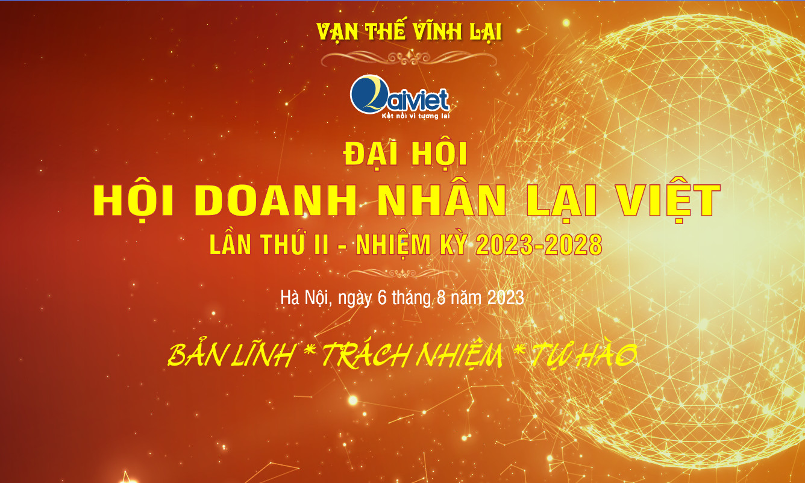
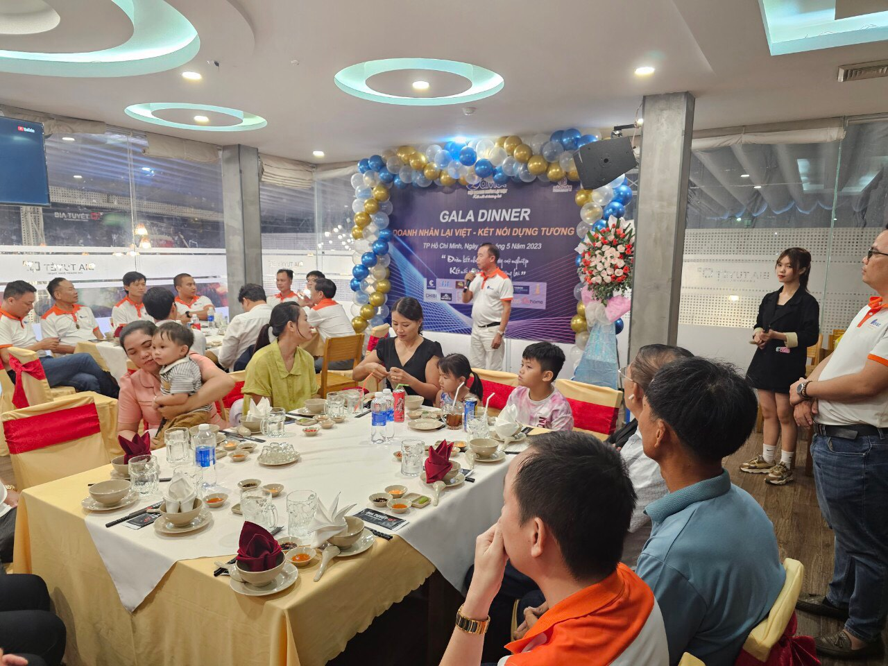

Hội DN Lại Việt (HDNLV) là tổ chức trực thuộc HĐGT Họ Lại Việt Nam, được thành lập vào ngày 03/6/2017, hoạt động của Hội nhằm kết nối các Doanh nhân, Doanh nghiệp có nguồn gốc Họ Lại Việt Nam có nhiệt huyết, có đam mê, mong muốn xây dựng, phát huy và góp phần chấn hưng Dòng Họ, từ đó tạo ra các giá trị, xuất phát từ sự thay đổi tích cực của mỗi cá nhân dẫn tới sự thay đổi tích cực cho cả Dòng Họ, đóng góp cho cộng đồng và cho xã hội.  Trong nhiệm kỳ I, HDNLV đã hoàn thành sứ mệnh đặt những viên gạch đầu tiên vững chắc trong việc kết nối và xây dựng cộng đồng doanh nghiệp có nguồn gốc Họ Lại Việt Nam đoàn kết, trách nhiệm và chia sẻ, từ đó góp phần thúc đẩy các hoạt động sản xuất, kinh doanh của các doanh nghiệp thành viên.   HDNLV bên cạnh sứ mệnh kể trên, Hội cũng đã chủ động kết hợp với Ban liên lạc, Ban truyền thông là các tổ chức trực thuộc HĐGT, cùng nỗ lực thực hiện mọi nhiệm vụ đề ra tiêu biểu như: Kêu gọi các thành viên phát tâm công đức xây dựng nhà thờ, phát tâm giúp đỡ các hoàn cảnh khó khăn là con em trong Họ, là ngọn cờ đầu trong việc phát triển các hoạt động phong trào như: Hội Thao Họ Lại 2 năm 1 lần, ngày hội mùa xuân 2 năm 1 lần, cùng nhiều sự kiện lớn nhỏ khác và đã được Hội đồng Gia tộc ghi nhận những kết quả trong thời gian qua hoạt động tốt, có hiệu quả.

Nhằm đạt được những mục tiêu cao hơn và tạo ra sự phát triển bền vững trong thời gian tới, Hội Doanh Nhân Lại Việt căn cứ vào điều lệ hoạt động hội đã quyết định tổ chức Đại Hội - Hội Doanh Nhân Lại Việt lần II. Đây là sự kiện quan trọng nhằm tạo thêm nhiều cơ hội cho các thành viên cũ và mới giao lưu, chia sẻ kinh nghiệm, tìm kiếm cơ hội hợp tác trong hội. Đại Hội nhiệm kỳ II sẽ đánh dấu sự khởi đầu cho giai đoạn mới của Hội, mang đến cơ hội lớn để mở rộng mạng lưới kết nối, phát triển kinh doanh cho các thành viên.  Chương trình Đại Hội - Hội Doanh Nhân Lại Việt lần II sẽ được diễn ra vào:

- **Thời gian:** 7h30 sáng, ngày 06 tháng 08 năm 2023.
- **Địa điểm:** Trung tâm hội nghị Cảnh Hồ, 173B đường Trường Chinh, Khương Mai, Thanh Xuân, Hà Nội.

Chương trình sẽ có sự tham dự của đại diện Hội Đồng Gia Tộc, Ban Cố vấn Hội Doanh Nhân Lại Việt, các doanh nhân, lãnh đạo doanh nghiệp và các chuyên gia kinh doanh. Ngoài ra, còn có sự tham gia của các thành viên trong cộng đồng con cháu họ Lại quan tâm tới sự kiện.  Ban tổ chức kính mời quý vị quan tâm tham gia và đóng góp cho sự kiện quan trọng này. Hãy cùng chung tay xây dựng một cộng đồng doanh nhân Lại Việt:"**BẢN LĨNH-TRÁCH NHIỆM-TỰ HÀO"**, là tiền để để xây dựng dòng họ phát triển, đất nước phồn vinh.      **Các Doanh nhân, doanh nghiệp và các cá nhân có nguồn gốc Họ Lại Việt Nam** **quan tâm đến sự kiện vui lòng**  **đăng kí ngay tại:** [https://shorturl.at/wACFH](https://shorturl.at/wACFH)  **Mọi chi tiết về sự kiện xin liên hệ:**   - Ban kết nối: Lại Huy Quân (091.540.0668)  - Ban hậu cần: Lại Duy Tuân (098.102.5170)
