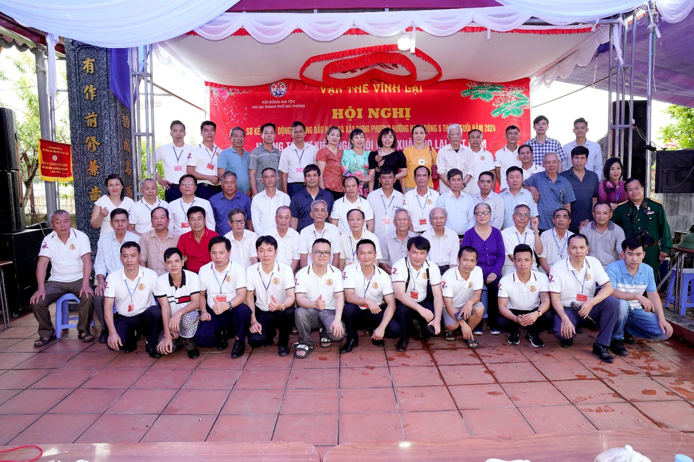
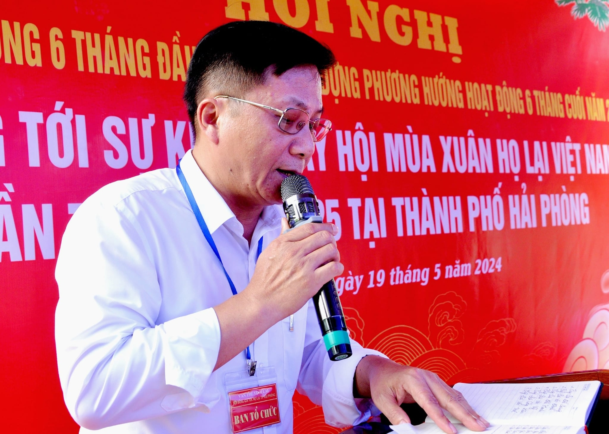
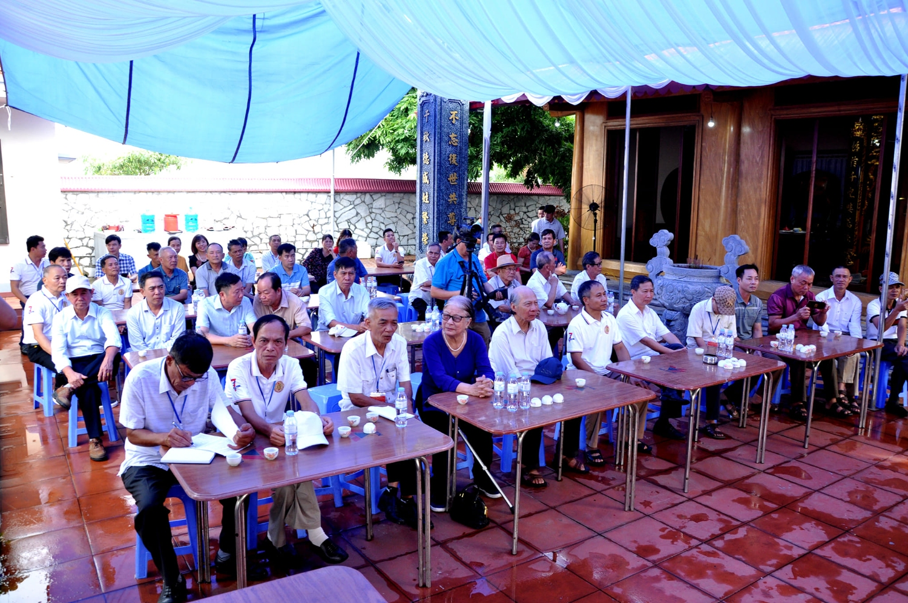
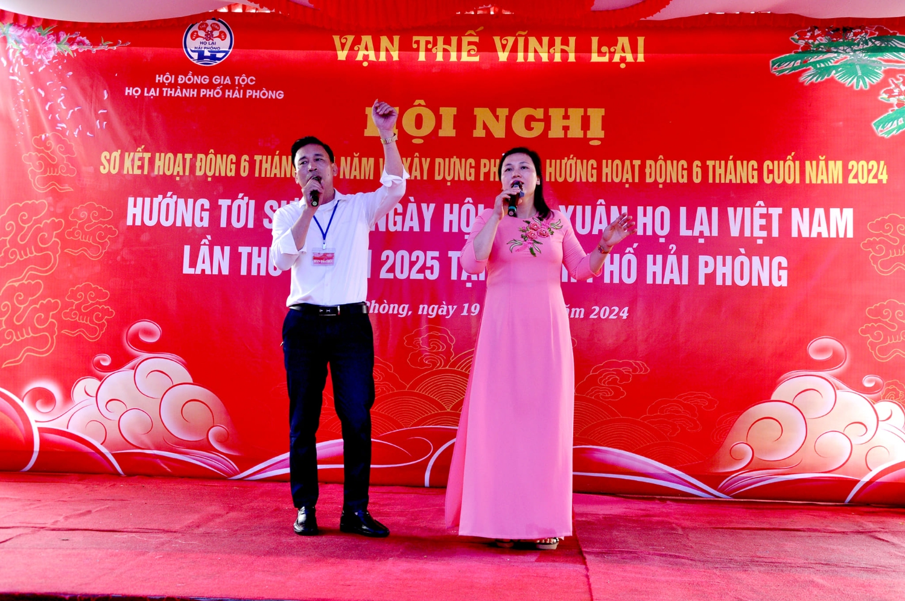
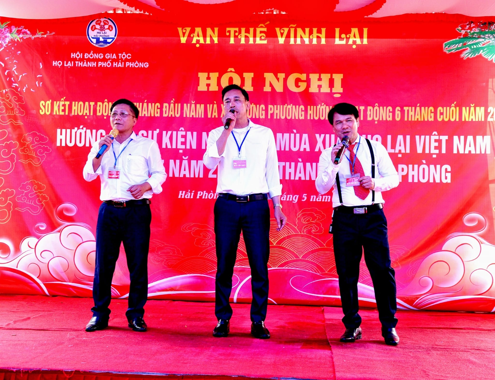
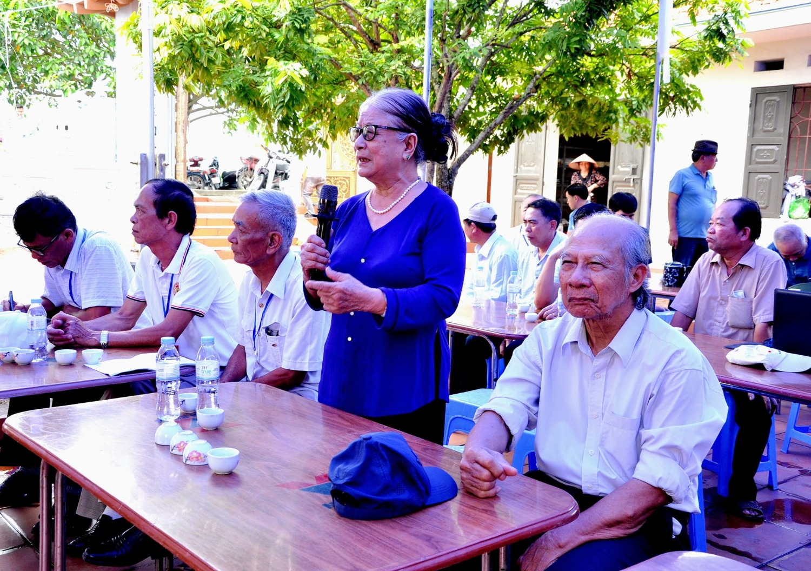
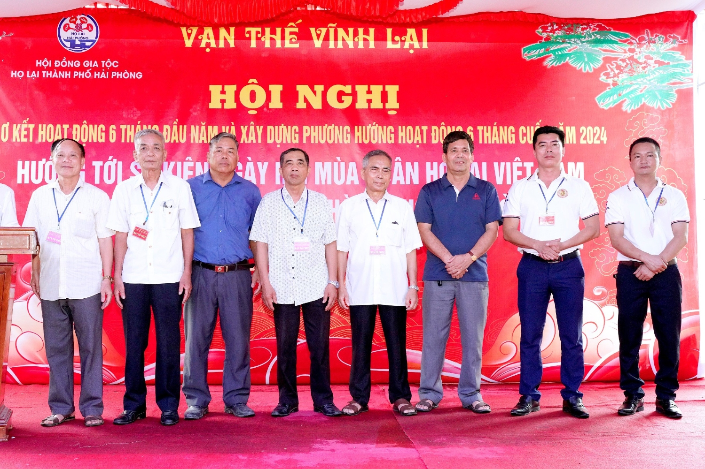

Hội nghị có sự tham gia của các vị đại biểu, khách mời cùng hơn 60 thành viên đại diện cho 11 Chi thuộc Hội đồng Gia tộc họ Lại thành phố Hải Phòng. Mở đầu hội nghị là chương trình văn nghệ chào mừng với các tiết mục đặc sắc từ ban văn nghệ họ Lại Hải Phòng, thể hiện lòng thành kính dâng lên Tiên tổ và Bác Hồ kính yêu.

Tiếp nối chương trình là Báo cáo Sơ kết hoạt động 6 tháng đầu năm và phương hướng hoạt động 6 tháng cuối năm 2024 do ông Lại Văn Thịnh, Thường trực Hội đồng Gia tộc họ Lại Việt Nam, Phó Chủ tịch Hội đồng Gia tộc họ Lại thành phố Hải Phòng, trình bày đã nhận được sự đồng thuận cao. Các thành viên đã cùng nhau thảo luận, phân tích và đánh giá báo cáo, tập trung vào kịch bản hướng tới "Ngày hội mùa xuân họ Lại Việt Nam lần thứ VII".

Với phương châm "Giữ gìn bản sắc văn hóa Việt và phát huy giá trị truyền thống họ Lại Việt Nam và truyền thống của dân tộc", Hội đồng Gia tộc họ Lại Hải Phòng đã đề ra chủ trương, biện pháp và các bước tiến hành để quyết tâm thực hiện thành công kế hoạch tổ chức "Ngày hội mùa xuân họ Lại Việt Nam lần thứ VII". Hội nghị cũng đã khảo sát và quyết định địa điểm tổ chức ngày hội mùa xuân, coi đây là một sự kiện trọng đại, mang ý nghĩa nhân văn sâu sắc nhằm tuyên truyền, giáo dục các thế hệ con cháu về tinh thần yêu nước, niềm tự hào dân tộc và truyền thống vẻ vang của họ Lại Việt Nam.  
   

 

Việc đăng cai "Ngày hội mùa xuân họ Lại Việt Nam lần thứ VII" là niềm vinh dự và trách nhiệm cao cả của Hội đồng Gia tộc họ Lại Hải Phòng. Đây là một hoạt động văn hóa truyền thống sâu rộng, với quy mô tầm cỡ quốc gia. HĐGT họ Lại TP Hải Phòng đã chủ động xây dựng nội dung dự thảo chương trình ngày hội mùa xuân họ Lại VN lần thứ 7, rất mong nhận được sự chỉ đạo thường xuyên từ Hội đồng Gia tộc họ Lại Việt Nam và sự hỗ trợ về tinh thần, vật chất, kinh phí từ các Hội đồng Gia tộc họ Lại trên toàn quốc, đặc biệt là khối doanh nghiệp, doanh nhân của họ Lại Việt Nam.  
   

 

Nhờ công tác chuẩn bị chu đáo, Hội nghị đã diễn ra thành công tốt đẹp, tạo tiền đề để Hội đồng Gia tộc họ Lại Hải Phòng thực hiện tốt các hoạt động 6 tháng cuối năm 2024. Đồng thời, hội nghị đã chủ động làm tốt công tác chuẩn bị các bước để tổ chức thành công "Ngày hội mùa xuân họ Lại Việt Nam lần thứ VII" vào mùa xuân năm 2025.

**Ban TTTT Họ Lại Việt Nam**
