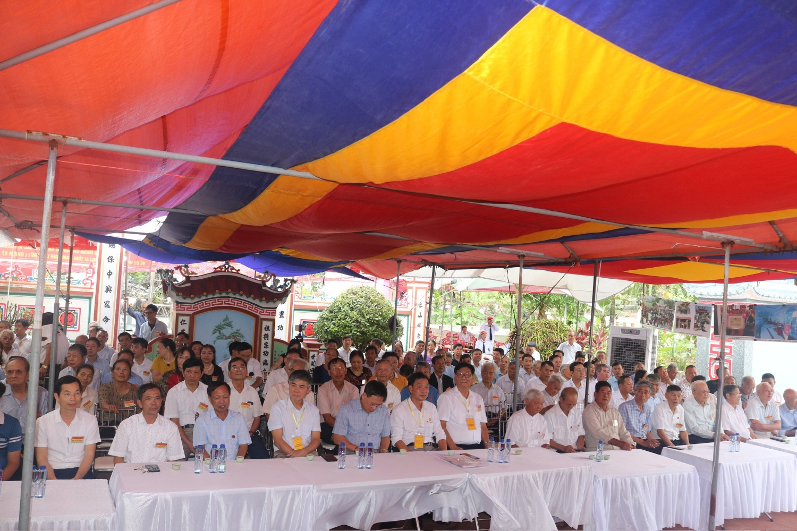

Trước khi tiến hành Đại hội, các đại biểu đã tiến hành Lễ dâng hương cung thỉnh Chư vị Tiên Tổ.

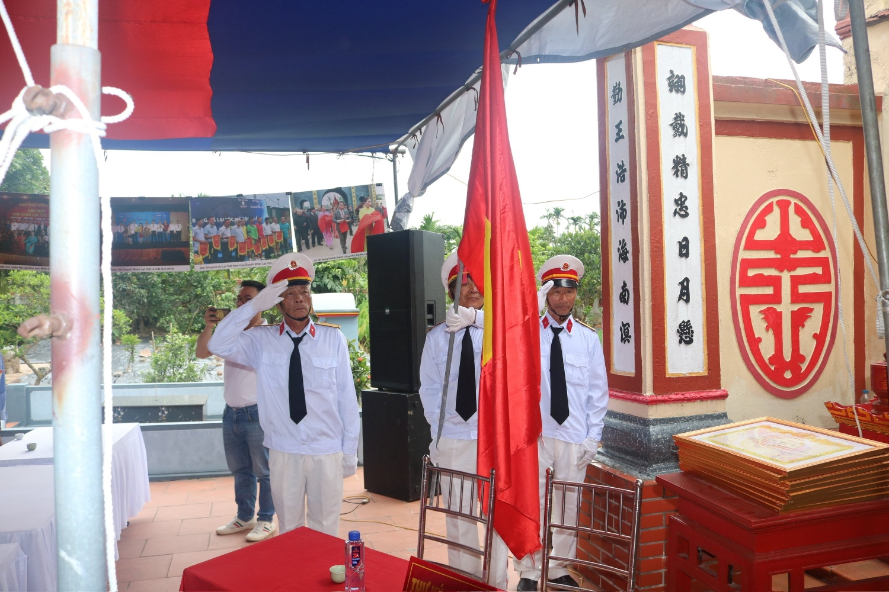

Đại hội được đón tiếp, nhận hoa và lời chúc mừng từ các Đoàn đại biểu Đại diện cho UBND xã Hải Trung, Ban di tích xã, Hội đồng gia tộc họ Lại Việt Nam,, Ban liên lạc, Ban Thông tin truyền thông họ Lại, HĐGT họ Lại Thái Bình, Hà Nam, họ Hoàng Đại tôn, họ Trần Đại tôn, họ Vũ Đại tôn, họ Phạm Đại tôn, họ Đỗ Đại tôn, Các bậc cao niên trong dòng họ, con cháu họ là Anh hùng Lực lượng Vũ Trang, Anh hùng Lao động, Sĩ quan cao cấp lực lượng VT, các doanh nhân, các cán bộ quản lý từ cấp xã, phường đến cấp trung ương.

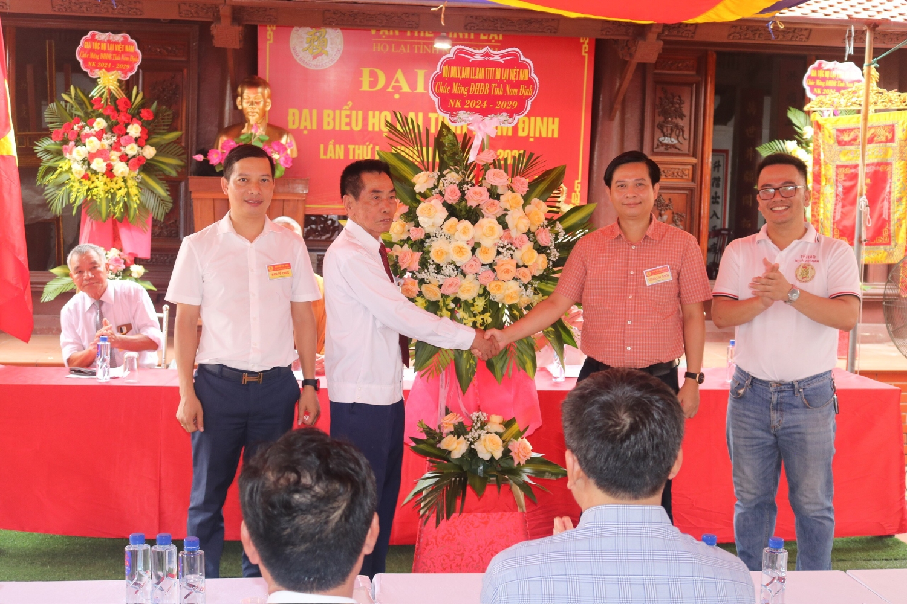

 

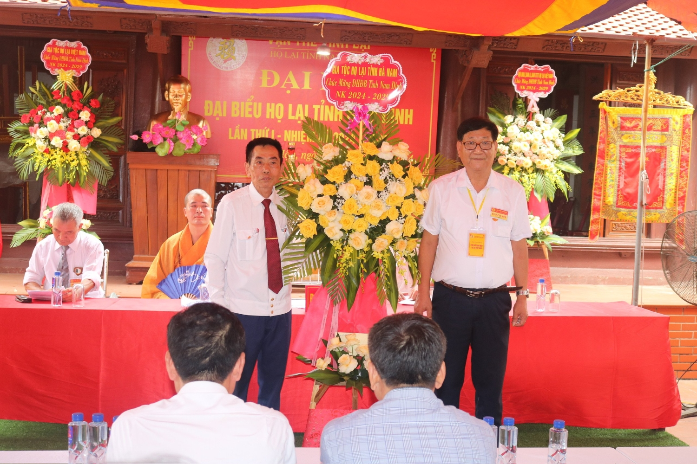

 

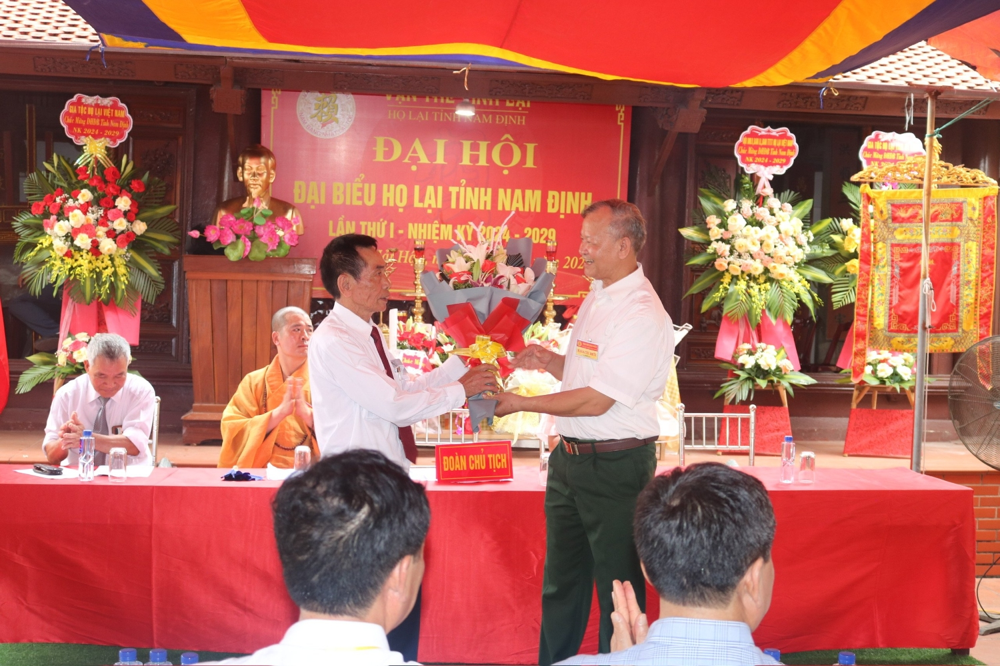

 

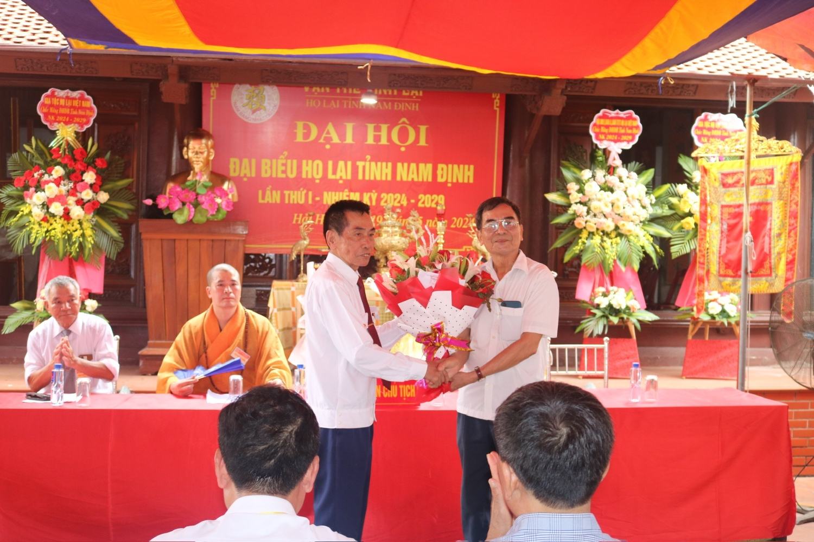

 

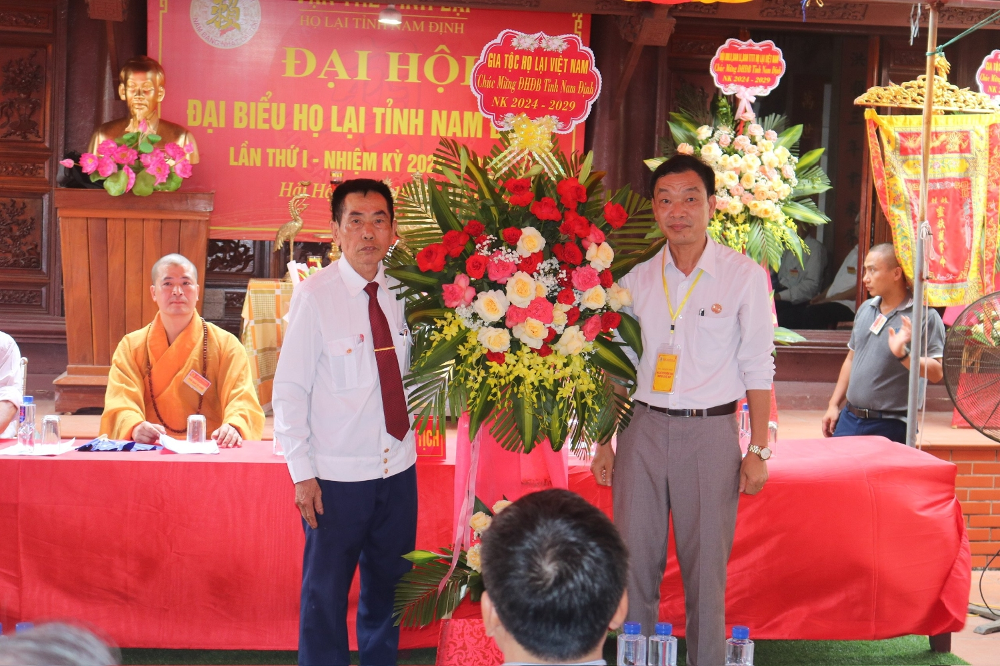

 

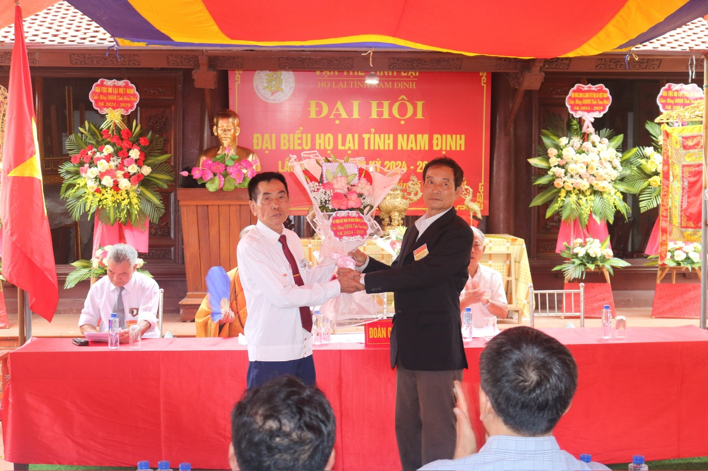

Sau diễn văn khai mạc của Đoàn chủ tịch, Đại hội đã được nghe Báo cáo Kết quả hoạt động của BCH lâm thời, Dự thảo phương hướng hoạt động của HĐGT họ Lại tỉnh Nam Định, nhiệm kỳ 2024 – 2029 do Ông Lại Văn Lịch chủ tịch HĐGT lâm thời tỉnh Nam Định trình bày.

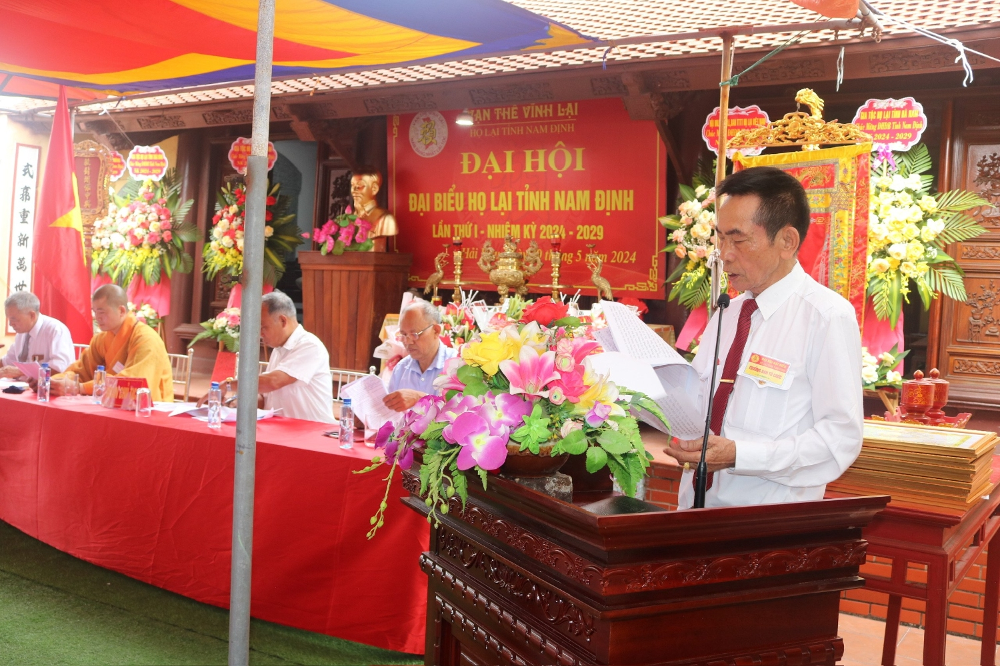

 

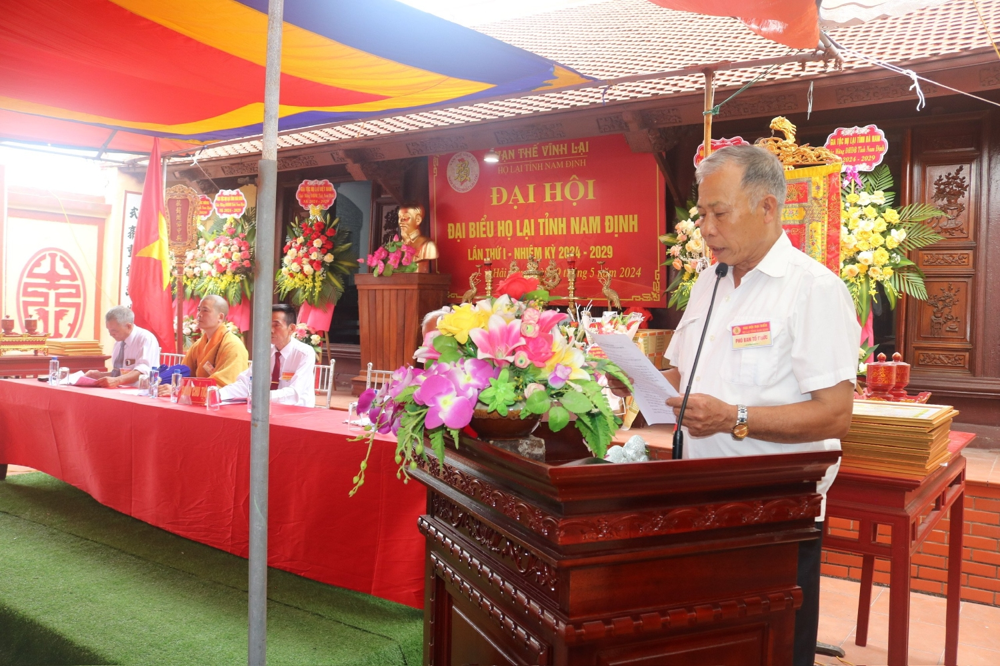

Đại hội cũng được nghe nhiều tham luận, ý kiến đóng góp quý báu của các đại biểu đến từ các chi họ nhằm xây dựng họ Lại đoàn kết, phát triển vững mạnh.  
 

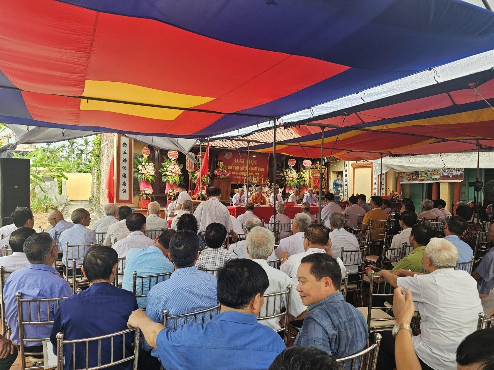

Đại hội bầu chọn cử 31 Đại biểu tham gia Hội đồng Gia tộc họ Lại tỉnh Nam Định khóa I, nhiệm kỳ 2024 – 2029, trong đó Ông Lại Văn Lịch được bầu làm Chủ tịch HĐGT họ Lại tỉnh Nam Định.  
 

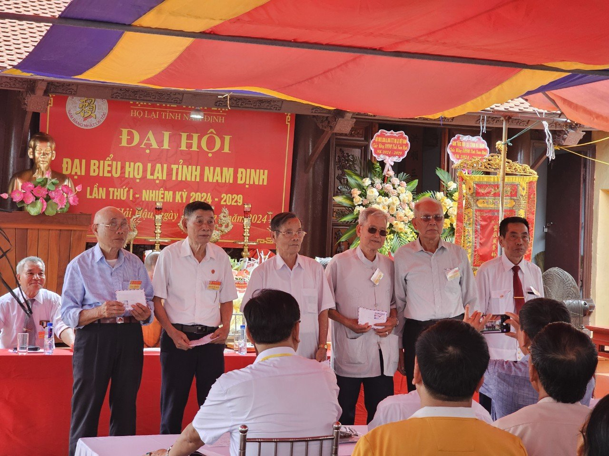

 

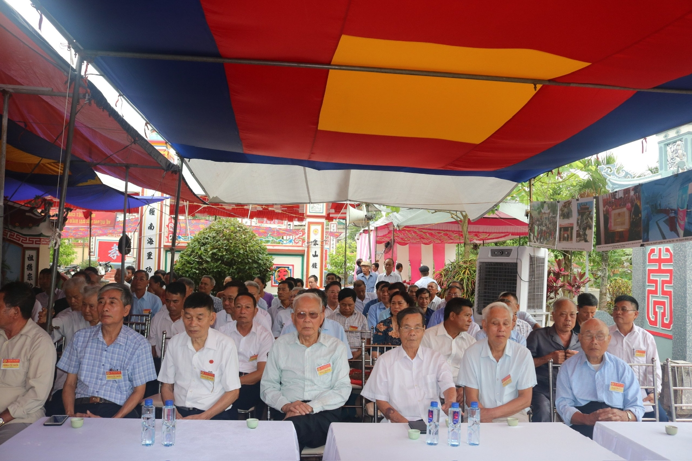

Đại hội đạt được sự nhất trí, đồng thuận cao về Nghị quyết Đại hội, Đại hội bế mạc hồi 11h 00p.

**Ban TTTT Họ Lại Việt Nam**
