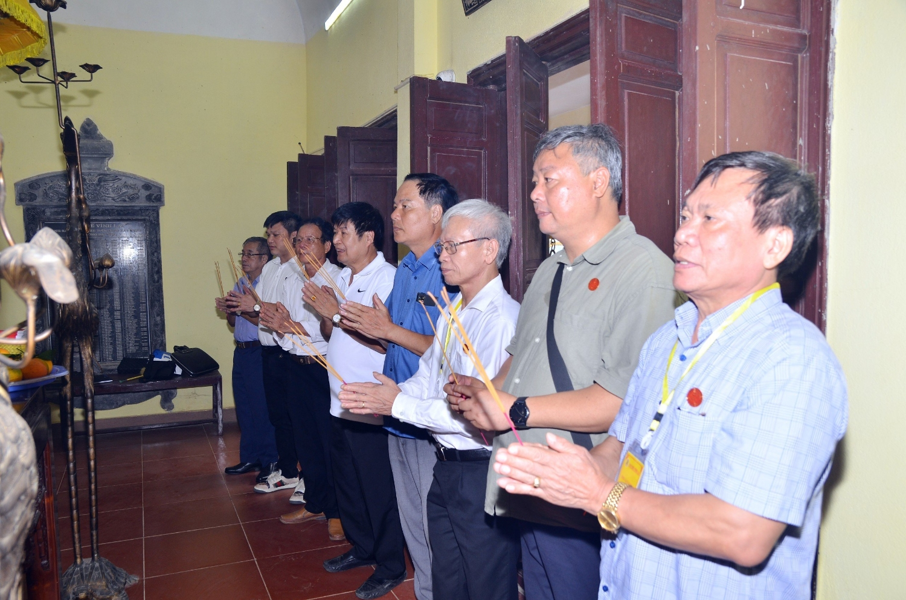
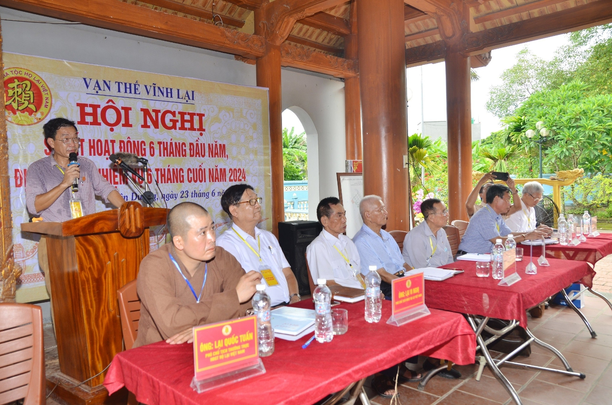
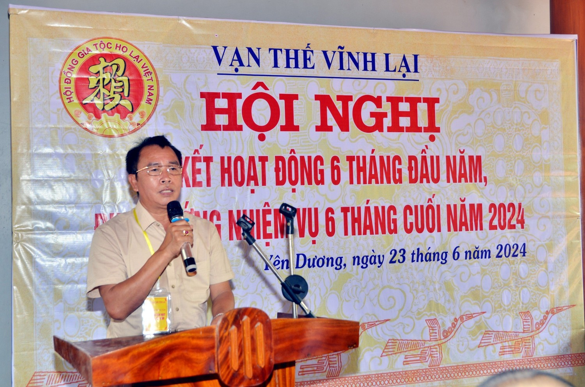
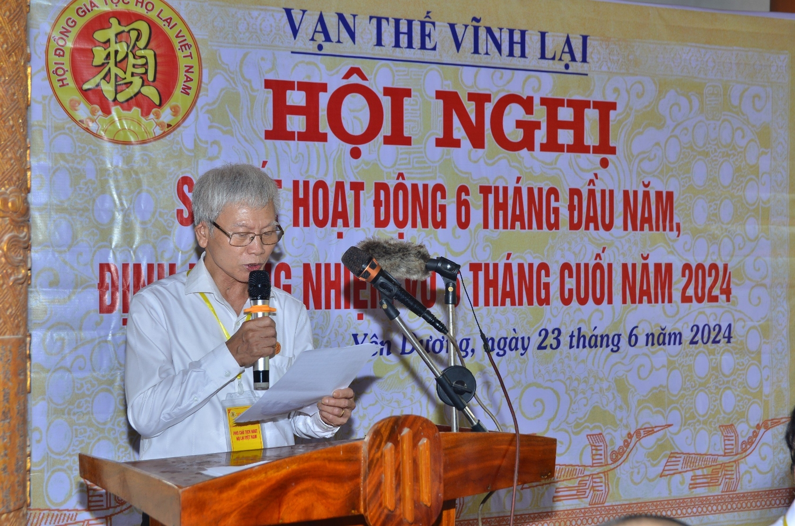
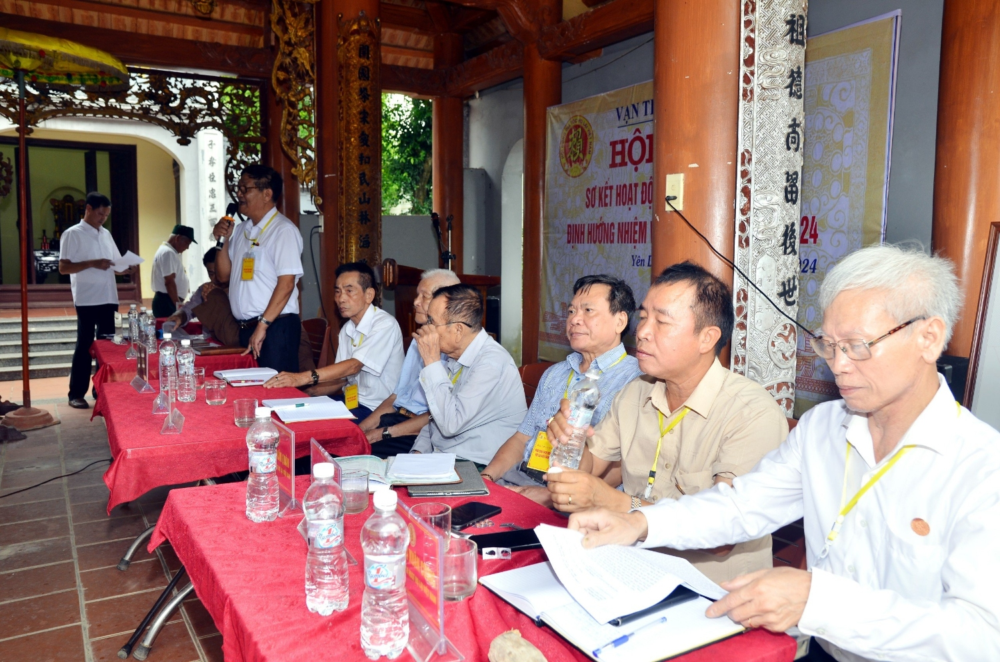
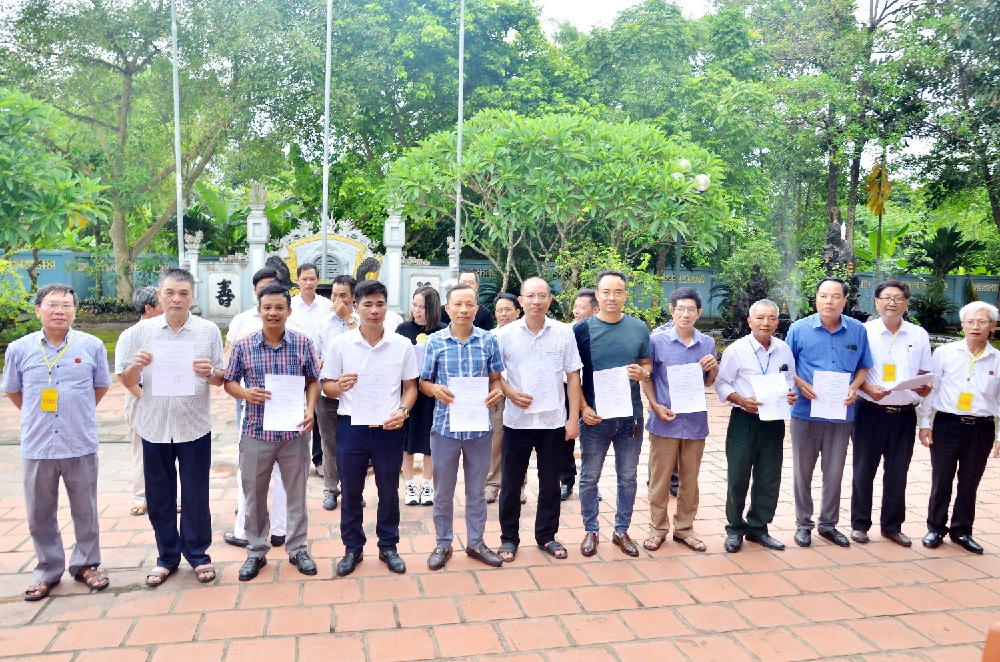
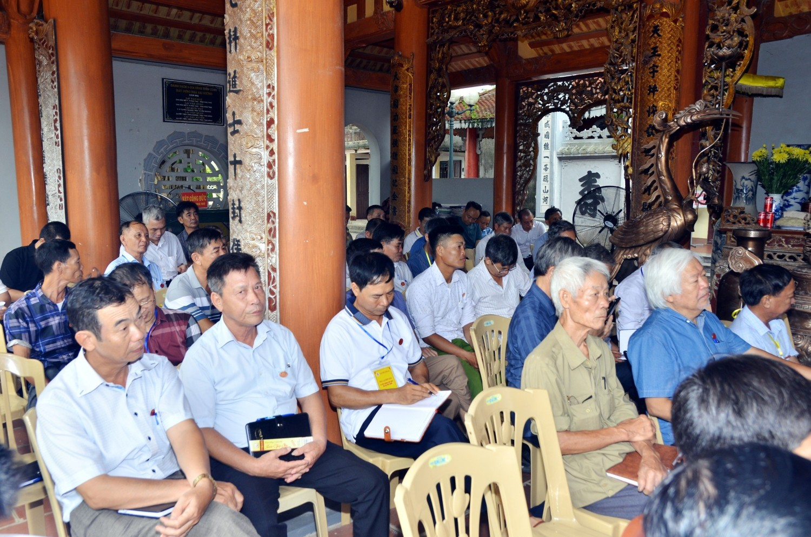

**Trước khi hội nghị diễn ra, các đại biểu vào dâng hương kính cáo tiên tổ**

 

**Ông Lại Quốc Tuấn PCTTT HĐGT phát biểu khai mạc**

**Tham dự Hội nghị bao gồm: 90 thành viên HĐGTHLVN (bao gồm 55 thành viên mới).**  
*** Đoàn Chủ tịch gồm có:**  
- Chủ tịch HĐGTHLVN Ông Lại Thế Tác  
*** 08 Phó Chủ tịch HĐGTHLVN:**  
- Ông Lại Quốc Tuấn - Phó Chú tịch thường trực HĐGTHLVN  
- Ông Lại Ngọc Thứ - Phó Chủ tịch HĐGTHLVN  
- Ông: Lại Văn Quán - Phó Chủ tịch HĐGTHLVN  
- Ông: Lại Vi Nghị - Phó Chủ tịch HĐGTHLVN  
- Ông: Lại Xuân Cương - Phó Chủ tịch HĐGTHLVN  
- Ông: Lại Trọng Tâm - Phó Chủ tịch HĐGTHLVN  
- Ông: Lại Văn Đức (Đại Đức Thích Thanh Độ) - Phó Chủ tịch HĐGTHLVN  
- Ông: Lại Văn Lịch - Phó Chủ tịch HĐGTHLVN  
***Điều hành Hội nghị là Phó Chú tịch thường trực HĐGTHLVN Lại Quốc Tuấn (được Chú tịch HĐGTHLVN Lại Thế Tác ủy quyền điều hành HN).***

*Ông Lại Trọng Tâm (PCT HĐGT - Chủ tịch Hội DN Lại Việt) lên đọc Báo cáo*

Trong buổi họp, các đại biểu đã cùng nhau đánh giá các hoạt động đã thực hiện trong 6 tháng đầu năm, đồng thời thảo luận và đưa ra phương hướng, nhiệm vụ cụ thể cho 6 tháng cuối năm. Các nội dung được thảo luận bao gồm việc tăng cường công tác kết nối, mở rộng và phát triển cộng đồng Họ Lại, cũng như các hoạt động xã hội, văn hóa và giáo dục.  
 

*Ông Lại Xuân Cương (PCT HĐGT - TB Thông tin truyền thông) Lên đọc báo cáo*

**Ông Lại Vi Nghị (TTHĐGT-CTHĐGT Họ Lại Tỉnh Hà Nam) Phát biểu**

Bên cạnh đó, hội nghị còn tổ chức trao quyết định và huy hiệu thành viên Hội đồng gia tộc cho các thành viên mới, ghi nhận và tôn vinh những đóng góp tích cực của họ trong việc phát triển cộng đồng Họ Lại, cũng như bổ sung thành viên đề cùng HĐGT phát triển phong trào của dòng họ trong thời gian tới.  
 

**HĐGT trao quyết định và huy hiệu cho các thành viên mới của HĐGT**

Ông Lại Thế Tác, Chủ tịch Hội đồng gia tộc, nhấn mạnh: "Hội đồng gia tộc Họ Lại luôn nỗ lực phấn đấu để trở thành một tổ chức mạnh mẽ và đoàn kết, hoàn thành sứ mệnh kết nối cộng đồng con cháu Họ Lại Việt Nam toàn quốc thành 1 khối thống nhất trên tinh thần NAM BANG NHẤT LẠI và VẠN THẾ VĨNH LẠI, Ông tin rằng với sự hợp tác và đóng góp của tất cả các thành viên, gia tộc Họ Lại sẽ ngày càng phát triển và vững mạnh."  
 

**Các thành viên HĐGT tham dự cuộc họp**

**Khối đại đoàn kết của HĐGT Họ Lại Việt Nam**

Hội nghị đã kết thúc thành công, mở ra những định hướng mới, hứa hẹn một nửa cuối năm 2024 với nhiều hoạt động sôi nổi và ý nghĩa, góp phần xây dựng cộng đồng Họ Lại ngày càng vững mạnh và phát triển.

**Theo Tony Lại (TBT Ban TTTT)**
