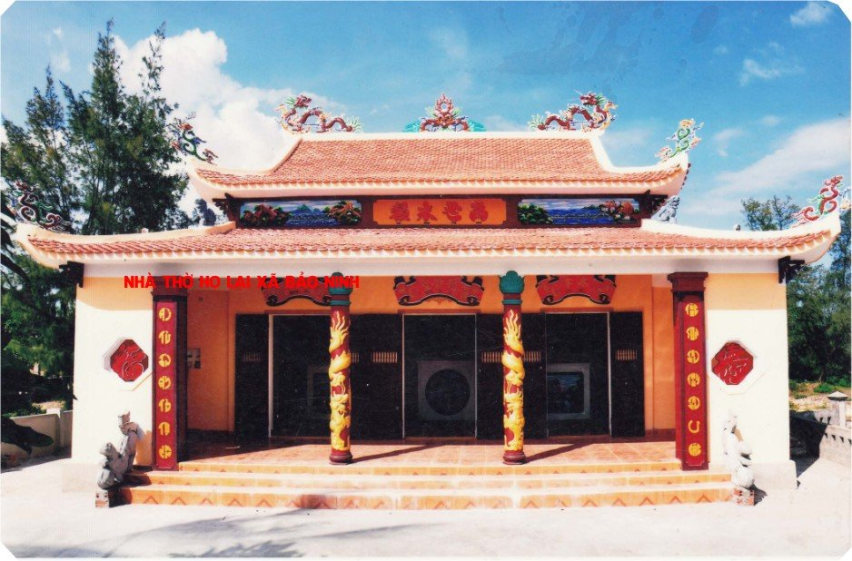
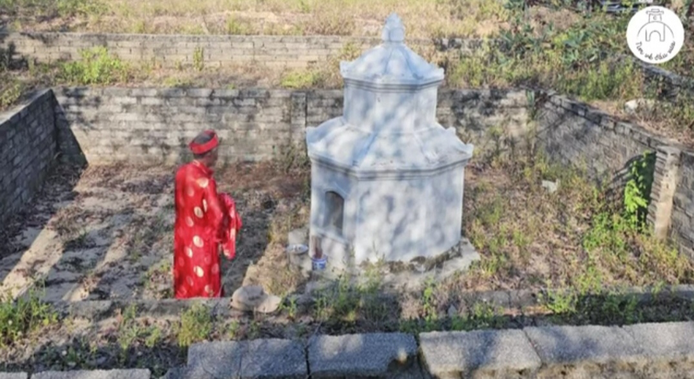
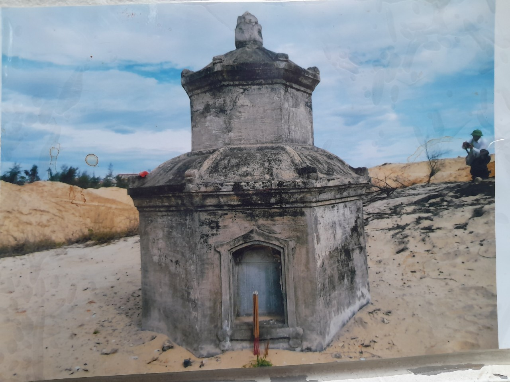
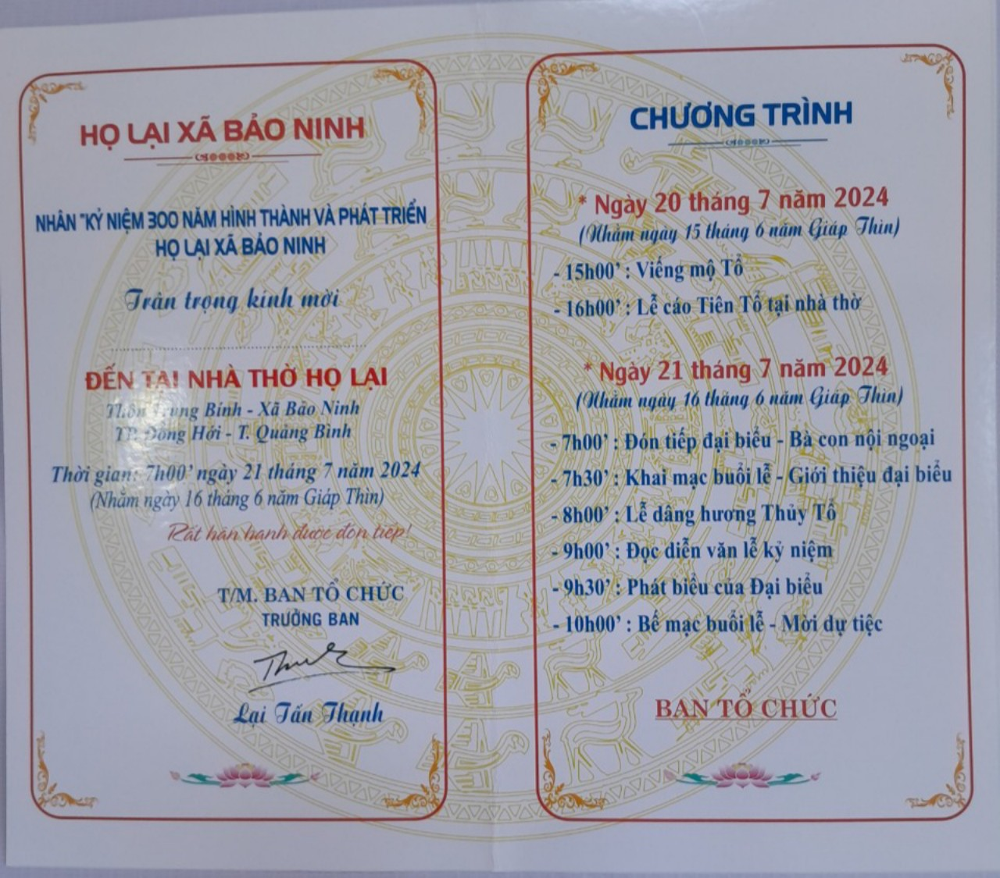

Để tưởng nhớ Thủy Tổ Lại Tấn Đá (Đời 16 tính từ đời Đức Triệu Tổ Lại Thế Tiên). Năm 1724, chúa Nguyễn Phúc Chu đã điều động quân sĩ ở các tỉnh phía Nam tỉnh Thừa Thiên ra tăng cường cho các đồn trấn thủ trên hai bờ sông nhật Lệ, trong đó có cụ Lại Tấn Đá - Thủy Tổ của dòng họ Lại xã Bảo Ninh. Cụ được điều động về đồn Sa Phụ - tiền đồn của lũy Trường Sa - đóng trên đồi cát giáp ranh giữa thôn Trung Bính và thôn Sa Động ngày nay.

**Ảnh nhờ thờ Chi Họ Lại Bảo Ninh**

Năm 1774 đồn Sa Phụ tự giải thể, tùy nghi di tản. Nhiều lính họ Lại và các họ Hoàng, Phạm, Nguyễn, Võ, Đào cùng gia đình chọn vùng đất xóm giữa của làng Trung Bính (ngày nay) làm nơi dừng chân để khai cương, lập ấp. Đến nay con cháu họ Lại xa Bảo Ninh đã phát triển đến đời thứ 15, tổ chức được 13 chi họ, sống rất thân ái và đoàn kết. Để lưu giữ công danh và sự nghiệp của tiên tổ cho đời sau nhớ và tri ân, Họ đã hoàn thành 3 công trình:  - Công trình nghiên cứu bổ sung và hoàn chỉnh Phả họ và phát về các chi họ.  - Công trình tôn tạo Lăng mộ Tổ đời thứ 2 và Lăng mộ các vị tổ chung của họ từ đời thú 3 đến đời thứ 6.  - Công trình xây Nhà thờ họ tương xứng với quy mô của họ.

**Lăng mộ cụ Lại Tấn Đá**

 

**Lăng mộ cụ: Lại Tấn Đá**

Nhân dịp đặc biệt này, Ban trị sự cùng cộng đồng con cháu Họ Lại Bảo Ninh long trọng tổ chức Lễ kỷ niệm 300 năm hình thành và phát triển họ Lại xã Bảo Ninh và kính mời tới toàn thể cộng đồng con cháu họ Lại Việt Nam về tham dự sự kiện (các thông tin theo File đính kèm).  

**Chi họ chúng tôi rất mong và hoan hỷ được đón tiếp!  
Chi tiết vui lòng liên hệ: BTC Lại Tấn Hân (0932496298)**

 

 

