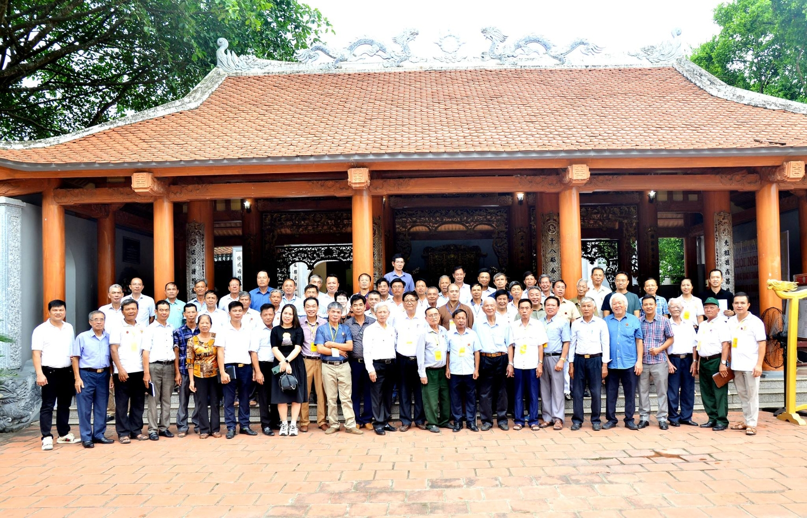

| **HỘI ĐỒNG GIA TỘC**    **HỌ LẠI VIỆT NAM**    Số: 02/2024-NQ-HĐGT | **VẠN THẾ VĨNH LẠI**    *Thanh hóa, ngày 23 tháng 6 năm 2024* |
| --- | --- |

**NGHỊ QUYẾT**  **Hội nghị sơ kết hoạt động dòng họ 6 tháng đầu năm** **2024 và** **tiếp tục triển khai những hoạt động** **của 6 tháng cuối năm**  **______________**  **HỘI ĐỒNG GIA TỘC HỌ LẠI VIỆT NAM**

*- Căn cứ Quy ước của gia tộc họ Lại Việt Nam**,*  *- Căn cứ* *Bản báo cáo* *tổng kết của* *Ban Thường trực HĐGTHLVN và các tổ chức trực thuộc HĐGTHLVN,*   *- Căn cứ Biên bản* *họp* *của* *Ban Thường trực HĐGTHLVN ngày* *23/**6/202**4.*  

Ngày 23/06/2024, vào hồi 09h00 tại Nhà thờ họ Lại Việt Nam - xã Yên Dương, huyện Hà Trung, tỉnh Thanh Hóa tổ chức Hội nghị của HĐGTHLVN sơ kết hoạt động dòng họ 6 tháng đầu năm 2024 và tiếp tục triển khai những hoạt động của 6 tháng cuối năm  **I. Thành phần tham dự** **Hội nghị:**  1. Tham dự gồm có: 87/103 thành viên HĐGTHLVN (thành viên cũ 38, thành viên mới 49); vắng mặt 16 thành viên HĐGTHLVN (thành viên cũ 10 thành viên mới 06) có lý do.  2. Đoàn chủ tịch:  - Ông Lại Thế Tác - Chủ tịch HĐGTHLVN  - Ông Lại Ngọc Thư - Phó Chủ tịch HĐGTHLVN  - Ông Lại Quốc Tuấn Phó Chú tịch thường trực HĐGTHLVN  - Ông: Lại Văn Quán - Phó Chủ tịch HĐGTHLVN  - Ông: Lại Vi Nghị - Phó Chủ tịch HĐGTHLVN  - Ông: Lại Xuân Cương - Phó Chủ tịch HĐGTHLVN  - Ông: Lại Trọng Tâm - Phó Chủ tịch HĐGTHLVN  - Ông: Lại Văn Đức (Đại Đức Thích Thanh Độ) - Phó Chủ tịch HĐGTHLVN  - Ông: Lại Văn Lịch - Phó Chủ tịch HĐGTHLVN  3. Điều hành HN: ông Lại Quốc Tuấn Phó Chú tịch thường trực HĐGTHLVN (được ông Lại Thế Tác Chú tịch HĐGTHLVN ủy quyền điều hành HN).  4. Thư ký HN:  - Lại Xuân Đức - Ủy viên Thường trực HĐGTHLVN  - Nguyễn Thùy Linh - Ủy viên Thường trực HĐGTHLVN  **II****.** **Khai mạc Hội nghị****:**  Ông Lại Quốc Tuấn Phó Chú tịch thường trực HĐGTHLVN tuyên bố lý do Hội nghị sơ kết hoạt động 6 tháng đầu năm 2024 và tiếp tục triển khai những hoạt động của 6 tháng cuối năm của HĐGTHLVN, bao gồm 5 nội dung chính:  1. Công tác tổ chức: Trao các quyết định bổ sung mới các: Phó Chủ tịch HĐGTHLVN, UV Thường trực HĐGT HLVN, thành viên HĐGT HLVN.  2. Đại diện HĐGTHLVN và các tổ chức trực thuộc HĐGTHLVN đọc báo cáo.  3. Thảo luận các báo cáo  4. Những nội dung khác  5. Kết luận Hội nghị.

**III. Diễn biến** **Hội nghị:**  **PHẦN I**

**A. Công tác tổ chức:**  Trao các quyết định bổ sung nhân sự đối với các chức danh sau:    1*.* Bổ sung 01 Phó Chủ tịch HĐGTHLVN: Ông Lại Văn Đức (Đại Đức Thích Thanh Độ).  2. Bổ sung 02 thành viên HĐGTHLVN vào Ban Thường trực HĐGT HLVN:  - Ông Lại Thành Long - tỉnh Thanh Hóa  - Ông Lại Hợp Long - tỉnh Thái Bình  3. Bố sung mới 55 thành viên HĐGT HLVN *( Có danh sách kèm theo)**.*  **B.** **Các** **Báo cáo**  **sơ** **kết hoạt động** **6 tháng đầu** **năm 202****4** **và** **tiếp tục triển khai những** **hoạt động** **của 6 tháng cuối năm**  ***1. Báo cáo của Ban Thường trực HĐGTHLVN***  Ông Lại Quốc Tuấn - Phó Chủ tịch Thường trực HĐGTHLVN trình bầy Báo cáo kết quả thực hiện 6 tháng đầu năm 2024 và tiếp tục triển khai những hoạt động của 6 tháng cuối năm của HĐGTHLVN (có BC kèm theo).  a) Kết quả thực hiện 6 tháng đầu năm 2024: dưới sự chỉ đạo của Thường trực HĐGTHLVN, các tổ chức trực thuộc HĐGTHLVN, khu vức, HĐGTHL các địa phương, Ban Trị sự, ... đã thực hiện tốt nhiệm vụ nêu tại Nghị quyết ngày 14/01/2024 của HĐGTHLVN và những quyết định của Ban Thường trực HĐGTHLVN tại các phiên họp ngày16/2/2024 và ngày 16/3/2024, cụ thể:  - Tổ chức tốt ngày giỗ Đức Triệu Tổ, rằm tháng Giêng.  - Tổ chức tốt công tác bàn giao tài sản nhà thờ họ Lại Việt Nam cho Ban Thường trực HĐGTHLVN.  - Dự, chỉ đạo thành công Hội thao Họ Lại lần thứ 5 Tỉnh Thái Bình.  - Xây dựng Nội quy tại Nhà thờ Đức Triệu Tổ Lại Thế Tiên.  - Tổng hợp, triển khai vẽ truyền thần ảnh mẹ Việt Nam anh hùng, anh Hùng Lực lượng vũ trang.  - Lắp đặt bóng đen năng lượng và lắp thêm 4 camera nhà thờ tổ.  - Ban hành Quyết định của HĐGTHLVN về việc thành lập Ban Chỉ đạo Ngày Hội Mùa Xuân lần thứ 7 năm 2025 tại Thành phố Hải Phòng.  - Thực hiện tốt việc hiếu trong dòng họ.  - Dự Ngày hội mùa xuân 2024 HL tỉnh Thái Bình lần thứ nhất.  - Tham gia tổ chức lễ giỗ Tổ và khánh thành Lăng mộ chi họ Lại Quỳnh Giang – Nghệ An.  - Dự Đaị hội Đại biểu HĐGTHL tỉnh Nam Định lần thứ nhất.  - Gặp gỡ các chi họ Lại tỉnh Thanh Hóa.  b) Hạn chế:  - Chưa tìm được nguồn tài chính để trả nợ.  - Chưa chuyển đổi tài sản đất sang tên Nhà thờ Họ Lại Việt Nam.  - Công tác xây dựng nhà Truyền thống còn chậm.  c) Triển khai nhiệm vụ 6 tháng cuối năm 2024:  - Tiếp tục chỉ đạo HĐGTHL các tỉnh, thành phố, khu vực và các chi họ, Ban Trị sự, ... quan tâm, động viên con cháu tích cực tham gia các hoạt động vì tình đoàn kết trong dòng họ.  - Hoàn thiện nội dung tổ chức Đại hội Đại biểu HĐGTHLVN lần thứ nhất, như công tác tổ chức, văn kiện Đại hội, công tác hậu cần, .... Đại hội dự kiến tổ chức vào tháng 2/2025 (âm lịch).  - Xây dựng Kế hoạch Phả số: trước hết đề nghị các HĐGTHL các tỉnh, thành phố, khu vực và các chi họ, Ban Trị sự, ... gửi đến Ban Thường trực HĐGTHLVN những tài liệu liên quan đến Phả, Phả (Phả cổ, chữ Hán Nôm hay Phả chữ quốc ngữ) để Ban Thường trực HĐGTHLVN thuê dịch, tổng hợp, chuẩn bị cho việc tu Phả lần kế tiếp, theo quy định tại Quy ước Gia tộc HLVN.  d) Chỉ đạo thực hiện những việc phát sinh khác.  ***2.*** ***Báo cáo*** ***của*** ***Ban*** ***Thông tin -*** ***truyền thông*** ***h******ọ Lại Việt Nam*** ***(Ban TTTT)******.***  Ông Lại Xuân Cương - Phó Chủ tịch HĐGTHLVN trình bầy báo cáo hoạt động của Ban TTTT (có BC kèm theo).  a) Những kết quả thực hiện 6 tháng đầu năm 2024, Ban đã tổ chức, triển khai thực hiện tốt những hoạt động, những sự kiện diễn ra trong năm 2024 theo chỉ đạo của HĐGTHLVN và theo chức năng, nhiệm vụ, quyền hạn của Ban, cụ thể:  Ban TTTT đã chủ động lên kế hoạch năm cho công tác biên tập - thông tin - truyền thông, như: biên tập các văn bản, ban hành Nghị quyết của HĐGTHLVN, thông báo nội dung Nghị quyết họp ngày 14/01/2024 và 36 bài truyền thông đến tửng thành viên dòng họ để biết, triển khai thực hiện; xóa bỏ gần 100 bài quảng cáo và Spam trong group. Chủ động xây dựng kịch bản về thông tin truyền thông những sự kiện diễn ra của dòng họ Lại VN trước, trong ngày Giỗ Tổ; phối hợp với các tổ chức thuộc HĐGTHLVN, HĐGT họ Lại tại các tỉnh, thành phố, khu vực và các chi họ, Ban Trị sự, ... để tổ chức, thực hiện thành công Hội Thao họ Lại lần thứ 5 năm 2024 tại tỉnh Thái Bình; đẩy mạnh truyền thông việc chuẩn bị cho năm 2025 như, Đại hội của HĐGTHLVN lần thứ nhất và Ngày hội mùa xuân họ Lại VN lần thứ 7 tại TP Hải Phòng; đồng thời tuyên thông những sự kiện lớn diễn ra đối với HĐGTHL tỉnh Thái Bình, tỉnh Nam Định; ...  b) Triển khai nhiệm vụ 6 tháng cuối năm 2024, cụ thể:  - Tiếp tục triển khai thực hiện nhiệm vụ năm 2024 theo Nghị quyết, kế hoạch đề ra của HĐGTHLVN và đẩy mạnh công tác truyền thông trong những tháng cuối năm 2024.  - Tăng cường các biện pháp quản lý các kênh thông tin truyền thông của dòng họ.   - Triển khai kiện toàn tổ chức Ban TTTT theo chỉ đạo của HĐGTHLVN.  - Tìm các biện pháp tháo gỡ khó khăn để có kinh phí chi trả tên miền, hosting, bảo trì website, nhuận bút cho các cộng tác viên viết bài đưa tin và tổ chức các chương trình, các cuộc thi phát triển hình ảnh dòng họ, ...  ***3.*** ***Báo cáo*** ***của***  ***Hội doanh nhân*** ***Lại Việt***  Ông Lại Trọng Tâm chủ tịch Hội doanh nhân Lại Việt trình bầy báo cáo hoạt động của Hội doanh nhân Lại Việt (có BC kèm theo).  a) Những kết quả thực hiện 6 tháng đầu năm 2024, Hội đã tổ chức, triển khai thực hiện tốt những hoạt động, những sự kiện diễn ra trong năm 2024 theo chỉ đạo của HĐGTHLVN và theo chức năng, nhiệm vụ, quyền hạn của Hội, cụ thể:  - Tiếp tục kết nạp Thành viên mới, triển khai công tác xúc tiến đầu tư theo kế hoạch.  - Xây dựng Bản tin xúc tiến thương mại để hỗ trợ các doanh nghiệp giới thiệu công ty và sản phẩm kinh doanh.  - Phối hợp với các tổ chức thuôc HĐGTHLVN, HĐGTHL tỉnh Thái Bình tổ chức thành công Hội thao lần thứ 5 tại tỉnh Thái Bình; đồng thời kêu gọi tài trợ cho Hội thao này 77.200.000 vnđ, trong đó các thành viên Hội là 56.500.000 vnđ.  - Tổ chức Đoàn về dâng hương: ngày giỗ Đức Triệu Tổ Lại Thế Tiên, Đền thờ, Lăng mộ cụ Thái Tế Khiêm Quốc Công Lại Thế Khánh (tỉnh Ninh Bình).  - Tham dự Hội nghị của HĐGTHL TP Hải Phòng chuẩn bị cho tổ chức Ngày Hội mùa Xuân HLVN lần thứ 7, năm 2025 tại Hải Phòng và dự Đại Hội đại biểu HĐGTHL tỉnh Nam Định ngày 19/5/2024.  b) Triển khai nhiệm vụ 6 tháng cuối năm 2024, cụ thể:  Tiếp tục triển khai thực hiện nhiệm vụ năm 2024 theo Nghị quyết, kế hoạch đề ra của HĐGTHLVN và đẩy mạnh công tác phát triển Thành viên mới, tăng cường giao lưu, kết nối giữa các doanh nghiệp Lại Việt.  ***4.*** ***Báo cáo*** ***của Ban*** ***tài chính***  Ông Lại Xuân Đức - Ủy viên Ban Thường trực HĐGTHLVN thay mặt Ban Tài chính báo cáo tài chính 6 tháng đầu năm 2024 của HĐGTHLVN (có BC kèm theo).  Đến nay nguồn thu chưa đáp ứng được những chi phí cần thiết cho những hoạt động dòng họ, nhất là khoản nợ cho các nhà thầu.  ***5. Q******uy hoạch tổng th******ể***  ***N******hà thờ*** ***Đức Triệu Tổ Lại Thế Tiên***  - Ông Lại Đăng Giỏi - Thành viên HĐGTHLVN: trình bày Bản Quy hoạch tổng thể Nhà thờ Đức Triệu Tổ Lại Thế Tiên *(N**hà thờ HLVN**)*

**PHẦN II**  **NHỮNG Ý KIẾN THAM LUẬN TẠI HỘI NGHỊ**

Các ý kiến của các ông thuộc Đoàn Chủ tịch Hội nghị và một số thành viên HĐGT tham dự Hội nghị về nội dung các báo cáo trình bầy tại Hội nghị:  1. Các ý kiến đã cơ bản thống nhất với nội dung các báo cáo đã trình bầy tại Hội nghị như kết quả thực hiện Nghị quyết, Quyết định, Kế hoạch thực hiện của HĐGTHLVN, cũng như chỉ đạo của Thường trực HĐGTHLVN đề ra cho năm 2024. Báo cáo đã chỉ ra những khó khăn, các biện pháp khắc phục của 6 tháng đầu năm 2024;  2. Những ý kiến cụ thể cho việc triển khai nhiệm vụ 6 tháng cuối năm 2024:  Kế hoạch làm phả số; xây dựng kịch bản chuẩn bị cho Đại hội lần thứ nhất HLVN; việc thành lập Ban cố vấn HĐGTHLVN; công tác tổ chức nên trẻ hóa đội ngũ thành viên HĐGTHLVN; Ban TTTT nghiên cứu in tạp chí dòng họ; huy động kinh phí cho hoạt động dòng họ; có triển khai xây dựng Nhà Thờ Tổ theo Quy hoạch mới không; giải pháp ngăn chặn những thông tin trên mạng xã hội trái với lịch sư, Phả; thời điểm Đại hội Đại biểu HĐGTHLVN lần thứ nhất 2025 trước hay sau thời điểm tổ chức Ngày Hội Mùa Xuân HLVN 2025 tại TP Hải Phòng và huy động kinh phí cho 2 sự kiện này như thế nào.  3. Một số nội dung đề xuất khác như: Tiếp tục truyền thần miễn phí ảnh các Bà mẹ VNAH, anh Hùng Lực lượng vũ trang thuộc dòng họ Lại VN; về việc gửi những tài liệu liên quan đến Phả, Phả (Phả cổ, chữ Hán Nôm hay Phả chữ quốc ngữ) đến Ban Thường trực HĐGTHLVN để Ban thuê dịch, tổng hợp, chuẩn bị cho việc tu Phả lần kế tiếp, theo quy định tại Quy ước Gia tộc HLVN.

**PHẦN III**  **QUYẾT NGHỊ**

1.  HĐGTHLVN tiếp tục chỉ đạo triển khai nhiệm vụ 6 tháng cuối năm 2024 như Nghị quyết, Quyết định, Kế hoạch thực hiện của HĐGTHLVN đề ra, bao gồm những nhiệm vụ nêu trong báo cáo của Ban Thường trực HĐGTHLVN và các tổ chức trực thuộc HĐGTHLVN.  2. HĐGTHLVN đồng ý triển khai thực hiện các nhiệm vụ cụ thể sau:  Kế hoạch làm phả số; xây dựng kịch bản chuẩn bị cho Đại hội lần thứ nhất HĐGTHLVN; công tác tổ chức nên trẻ hóa đội ngũ thành viên HĐGTHLVN; huy động kinh phí cho hoạt động dòng họ; giải pháp ngăn chặn những thông tin trên mạng xã hội trái với lịch sử, Phả; huy động kinh phí cho sự kiện Đại hội Đại biểu HĐGTHLVN lần thứ nhất 2025 và Ngày Hội Mùa Xuân HLVN 2025 tại TP Hải Phòng.  Giao Ban Thường trực HĐGTHLVN chỉ đạo các tổ chức thuộc HĐGTHLVN, cũng như HĐGTHL các địa phương triển khai thực hiện cụ thể những nội dung trên theo chức năng nhiệm vụ nêu tại Quy ước Gia tộc HLVN và các quy định khác.  3. HĐGTHLVN Quyết định tổ chức Đại hội Đại biểu HĐGTHLVN lần thứ nhất 2025 sau thời điểm tổ chức Ngày Hội Mùa Xuân HLVN 2025 tại TP Hải Phòng, như đề nghị của HĐGTHL thành phố Hải Phòng.  Giao Ban Thường trực HĐGTHLVN chỉ đạo các tổ chức thuộc HĐGTHLVN, phối hợp với HĐGTHL thành phố Hải Phòng và các Tiểu Ban thuộc Ban Thường trực HĐGTHLVN triển khai thực hiện cụ thể hai sự kiện này.  4. HĐGTHLVN không đồng ý thành lập Ban cố vấn HĐGTHLVN;  5. HĐGTHLVN ghi nhận và đánh gia cao Bản Quy hoạch tổng thể Nhà thờ Đức Triệu Tổ Lại Thế Tiên *(N**hà thờ HLVN**)* do ông Lại Đăng Giỏi - Thành viên HĐGTHLVN xây dựng, trình bày tại Hội nghị. Tuy nhiên, HĐGTHLVN chưa đồng ý triển khai ngay việc xây dựng Nhà Thờ Tổ theo Quy hoạch mới.  6. HĐGTHLVN đề nghị các HĐGTHL các tỉnh, thành phố, khu vực và các chi họ, Ban Trị sự các chi họ Lại Việt Nam:  - Gửi những tài liệu liên quan đến Phả, Phả (Phả cổ, chữ Hán Nôm hay Phả chữ quốc ngữ) đến Ban Thường trực HĐGTHLVN để Ban thuê dịch, tổng hợp, chuẩn bị cho việc tu Phả lần kế tiếp, theo quy định tại Quy ước Gia tộc HLVN;  - Gửi danh sách kèm theo ảnh của các Bà mẹ VNAH, anh Hùng Lực lượng vũ trang về Ban Thường trực HĐGTHLVN để tổng hợp, có KH truyền thần miễn phí.  7. Giao Ban TTTT soạn thảo văn bản thông báo, đăng trên trang Website: http://holaivietnam.com của dòng họ nội dung Nghị quyết này để các chi họ Lại trên toàn quốc và nước ngoài biết, thực hiện.  Hội nghị biểu quyết bằng hình thức giơ tay và 100% đại biểu nhất trí với 7 nội dung nêu trên.

 

| ***Nơi nhận:***    - Chủ tịch, các PCT, các TVHĐGTHLVN,    - Ban TTrHĐGTHLVN (để chỉ đạo),    - Các tổ chức thuộc HĐGTHLVN, HĐGTHL các địa phương, khu vực và các chi họ, Ban Trị sự, ... (để biết, thực hiện),    - Lưu. | *Thanh Hóa, ngày* *23 tháng* *6 năm 2024*			**TM. HĐGTHLVN**    **KT. CHỦ TỊCH**    **PCT THƯỜNG TRỰC**    *(Đã ký)*        **Lại Quốc** **Tuấn** |
| --- | --- |
