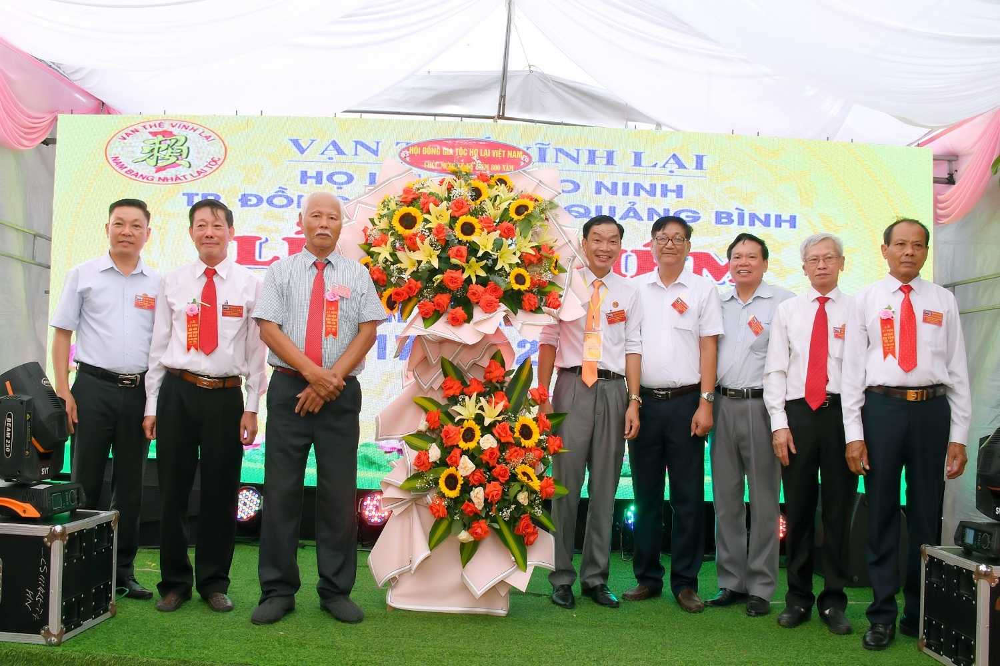
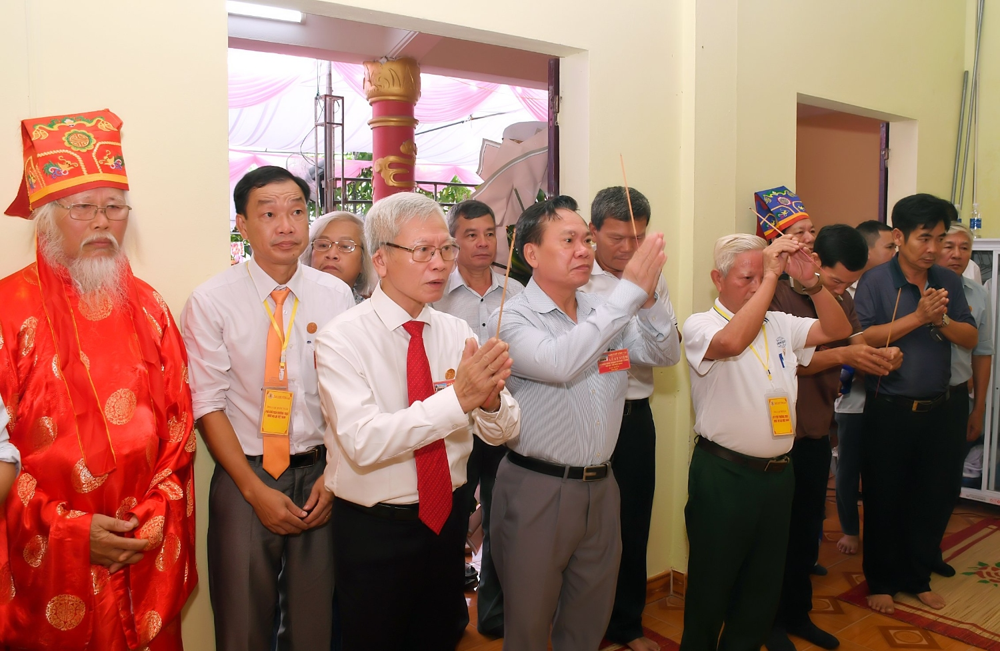
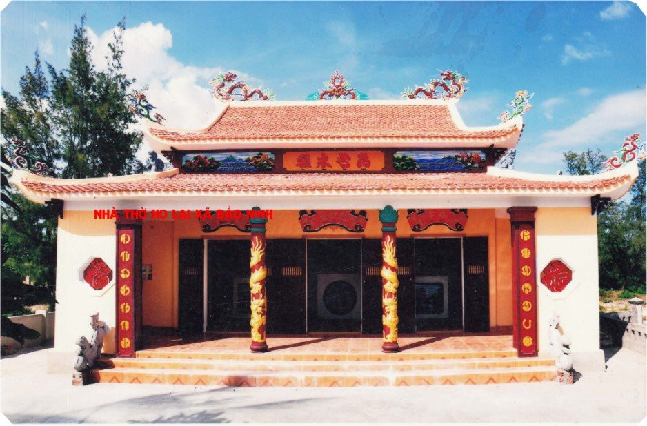
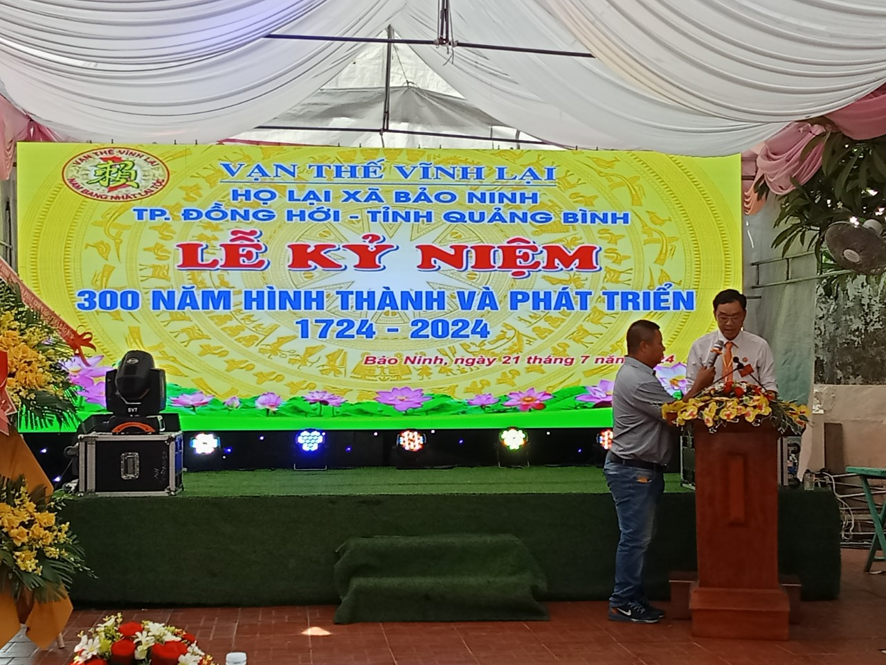
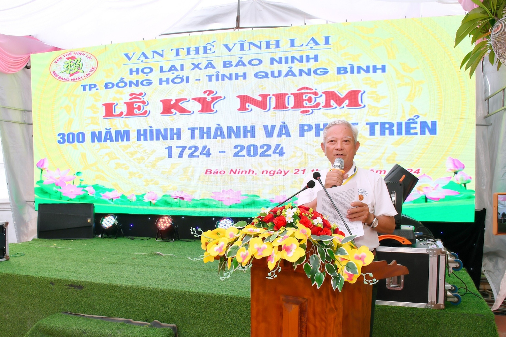
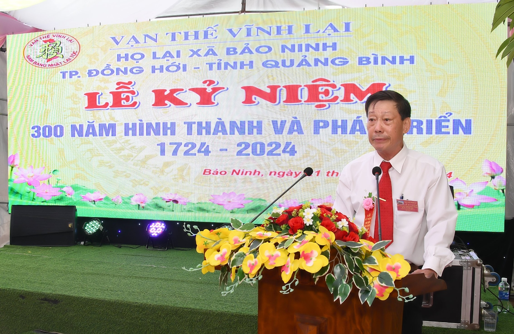
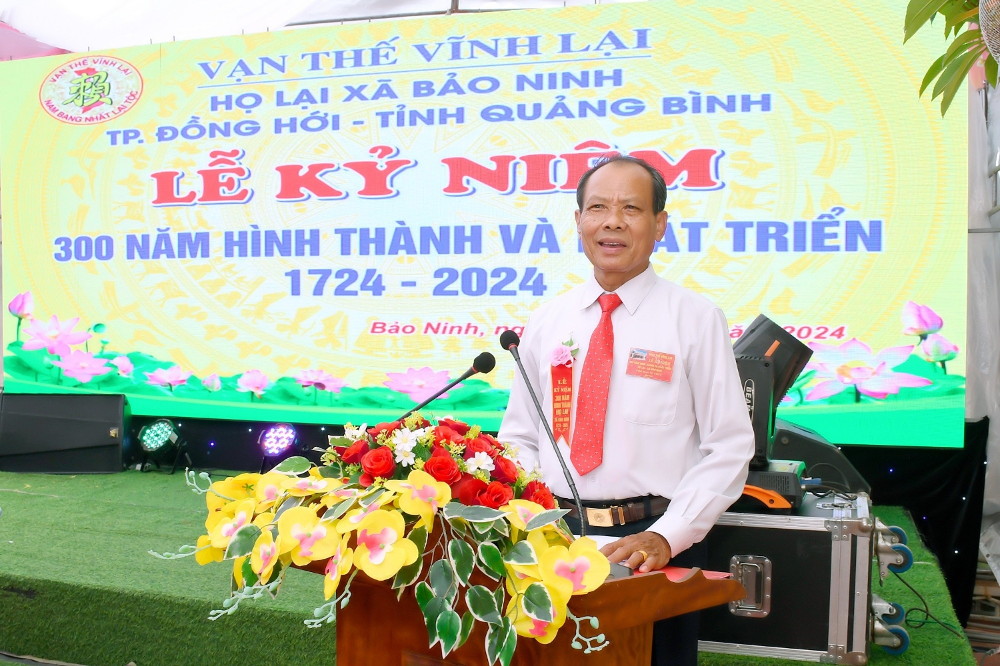
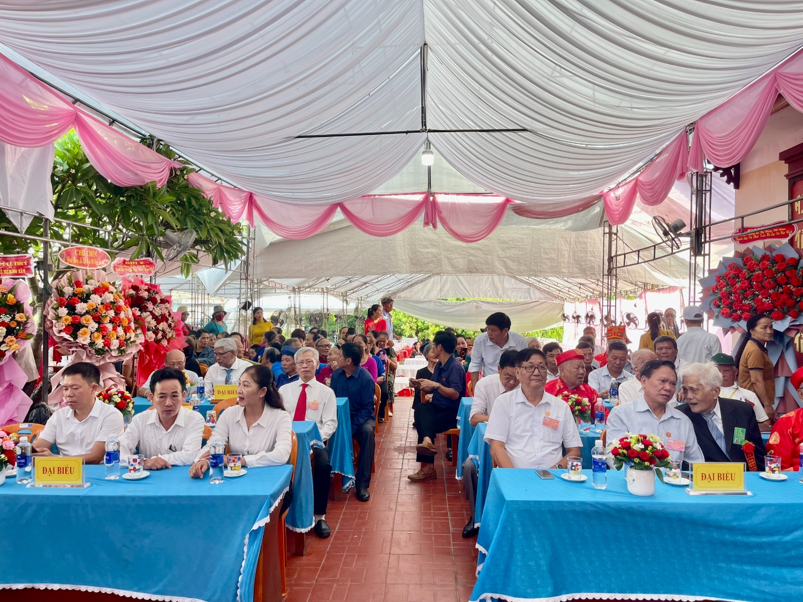

**Đoàn Đại biểu Hội đồng Gia tộc họ Lại Việt Nam đã đến dâng hương tại Nhà thờ Thủy Tổ Lại Tấn Đá (Đời 16 tính từ đời Đức Triệu Tổ Lại Thế Tiên)**

**Nhà Thờ Thủy Tổ Lại Tấn Đá (Đời 16 tính từ đời Đức Triệu Tổ Lại Thế Tiên) tại xã Bảo Ninh - thành phố Đồng Hới, tỉnh Quảng Bình.**

Đại biểu về tham dự Lễ ký niệm nêu trên, gồm có:  - Đoàn của HĐGTHLVN: Trưởng Đoàn ông Lại Quốc Tuấn Phó Chủ tịch thường trực HĐGTHLVN; các thành viên bao gồm các ông PCT. HĐGTHLVN: Lại Vi Nghị, Lại Xuân Cương, Lại Văn Quán, Lại Huy Quân; Các ông trong Ban Thường trực HĐGTHLVN: Lại Thế Kim, Lại Xuân Tôn, Lại Thế Ba, Lại Thế Sáu và TV. HĐGTHLVN: ông Lại Văn Thành.

**Đoàn Đại biểu Hội đồng Gia tộc họ Lại Việt Nam tặng hoa BTC**

- Đại biểu đại diện địa phương: Đảng Ủy, HĐND, UBND, UBMTTQ xã Bảo Ninh; Cấp ủy, Ban CTMT thôn Trung Bính; 05 Họ (họ Hoàng, họ Phạm, họ Võ, họ Đào, họ Nguyễn), thôn Trung Bính;   - 13 chi họ Lại thuộc Ban Điều hành họ Lại xã Bảo Ninh; các cụ, ông, bà, anh em, con cháu nội, ngoại họ Lại xã Bảo Ninh trong nước và nước ngoài về dự.   Chương trình Lễ ký niệm 300 năm hình thành và phát triển cộng đồng con cháu họ Lại tại xã Bảo Ninh - thành phố Đồng Hới, tỉnh Quảng Bình đã được tổ chức long trọng.  Sau Bài khai mạc Lễ ký niệm do ông Lại Tấn Hân trình bày, là Bài Diễn văn Lễ ký niệm 300 năm hình thành và phát triển cộng đồng con cháu họ Lại tại xã Bảo Ninh - thành phố Đồng Hới, tỉnh Quảng Bình, do ông Lại Tấn Thịnh trình bày.  Tại Lễ ký niệm này, được sự ủy quyền của Chủ tịch Lại Thế Tác, thay mặt HĐGTHLVN, ông Lại Quốc Tuấn Phó Chủ tịch thường trực HĐGTHLVN đã có bài phát biểu chúc mừng, ghi nhận quá trình hình thành, phát triển, sự gắn kết 13 chi họ Lại mà Ban Điều hành họ Lại xã Bảo Ninh dựng xây qua các thời kỳ thăng trầm, phát triển của lịch sử họ Lại xã Bảo Ninh và có đề nghị thời gian đến những hoạt động của Ban Điều hành họ Lại xã Bảo Ninh cần được gắn kết với những hoạt động của HĐGTHLVN tích cực hơn nữa để phát triển dòng họ.

**ông Lại Quốc Tuấn – PCTTTr HĐGTHLVN phát biểu**

**ông Lại Thế Kim – Trưởng Ban Liên Lạc họ Lại miền Trung phát biểu**

**ông Lại Tấn Thạnh – Trưởng Ban điều hành họ Lại xã Bảo Ninh trình bầy Bài Diễn văn Lễ Kỷ niệm**

**Lại Tấn Hân – Phó trưởng Ban Điều hành họ Lại xã Bảo Ninh trình bầy Bài Diễn văn khai mạc Lễ Kỷ niệm**

**Toàn cảnh buổi lễ**

Kết thúc Lễ ký niệm 300 năm hình thành và phát triển cộng đồng con cháu họ Lại tại xã Bảo Ninh - thành phố Đồng Hới, tỉnh Quảng Bình, ông Lại Tấn Thạnh – Trưởng Ban tổ chức Lễ Ký niệm thay mặt Ban Điều hành họ Lại xã Bảo Ninh đã có Bài cảm ơn :  
 

**BÀI CÁM ƠN CỦA BAN ĐIỀU HÀNH HỌ LẠI XÃ BẢO NINH, THÀNH PHỐ ĐỒNG HỜI, TỈNH QUẢNG BÌNH**

Kính gửi:   - Đoàn Đại biểu của HĐGTHLVN;  - Các ông, bà đại diện: Đảng Ủy, HĐND, UBND, UBMTTQ xã Bảo Ninh; Cấp ủy, Ban CTMT thôn Trung Bính; 05 Họ (họ Hoàng, họ Phạm, họ Võ, họ Đào, ho Nguyễn), thôn Trung Bính;   - 13 chi họ Lại thuộc Ban Điều hành họ Lại xã Bảo Ninh; các cụ, ông, bà, anh em, con cháu nội, ngoại họ Lại xã Bảo Ninh trong nước và nước ngoài.   Ngày 21 Tháng 7 Năm 2024 (Nhằm ngày 16 tháng 6 năm Giáp Thìn), tại xã Bảo Ninh, thành phố Đồng Hới, tỉnh Quảng Bình, Ban Điều hành họ Lại xã Bảo Ninh đã được đón tiếp các vị Đại biểu, khách quý và các cụ, ông, bà, anh em, con cháu nội, ngoại họ Lại xã Bảo Ninh trong nước và nước ngoài về dự Lễ Kỷ niệm 300 năm hình thành và phát triển họ Lại xã Bảo Ninh, thành phố Đồng Hới, tỉnh Quảng Bình. Sự hiện diện của các quý vị là niềm vinh dự đối với Ban tổ chức và thành công của Lễ Kỷ niệm.  Ban Tổ chức Lễ Kỷ niệm 300 năm hình thành và phát triển họ Lại xã Bảo Ninh, thành phố Đồng Hới, tỉnh Quảng Bình xin chân thành cảm ơn sâu sắc đến HĐGT họ Lại Việt Nam; Ban Liên lạc họ Lại miền Trung; các ông, bà đại diện: Đảng ủy - HĐND - UBND - UBMTTQVN xã Bảo Ninh, Lãnh đạo thôn Trung Bính, 05 họ gốc thôn Trung Bính, 13 chi họ Lại thuộc Ban Điều hành họ Lại xã Bảo Ninh; các cụ, ông, bà, anh em, con cháu nội, ngoại họ Lại xã Bảo Ninh trong nước và nước ngoài đã về dự Lễ Kỷ niệm.   Cảm ơn các tập thể, gia đình và cá nhân đã tặng hoa chúc mừng, ủng hộ một phần kinh phí, vật chất cho Lễ kỷ niệm được long trọng, thành công tốt đẹp.  Kính chúc quý vị Đại biểu, khách quý và các cụ, ông, bà, anh em, con cháu nội, ngoại họ Lại xã Bảo Ninh trong nước và nước ngoài mạnh khỏe, bình an, hạnh phúc, thành công trong cuộc sống./.

 **TM.** **BAN ĐIỀU HÀNH HỌ LẠI XÃ BẢO NINH**   **TRƯỞNG BAN** **TỔ CHỨC**  

 **Lại Tấn Thạnh**  

 

[Bài diễn văn tại Lễ kỷ niệm 300 năm hình thành và phát triển Họ Lại Xã Bảo Ninh, Thành Phố Đồng Hới, Quảng Bình.](https://drive.google.com/drive/folders/1wLA1TgV23-s2QdcMQKT96xHEjbk2X-me)
