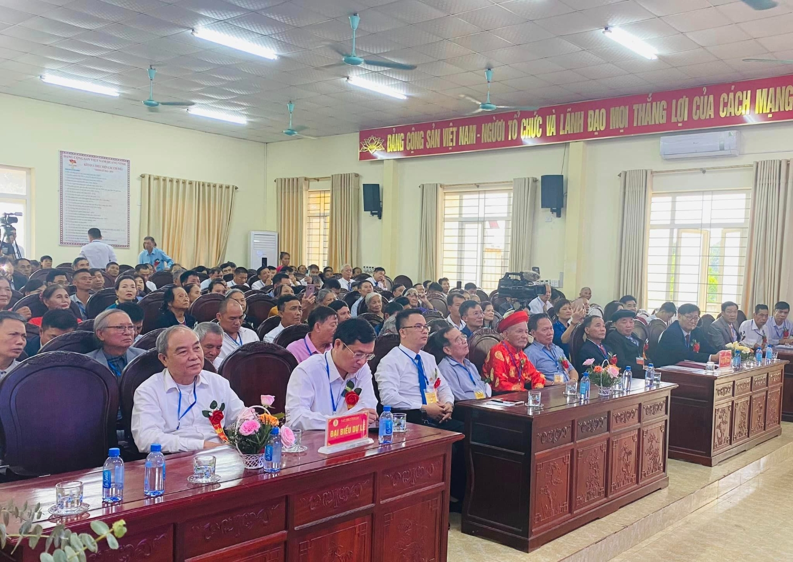

Tham dự Đại hội có sự hiện diện của các vị khách quý đại diện cho chính quyền địa phương và các dòng họ bạn trong tỉnh Thanh Hóa, đại diện HĐGT Họ Lại Việt Nam và HĐGT Họ Lại các tỉnh như Hà Nam, Nam Định, Thái Bình, Ninh Bình, Hải Phòng, Quảng Bình, cùng các khu vực miền Trung - Tây Nguyên, miền Nam, và Bắc Ninh. Các tổ chức trực thuộc HĐGT, như Hội Doanh nhân Lại Việt, Ban Liên lạc (BLL), và Ban Truyền thông (BTT) Họ Lại Việt Nam, cũng có mặt để chung vui và hỗ trợ sự kiện. Đặc biệt, gần 200 đại biểu đại diện cho các chi Họ Lại trên địa bàn tỉnh Thanh Hóa đã có mặt, thể hiện sự đoàn kết, gắn bó và tầm quan trọng của sự kiện.  
 

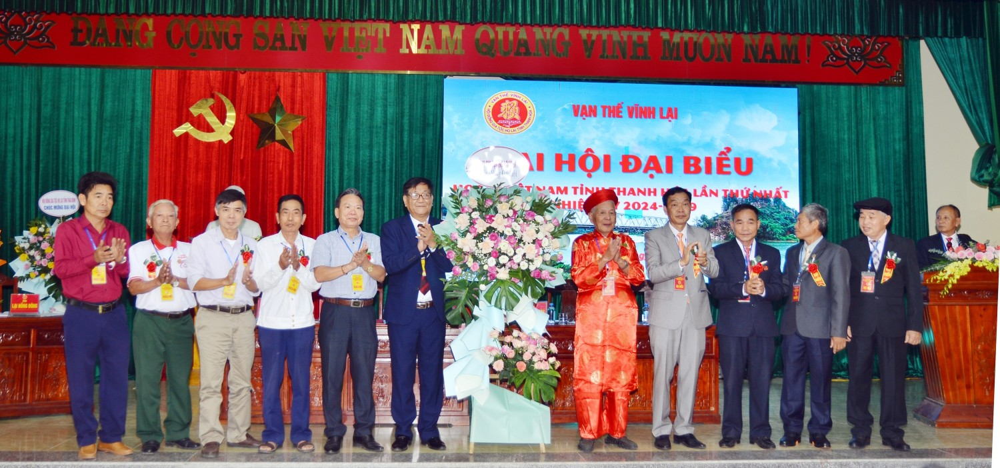

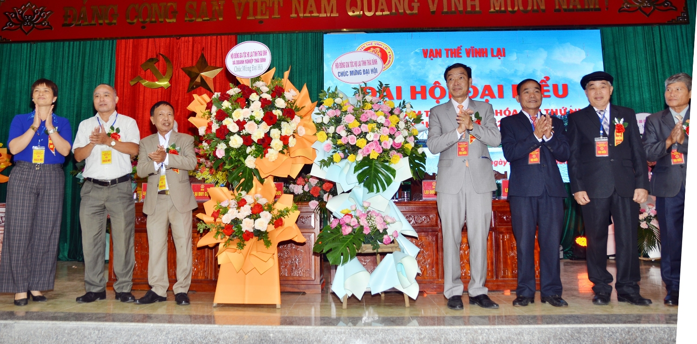

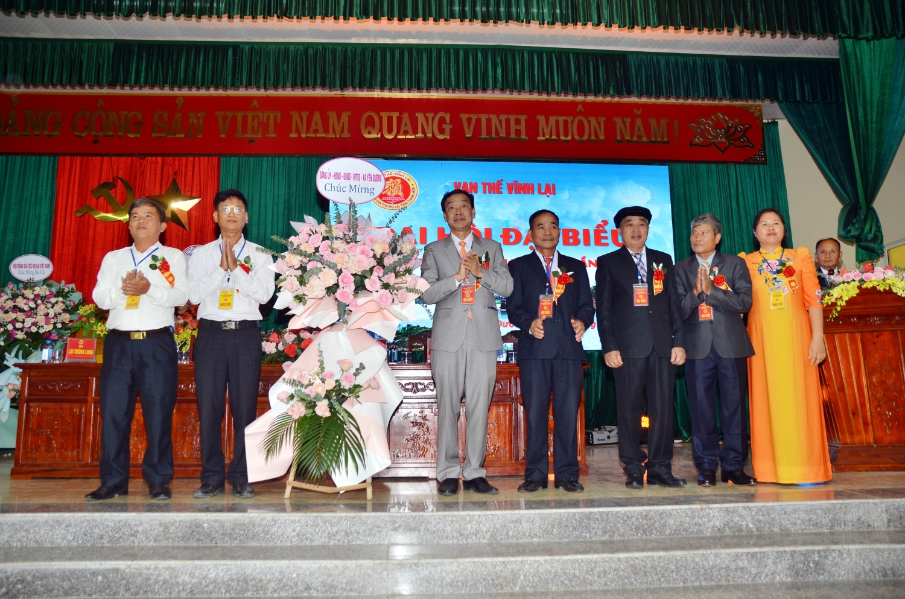

**Các đoàn đại biểu về dự đã có lẵng hoa tươi thắm chúc mừng Đại Hội**

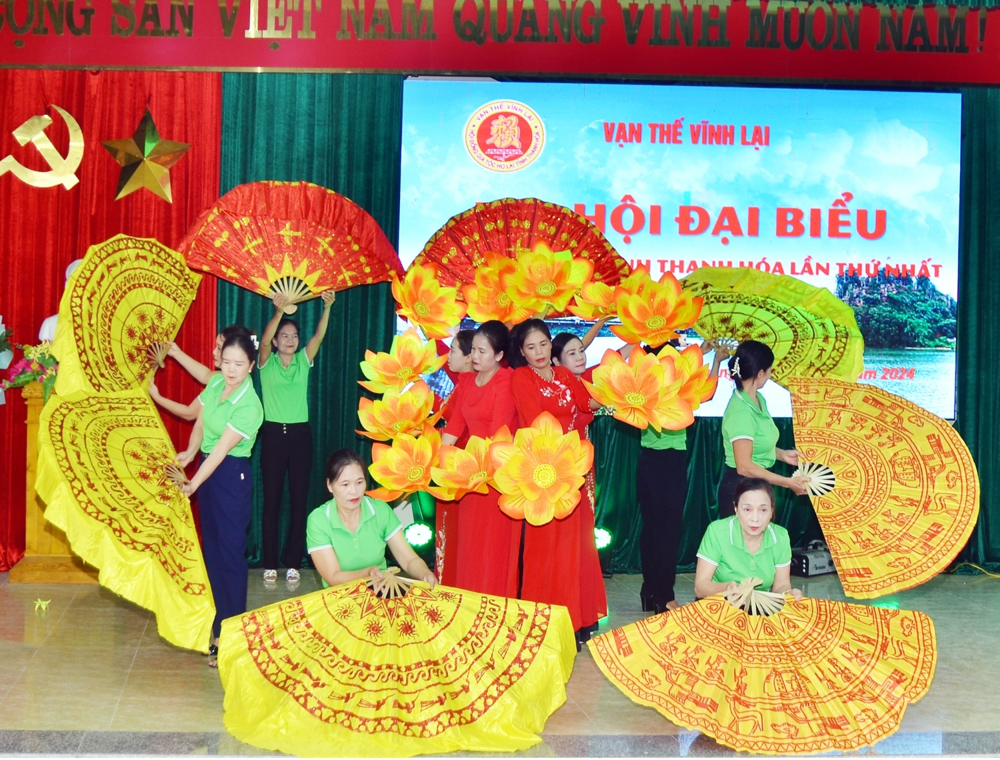

 

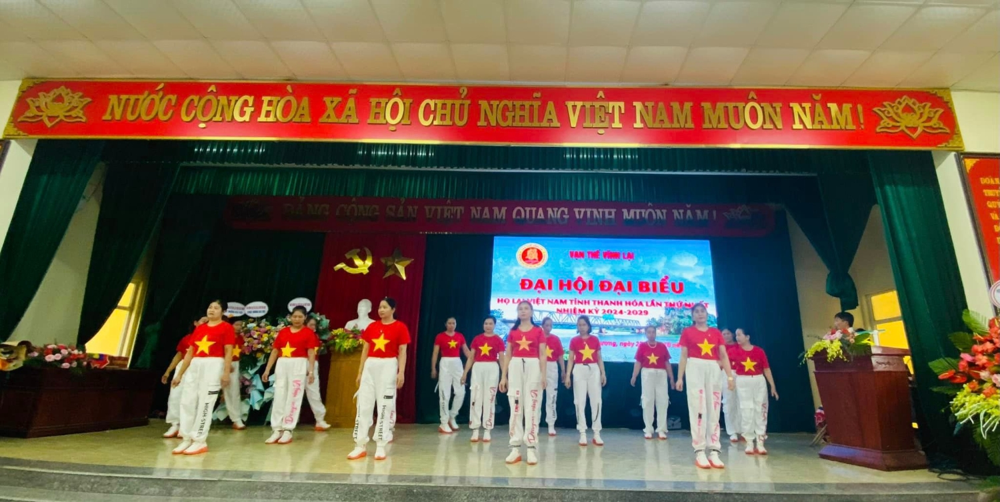

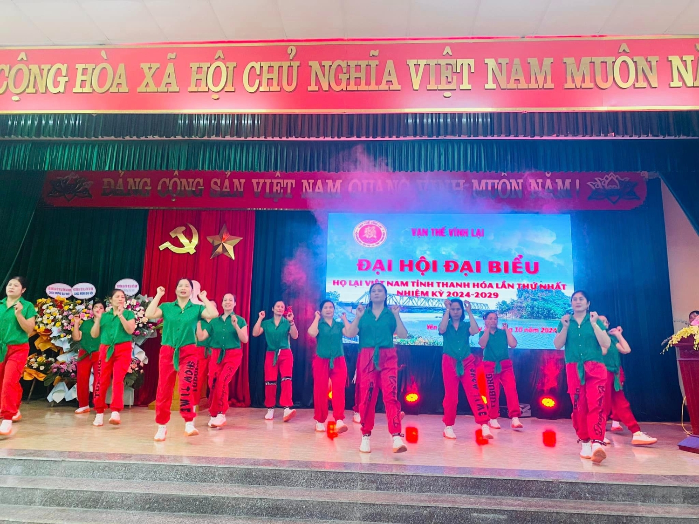

**Các tiết mục văn nghệ do cộng đồng con cháu Họ Lại Thanh Hóa thể hiện**

Trong Đại hội, các đại biểu đã cùng nhau đánh giá các hoạt động của BCH lâm thời, ghi nhận những thành quả đáng tự hào trong quá trình xây dựng và kết nối dòng họ tại Thanh Hóa. Đồng thời, Đại hội đã đề ra phương hướng, nhiệm vụ cụ thể cho nhiệm kỳ 2024-2029, nhằm củng cố và phát triển HĐGT Họ Lại Thanh Hóa vững mạnh, góp phần tích cực vào các phong trào của Họ Lại toàn quốc.  
 

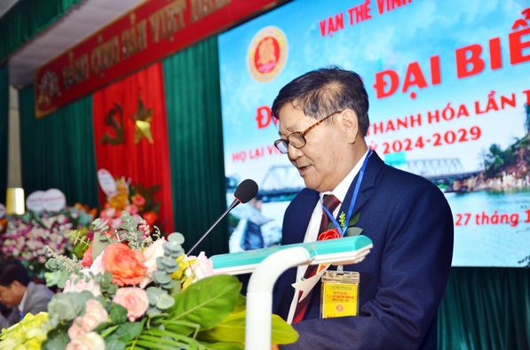

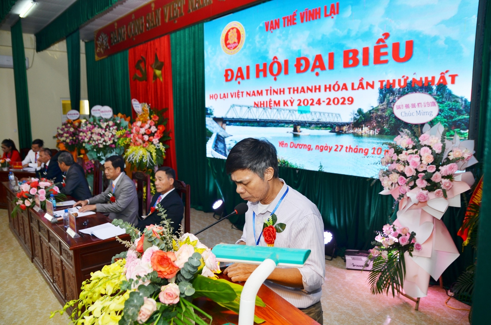

 

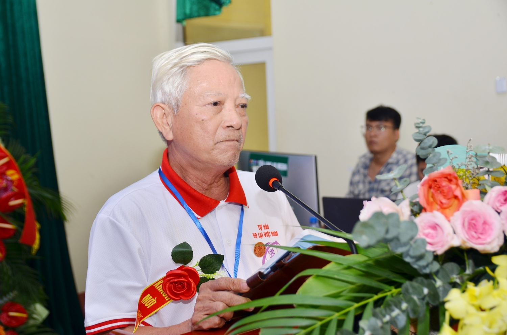

 

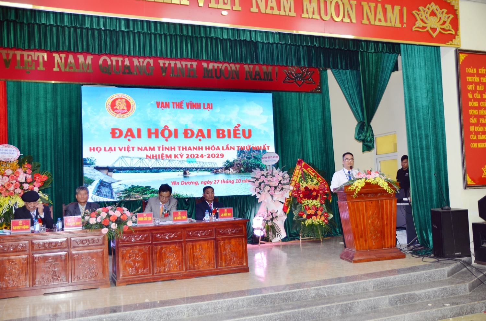

**Các đại biểu về tham dự đã có những đóng góp ý kiến và tham luận cho Đại hội**

Kết quả quan trọng nhất của Đại hội là việc bầu ra BCH chính thức HĐGT Họ Lại Tỉnh Thanh Hóa nhiệm kỳ 2024-2029. Tân BCH sẽ là lực lượng nòng cốt, dẫn dắt các hoạt động đoàn kết, gắn bó dòng họ trong thời gian tới, tiếp nối và phát huy truyền thống vẻ vang của Họ Lại Việt Nam.  
 

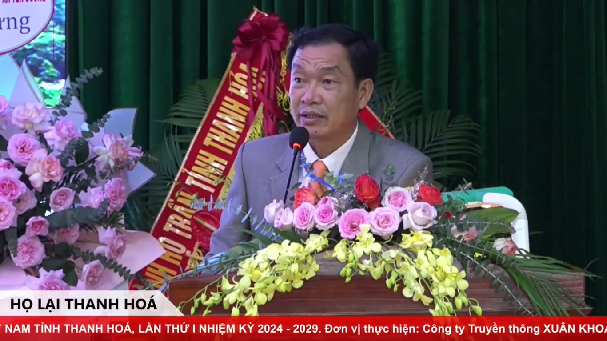

Buổi lễ kết thúc trong không khí trang trọng, đầm ấm, khẳng định một chặng đường mới đầy hứa hẹn của HĐGT Họ Lại Tỉnh Thanh Hóa. Đây là tiền đề quan trọng để dòng họ ngày càng phát triển và gắn kết, lan tỏa tinh thần đoàn kết và đóng góp tích cực vào cộng đồng.

**Theo: Tony Lại (Ban TTTT Họ Lại Việt Nam)**
