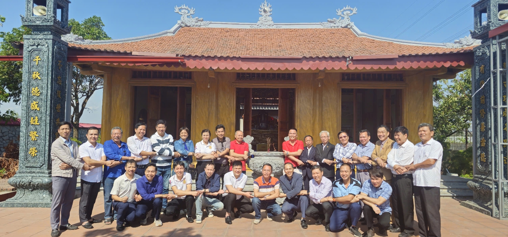
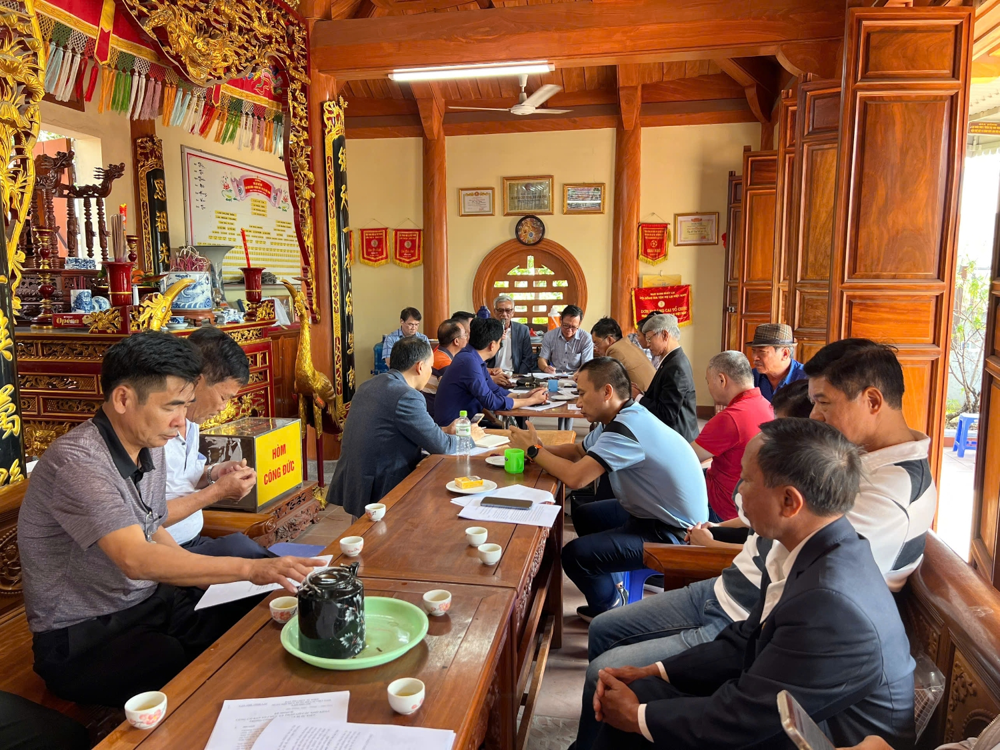
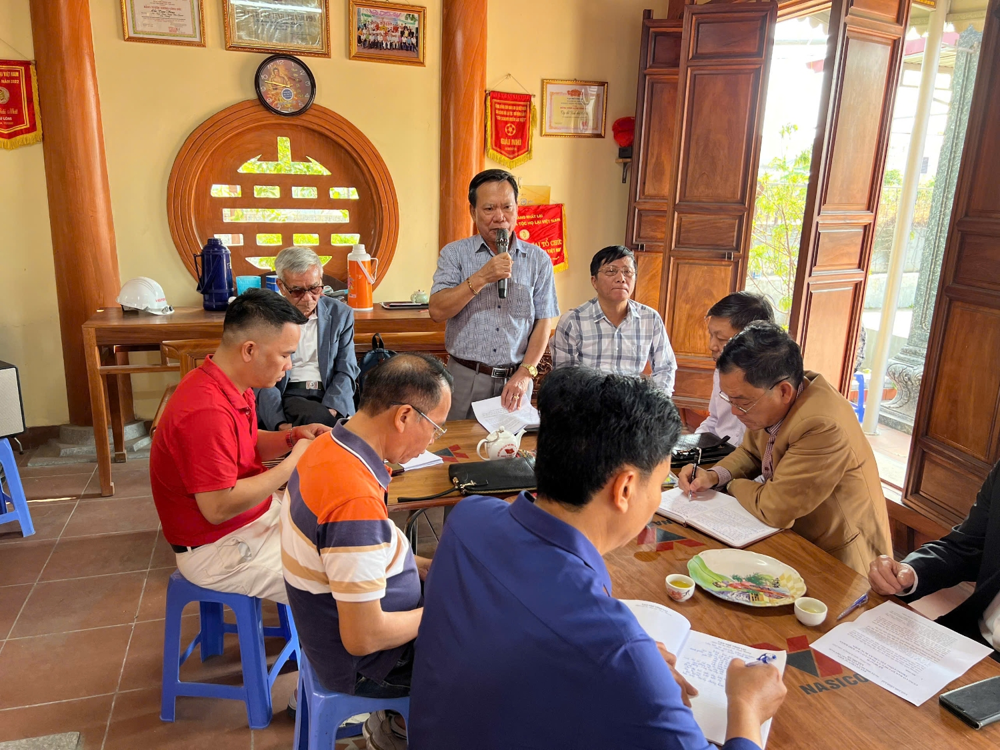
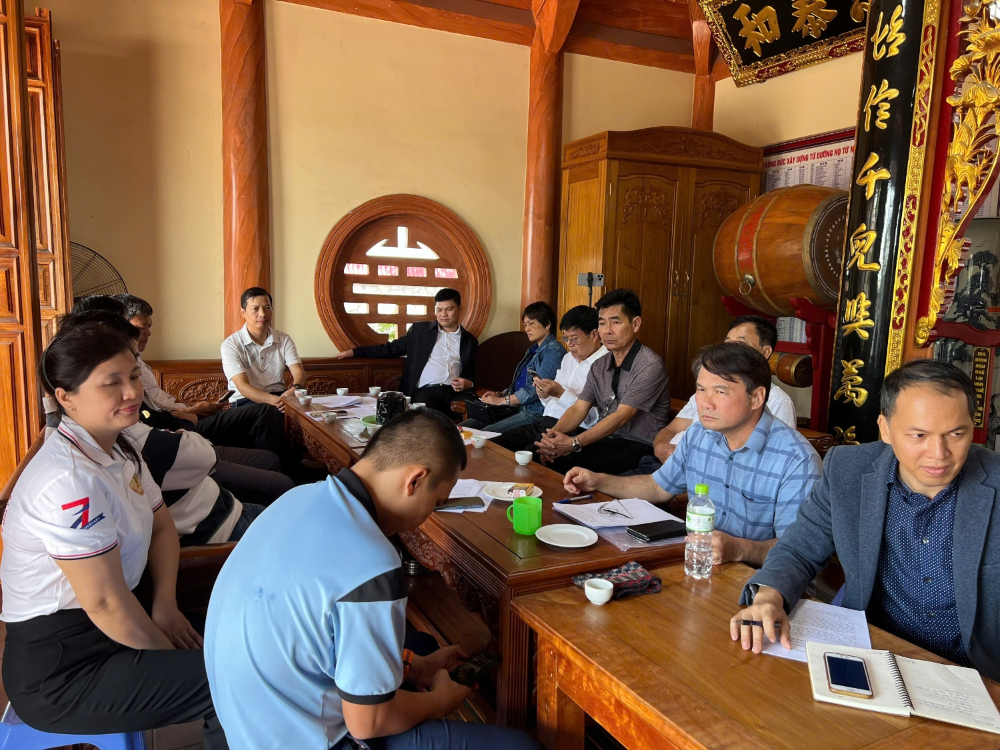

Hội nghị diễn ra trong không khí sôi nổi và đầy trách nhiệm, thể hiện tình yêu sâu sắc với dòng họ Lại. Các đại biểu tam dự Hội nghị đã cùng nhau thảo luận và đóng góp ý kiến với tinh thần đoàn kết và xây dựng.  
 

**Các đại biểu tham dự hội nghị**

Tham dự Hội nghị: Đại diện Hội đồng Gia tộc HLVN gồm có các ông: Lại Quốc Tuấn, Phó Chủ tịch Thường trực HĐGT Họ Lại Việt Nam; Lại Văn Quán, Phó Chủ tịch HĐGTHLVN, Trưởng ban Chỉ đạo sự kiện; Lại Trọng Tâm, Phó Chủ tịch HĐGTHLVN, Phó ban Chỉ đạo sự kiện; Lại Xuân Cương, Phó Chủ tịch HĐGTHLVN, Phó ban Chỉ đạo sự kiện; Lại Huy Quân, Phó Chủ tịch HĐGTHLVN, Phó ban Chỉ đạo sự kiện.  Đại diện HĐGTHL thành phố Hải Phòng (Địa phương đăng cai sự kiện), gồm có các ông: Lại Hồng Giang, Chủ tịch HĐGT họ Lại Hải Phòng, Phó ban Chỉ đạo sự kiện; Lại Thế Minh, Lại Văn Hưởng, Lại Thế Trung, Lại Văn Ngọc là các thành viên trong Ban Thường trực HĐGT họ Lại thành phố Hải Phòng.  Tham dự Hội nghị còn có các đại diện là thành viên trong BTC sự kiện thuộc Hội doanh nhân Lại Việt, Ban TT truyền thông, Ban Liên lạc con cháu họ Lại Việt Nam và các đoàn họ Lại đại diện HĐGT họ Lại các địa phương từ các tỉnh: ông Lại Xuân Tôn - UVTTrHĐGTHLVN, Phó Chủ tịch HĐGTHL tỉnh Vĩnh Phúc làm trưởng đoàn; ông Lại Thế Thảo - UVTTrHĐGTHLVN, Phó Chủ tịch HĐGTHL tỉnh Thái Bình làm trưởng đoàn.

**Ông Lại Văn Quán (PCT HĐGT, Trưởng BCĐ sự kiện) điều hành hội nghị**

Hội nghị đã phân tích chi tiết bối cảnh của sự kiện và những khó khăn trong công tác chuẩn bị sự kiện. Trong không khí đoàn kết và đầy nhiệt huyết, các đại biểu đã cùng nhau thảo luận, với trách nhiệm cao và tình yêu lớn lao dành cho dòng họ. Những ý kiến đóng góp đã giúp làm rõ nhiều vấn đề và đưa ra các giải pháp khả thi.  Trên tinh thần “Nam Bang Nhất Lại”, các đại biểu đã phân tích chỉ ra những nguyên nhân những khó khăn. Một trong những khó khăn chính là do ảnh hưởng của cơn bão số 3 đã gây thiệt hại nặng nề đến cơ sở vật chất và đời sống của bà con tại địa phương, dẫn đến nhiều khâu chuẩn bị bị gián đoạn. Đồng thời, Hội nghị cũng thảo luận sâu về quan điểm của một số điểm chưa thống nhất trong quá trình xây dựng nội dung của kịch bản sự kiện. Trong quá trình thảo luận cũng có nhiều ý kiến, ý tưởng mới đề xuất về thời gian và cách thức tổ chức, ... khả thi được bổ sung vào nội dung của kịch bản sự kiện .  

 

**Các đại biểu tập trung lắng nghe và đóng góp ý kiến**

 Việc tổ chức một sự kiện trọng đại của dòng họ Lại Việt Nam cần có sự phối hợp chặt chẽ hơn nữa và tâm huyết từ tất cả các thành viên, trong đó, cụ thể là sự chủ động của HĐGT họ Lại Hải Phòng và sự phối hợp chặt chẽ của các tổ chức trực thuộc HĐGTHLVN sẽ là tiền đề quyết định thành công bước đầu trong công tác chuẩn bị, cũng như triển khai thực hiện sự kiện.  Mặt khác, với những nguyên nhân, lý do được phân tích trên, Hội nghị đã thống nhất tạm dừng tổ chức Ngày Hội Mùa Xuân vào mùa xuân 2025 theo kế hoạch ban đầu và sẽ dời vào một thời điểm thích hợp trong năm 2025, có thể vào mùa Hè hoặc mùa Thu... Tên gọi Ngày Hội Mùa Xuân sẽ được thay đổi để phù hợp với thời gian tổ chức sự kiện, cũng như những nội dung của kịch bản sẽ có nhiều điểm mới, mang mầu sắc mới, ý nghĩa nhằm mang đến niềm vui và cảm xúc hân hoan, tình đoàn kết cho con cháu trong dòng họ.

**Các Đại biểu cùng nắm chặt tay thể hiện tinh thần Nam Bang Nhất Lại**

Ngoài ra, Hội nghị này không chỉ giải quyết những khó khăn trong công tác chuẩn bị sự kiện lớn của dòng họ Lại năm 2025 mà còn tạo tiền đề cho việc tổ chức các sự kiện của dòng họ trong thời gian đến được thành công tốt đẹp hơn, nâng cao tinh thần đoàn kết và niềm tự hào của dòng họ.   Với tinh thần trách nhiệm, tình yêu dòng họ và sự đoàn kết của các thành viên tham dự, Hội nghị đã thành công tốt đẹp.

**Theo: Ban truyền thông Họ Lại Việt Nam**
