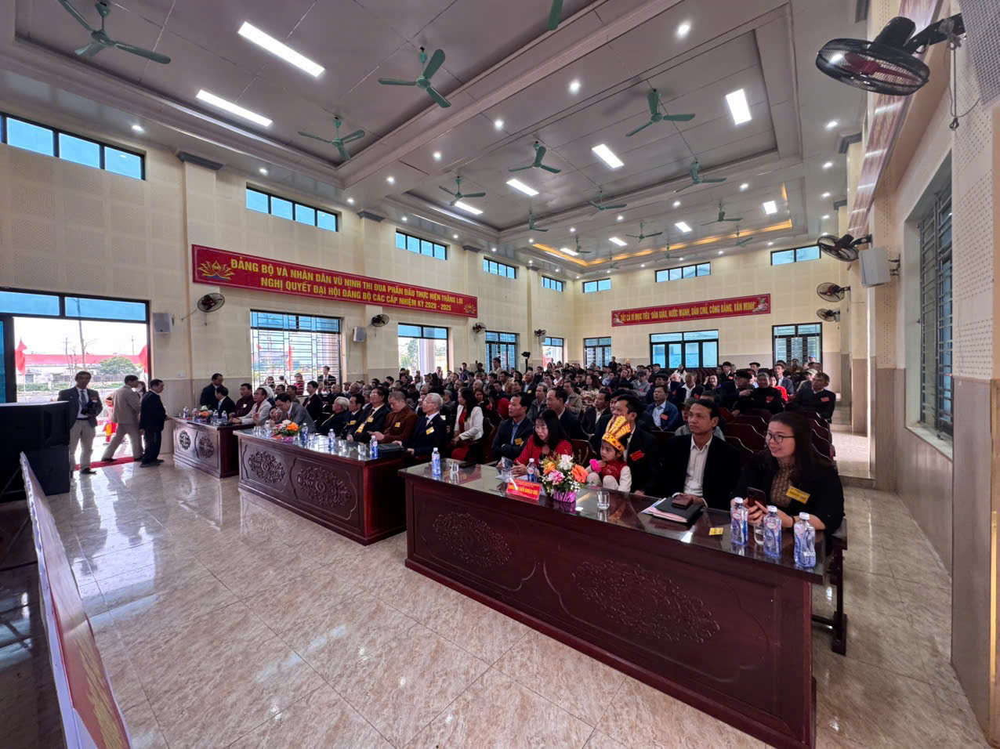

Trước khi tiến hành Đại hội, các đại biểu đã tiến hành nghi Lễ viếng Nghĩa trang liệt sĩ xã Vũ Ninh (chủ yếu các liệt sĩ tại nghĩa trang là người họ Lại).

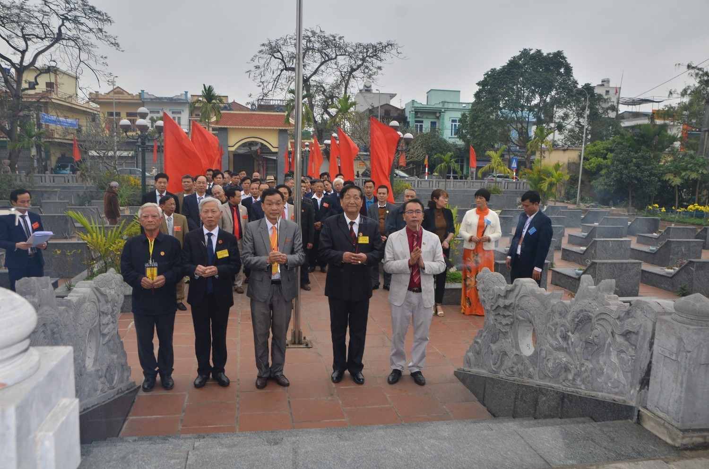

 

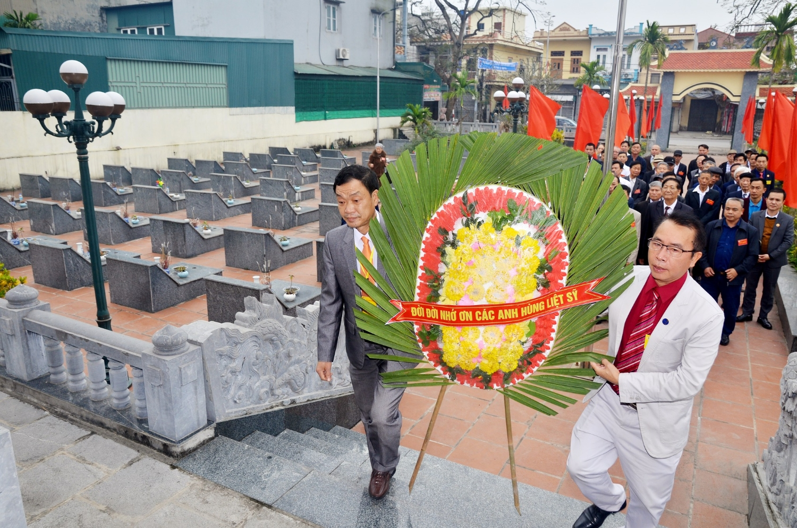

Chương trình Văn nghệ trào mừng Đại Hội bao gồm những tiết mục đặc sắc của các con, cháu họ Lại tại xã Vũ Ninh, huyện Kiến Xương, của các chi họ Lại trên địa bàn tỉnh Thái Bình và đoàn HĐGTHL thành phố Hải Phòng.

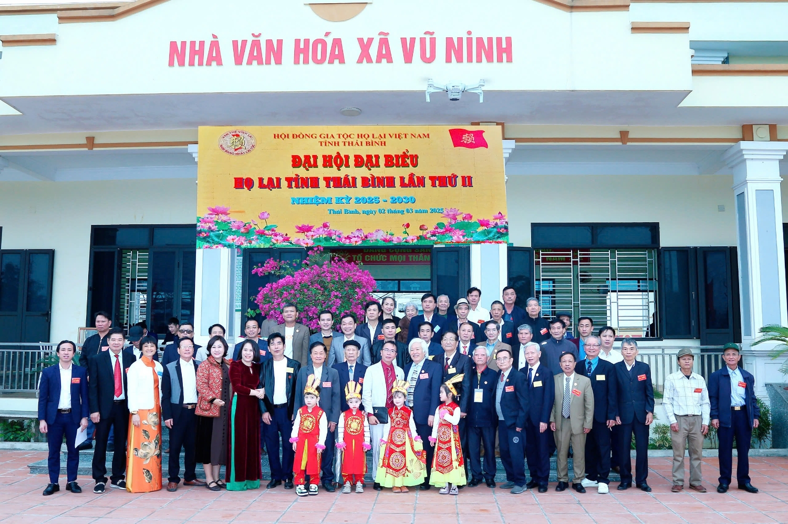

 

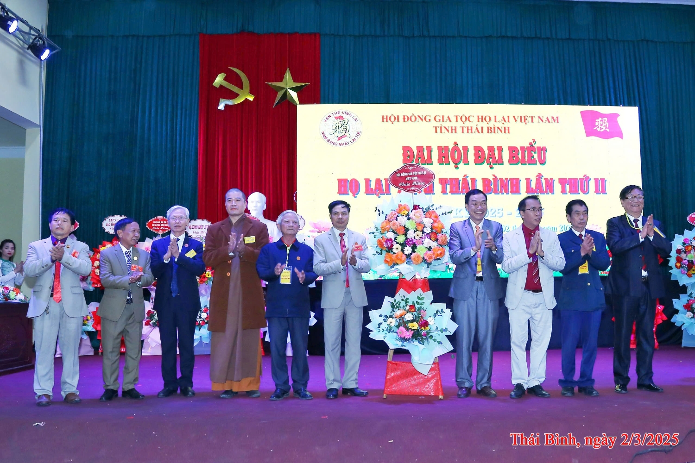

Đại hội được đón tiếp, nhận hoa và lời chúc mừng từ các Đoàn đại biểu Đại diện cho Đảng, chính quyền, MTTQ, và các tổ chức của huyện Kiến Xương, cũng như đại diện xã Vũ Ninh; HĐGTHL Việt Nam, Hội Doanh nhân Lại Việt, Ban Liên lạc con cháu họ Lại Việt Nam, Ban Thông tin truyền thông họ Lại Việt Nam; HĐGT họ Lại các tỉnh: Hà Nam, Hải Phòng, Nam Định, Thanh Hóa, Vĩnh Phúc, Bắc Ninh; Khu vực Tây Nguyên và Khu vực miền Trung; các Ủy viên Ban Thường trực, thành viên HĐGTHL tỉnh Thái Bình, Đại diện Hội Doanh nghiệp Lại Việt Thái Bình, một số Họ bạn trên địa bàn tỉnh Thái Bình và các đại biểu bậc cao niên trong dòng họ, con cháu họ là Anh hùng Lực lượng Vũ Trang, Anh hùng Lao động, Sĩ quan cao cấp lực lượng VT, một số cán bộ quản lý cao cấp từ cấp tỉnh đến cấp trung ương.  

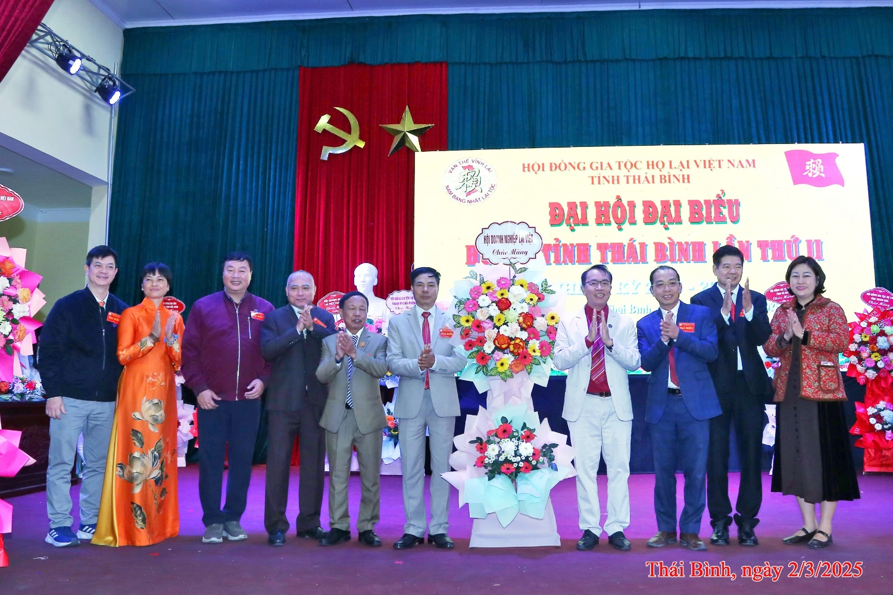

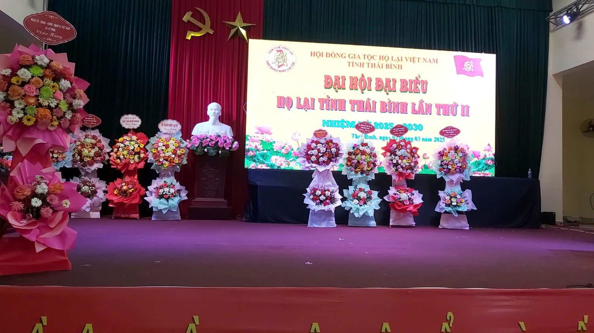

 

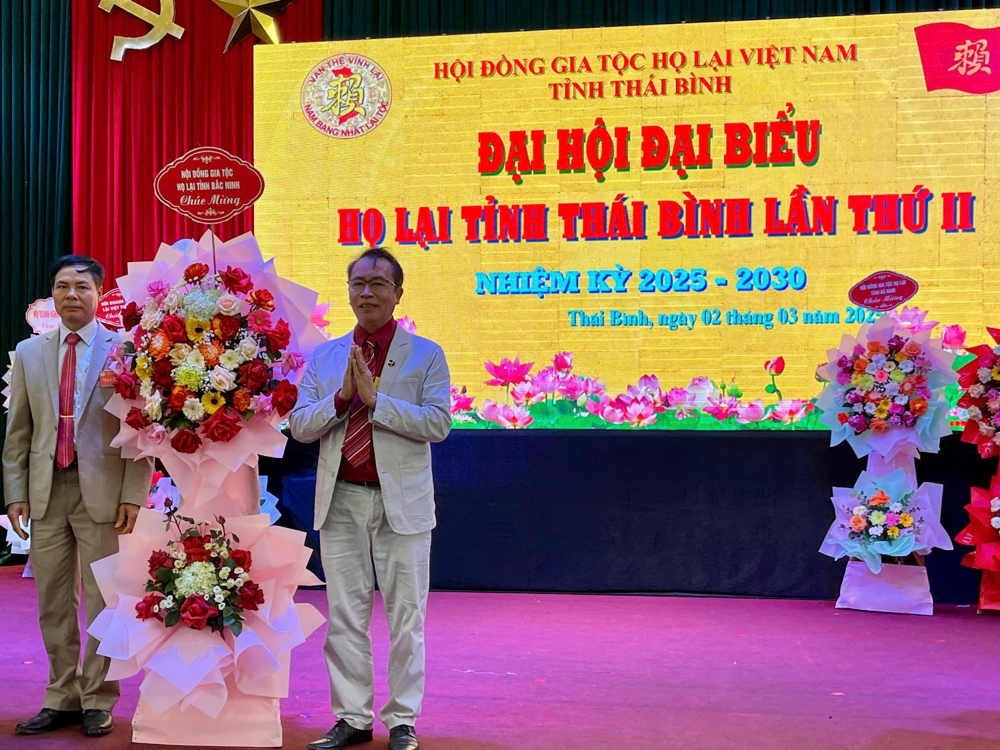

Sau Diễn văn khai mạc của Đoàn chủ tịch, Đại hội đã được nghe Báo cáo kết quả hoạt động của HĐGTHL tỉnh Thái Bình nhiệm kỳ thứ nhất, phương hướng hoạt động của HĐGTHL tỉnh Thái Bình nhiệm kỳ thứ hai (năm 2025 – 2030).

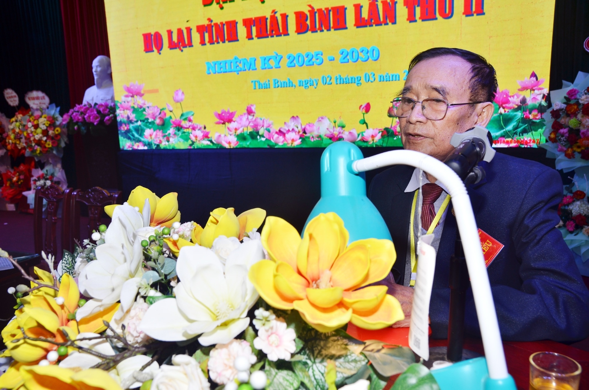

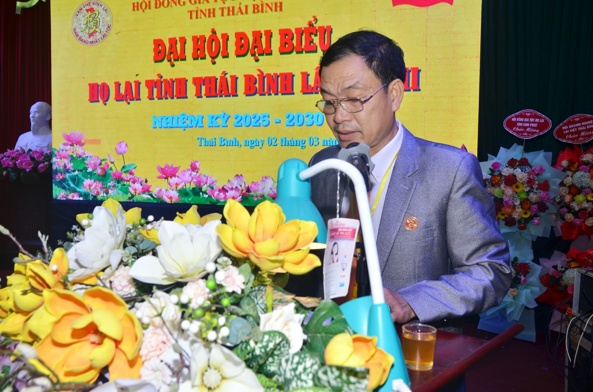

Đại diện HĐGTHL Việt Nam, ông Lại Quốc Tuấn - PCT TT HĐGTHL Việt Nam đã có bài phát biểu: ghi nhận kết quả hoạt động đạt được của HĐGTHL tỉnh Thái Bình nhiệm kỳ thứ nhất, đồng thời cũng động viên, mong muốn HĐGTHL tỉnh Thái Bình nhiệm kỳ thứ hai (năm 2025 - 2030), với tinh thần của Đại hội ***“Hướng về cội nguồn - tri ân Tiên tổ - Đoàn kết - Phát triển”***, đồng thời, cần triển khai thực hiện cho tốt những nội dung đã đề ra trong phương hướng hoạt động nhiệm kỳ thứ hai như Đoàn chủ tịch đã báo cáo tại Đại hội, thành tích đạt được của HĐGTHL tỉnh Thái Bình sẽ góp phần vào sự phát triển bền vững của dòng họ Lại Việt Nam.  Đại hội cũng được nghe một số tham luận, ý kiến đóng góp quý báu của các đại biểu của các chi họ, thành viên HĐGTHL tỉnh Thái Bình với tinh thần xây dựng, đoàn kết, phát triển dòng họ Lại bền vững.

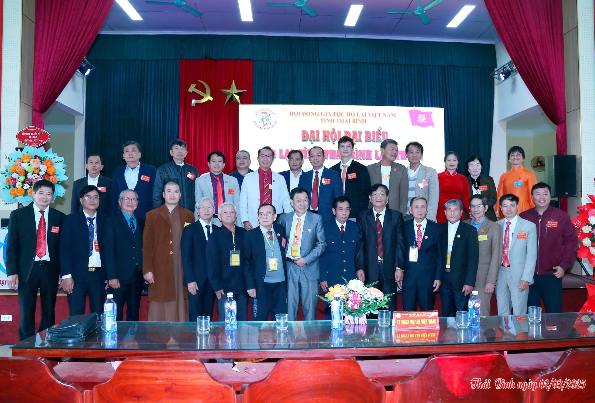

Đại hội đã bầu Hội đồng Gia tộc họ Lại tỉnh Thái Bình nhiệm kỳ II với 60 thành viên, trong đó:  21 thành viên được bầu làm Ủy viên trong Ban Thường trực HĐGTHL tỉnh Thái Bình,  01 Ủy viên trong Ban Thường trực HĐGTHL tỉnh Thái Bình được bầu đảm nhiệm chức danh Chủ Tịch HĐGTHL tỉnh Thái Bình,  02 Ủy viên trong Ban Thường trực HĐGTHL tỉnh Thái Bình được bầu đảm nhiệm chức danh Phó Chủ tịch HĐGTHL tỉnh Thái Bình.  Đại hội cũng đã bầu 65 thành viên HĐGTHL tỉnh Thái Bình (trong đó có 05 thành viên dự khuyết) tham dự Đại hội Đại biểu HĐGTHL Việt Nam nhiệm kỳ năm 2025 – 2030.  Ban Thư ký Đại hội báo cáo toàn văn nội dung Nghị quyết Đại hội và được Đại hội nhất trí biểu quyết 100%.   Đại hội Đaị biểu HĐGTHL tỉnh Thái Bình lần thứ hai, nhiệm kỳ 2025 - 2030 bế mạc hồi 11 giờ 30 phút ngày 02/3/2025./.  
 

*Theo: Ban TTT Họ Lại Việt Nam*
