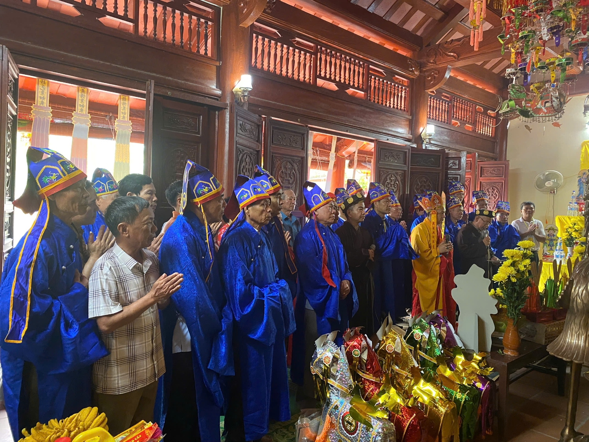
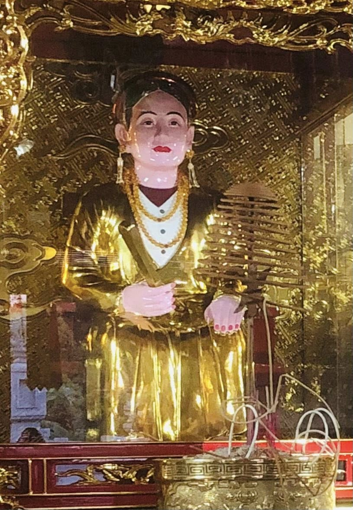
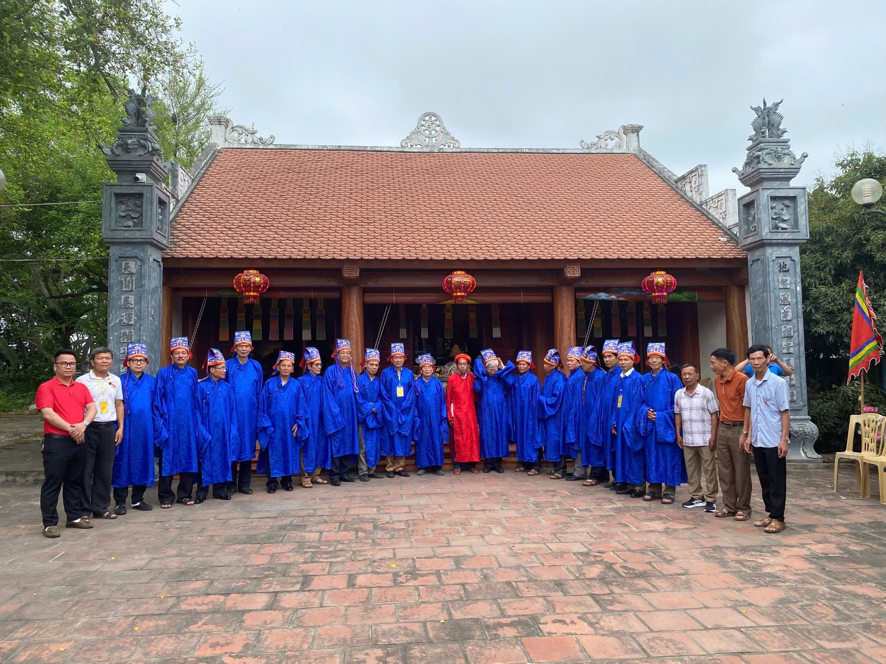
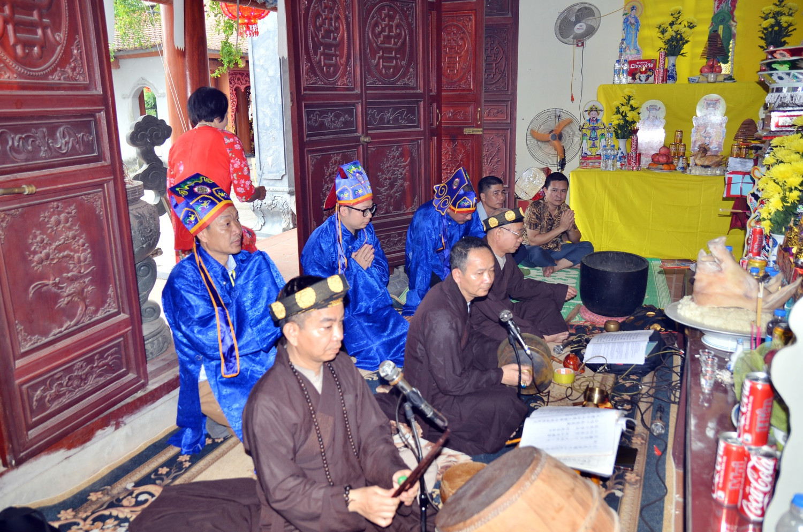
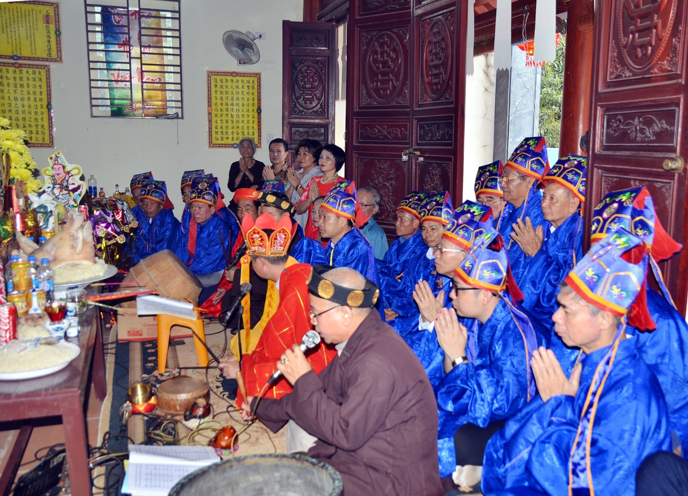

Lễ An vị Tượng Tổ Mẫu không chỉ là nghi lễ đưa pho tượng linh thiêng về vị trí trang trọng tại Nhà thờ Tổ Mẫu, mà còn là một dấu ấn lớn khẳng định tinh thần **"Uống nước nhớ nguồn"**, gắn kết các thế hệ con cháu, cùng hướng về cội nguồn, về người Mẹ linh thiêng đã khởi dựng nền móng cho cả dòng họ Lại từ thuở ban đầu.  
 

Từ sáng sớm, bà con trong dòng họ từ các tỉnh, thành phố – từ miền xuôi đến miền ngược – đã tề tựu đông đủ tại nhà thờ tổ. Trong không khí trang nghiêm và thành kính, **Lễ Cáo Tổ** diễn ra từ **9h15 đến 11h30**, với nghi thức dâng hương, dâng lễ và khấn cáo trước bàn thờ Tổ Tiên, trình báo việc tạc tượng và xin phép chính thức an vị pho tượng Tổ Mẫu tại trung tâm nhà thờ dòng họ.  
 

Buổi chiều và tối cùng ngày, từ **17h30 đến 20h30**, toàn thể con cháu trong họ cùng tham dự **Lễ An vị và Hô Thần Nhập Tượng** – một nghi lễ linh thiêng, thể hiện sự cung kính và niềm tin tâm linh sâu sắc. Trong ánh đèn lung linh, tiếng tụng kinh ngân vang hòa quyện cùng làn khói trầm thơm ngát, tượng Tổ Mẫu – biểu tượng thiêng liêng của lòng từ mẫu, sự bao dung và gắn bó – chính thức được an vị tại nơi tôn nghiêm nhất trong Nhà thờ Tổ.  
 

Pho tượng không chỉ là một tác phẩm nghệ thuật tâm linh, mà còn là biểu tượng sống động về tinh thần kết nối giữa quá khứ – hiện tại – tương lai của cả dòng họ. Phát biểu tại buổi lễ, **ông Lại Quốc Tuấn – Phó Chủ tịch Thường trực Hội đồng gia tộc Họ Lại Việt Nam**, đã xúc động chia sẻ: “Tượng Tổ Mẫu không chỉ là nơi con cháu tìm về để tri ân, cầu an, mà còn là điểm tựa tinh thần, là lời nhắc nhở sâu sắc về đạo lý làm người, về sự gắn bó máu thịt của những người con mang dòng máu Họ Lại.”

Sự kiện An vị Tượng Tổ Mẫu đã để lại trong lòng mỗi người con Họ Lại một niềm tự hào, sự xúc động và cảm hứng mạnh mẽ để tiếp tục phát huy truyền thống tốt đẹp, sống tử tế, biết yêu thương và sẻ chia – đúng như lời dạy của Tổ Tiên từ bao đời.

Lễ An vị kết thúc trong không khí linh thiêng, đầm ấm và trang trọng. Trong từng ánh mắt, từng lời cầu nguyện, ai cũng thấy rõ niềm tin vào một tương lai tươi sáng, gắn kết và phát triển bền vững của dòng họ – khi mỗi người con đều biết giữ gìn và tiếp nối ngọn lửa thiêng từ cội nguồn Tổ Mẫu.  

Theo: Tony Lại (Ban TTTT Họ Lại Việt Nam)
