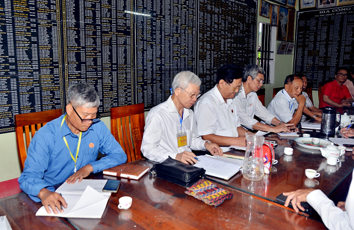
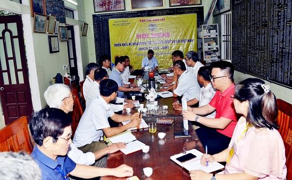

Các thành viên Ban Thường trực đã cùng nhau rà soát tình hình, thảo luận kỹ lưỡng và thống nhất ban hành Nghị quyết số 169/NQ-TTHĐGTLVN. Đây được xem là kim chỉ nam định hướng toàn bộ công tác tổ chức Đại hội trong thời gian tới, đồng thời là sự khẳng định cho tinh thần đồng lòng, quyết tâm cao độ của toàn bộ đội ngũ lãnh đạo dòng họ.  
 

Nghị quyết đã xác định rõ mục tiêu: Đại hội nhiệm kỳ tới không chỉ là sự kiện tổng kết và chuyển giao thế hệ, mà còn là dấu mốc lớn để gắn kết các chi họ trong cả nước, khơi dậy tinh thần tự hào, trách nhiệm và đoàn kết của con cháu Họ Lại trong và ngoài nước. Để đảm bảo tiến độ và chất lượng tổ chức, Ban Thường trực đã thống nhất thành lập các tiểu ban chuyên trách phụ trách từng mảng công việc quan trọng như xây dựng văn kiện, công tác nhân sự, hậu cần – tuyên truyền – an ninh, và vận động tài chính. Việc phân công nhiệm vụ rõ ràng, giao việc đúng người, đúng khả năng đã tạo nên không khí làm việc chủ động, quyết liệt và đầy nhiệt huyết trong từng thành viên.  

 

Cuộc họp lần này không chỉ là bước tiếp tục triển khai cụ thể chuẩn bị cho Đại hội, mà còn mà còn hun đúc thêm lòng tự hào về truyền thống Họ Lại, khơi dậy ý thức trách nhiệm của mỗi người con trong việc chung tay góp sức vì sự phát triển lâu dài và vững mạnh của đại gia đình Lại Việt. Từng ý kiến đóng góp, từng phần việc được bàn bạc, thống nhất đều cho thấy một quyết tâm lớn: tổ chức thành công một kỳ Đại hội trang trọng, tiết kiệm, hiệu quả, xứng đáng là nơi hội tụ trí tuệ – tâm huyết – tình cảm của hàng vạn con cháu dòng họ trên khắp mọi miền.

Kỳ Đại hội sắp tới hứa hẹn sẽ trở thành một dấu son đáng nhớ, không chỉ khẳng định vị thế của Họ Lại trong cộng đồng các dòng họ Việt Nam, mà còn mở ra một nhiệm kỳ mới đầy triển vọng, hướng tới một tương lai đoàn kết, phát triển và trường tồn – đúng như tinh thần "Vạn thế vĩnh Lại" mà bao thế hệ đã dày công vun đắp.

**Theo: Tony Lại (Ban TTTT Họ Lại Việt Nam)**
