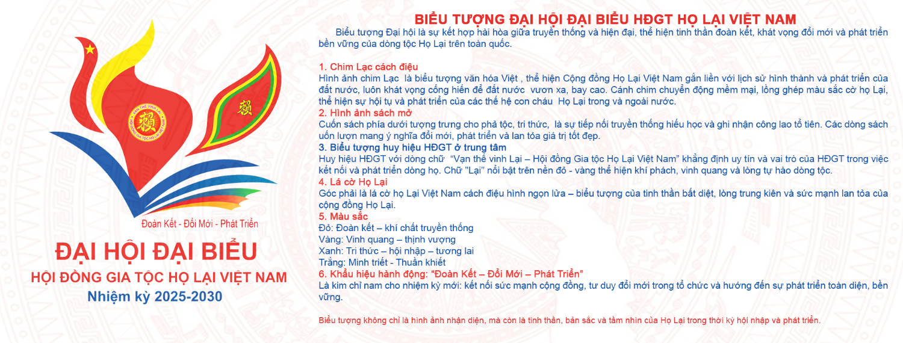
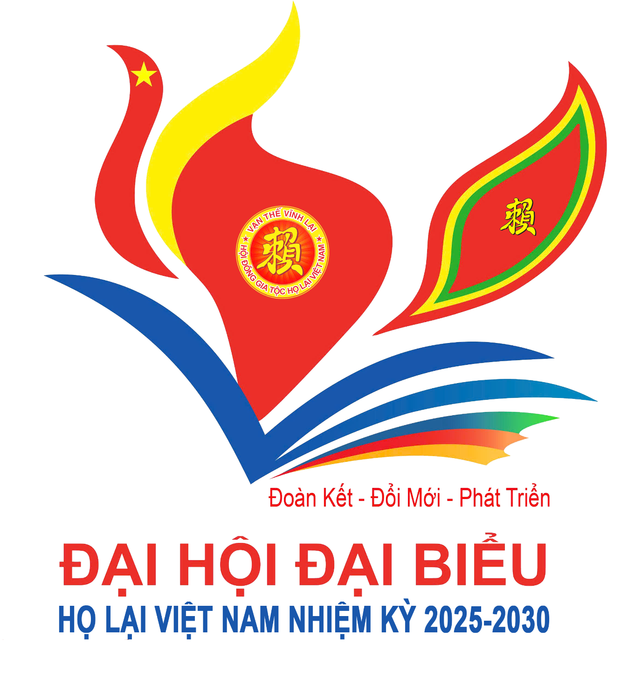
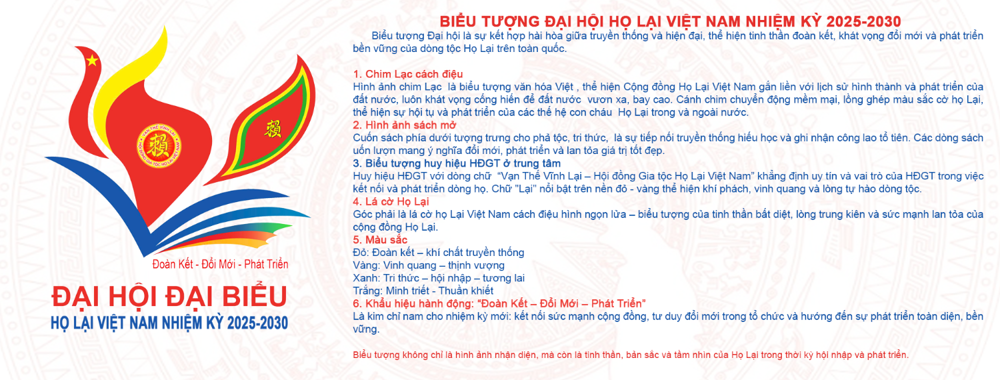

Đây là một cột mốc lịch sử đáng ghi nhớ, đánh dấu sự phát triển, đoàn kết và khát vọng vươn lên của cộng đồng con cháu họ Lại trên khắp mọi miền đất nước và trên Thế giới. Một bước tiến lớn trong hành trình kết nối dòng họ.  

Trải qua 30 năm hình thành và phát triển, Hội đồng Gia tộc họ Lại Việt Nam đã từng bước lớn mạnh, từ những buổi ban đầu gặp mặt còn nhỏ lẻ đến các cuộc họp quy mô lớn của HĐGT, không chỉ là quy tụ và từ đây đã ra đời của Hội Doanh nhân Lại Việt, Ban Liên lạc cộng đồng con cháu họ Lại Việt Nam, Ban Thông tin truyền thông họ Lại Việt Nam. Các tổ chức này đã phát động, thực hiện những hoạt động có ý nghĩa thiết thực như đã tổ chức được 5 lần Hội thao họ Lại Việt Nam, 6 lần Ngày hội mùa xuân họ Lại Việt Nam, …  

HĐGTHLVN không chỉ là nơi quy tụ con cháu khắp mọi miền đất nước, ngoài nước mà còn là biểu tượng của tình thân, là mái nhà chung gìn giữ giá trị văn hóa, lịch sử và truyền thống dòng họ Lại. Tất cả là minh chứng sống động cho một tinh thần xuyên suốt qua các thế hệ: Đoàn kết – Cống hiến – Tự hào về cội nguồn.  

Đại hội lần này không chỉ là dịp tổng kết các hoạt động nổi bật, mà còn là Lễ ra mắt chính thức HGTHLVN nhiệm kỳ 2025-2030 được kiện toàn với chủ đề lớn: Đoàn kết – Đổi mới – Phát triển và khẳng định vị thế của dòng họ trong cộng đồng các dòng họ Việt Nam, đồng thời, mở ra hướng đi mới với những định hướng bền vững, bài bản, chuyên nghiệp hơn.  

Với chủ đề nêu trên cũng là khẩu hiệu “Đoàn kết – Đổi mới – Phát triển” hành động ngắn gọn mà sâu sắc. Đại hội mong muốn thắp lên một tinh thần mới vừa giữ gìn giá trị truyền thống tốt đẹp, vừa không ngừng đổi mới cách tổ chức, cách kết nối, đặc biệt là phát huy vai trò của thế hệ trẻ đối với doanh nhân Lại Việt, những người đang và sẽ là động lực lớn cho tương lai dòng họ.

Đại hội Đại biểu họ Lại Việt Nam không chỉ là một cuộc họp thường niên, mà là một ngày hội linh thiêng, tràn đầy cảm xúc và ý nghĩa thiêng liêng với mỗi người con mang dòng máu Lại tộc. Đây là dịp để các thế hệ con cháu từ khắp mọi miền đất nước hay ở nước ngoài cùng tụ họp, cùng nhau tưởng nhớ Tổ tiên, tổng kết hành trình đã qua, định hướng cho tương lai và thắt chặt hơn nữa sợi dây gắn kết dòng tộc.  

Chương trình Đại hội không đơn thuần là các nội dung hành chính như báo cáo, bầu cử nhân sự, mà còn được kết hợp với lễ dâng hương long trọng tại Nhà thờ Đức Triệu Tổ, cùng các hoạt động giao lưu văn hóa, tọa đàm của các thế hệ, đặc biệt là nơi thế hệ trẻ được lắng nghe, kết nối và tiếp nối di sản tinh thần của Tổ tiên.  

**Điểm nhấn của Đại hội lần này, đặc biệt là Biểu tượng chính thức được thiết kế dành riêng cho sự kiện, đó là:**  Hình ảnh Chim Lạc vươn cao, biểu tượng cho khát vọng đi lên, cho niềm tự hào cội nguồn và tinh thần hội nhập. Bao bọc và nâng đỡ cánh chim là cuốn sách mở, tượng trưng cho Phả tộc, tri thức, sự học và tinh thần kế thừa.  
 

Màu sắc chủ đạo đỏ, vàng kim và xanh dương hòa quyện cùng sắc trắng của nền cờ họ Lại – tạo nên tổng thể hài hòa giữa quá khứ – hiện tại – tương lai, giữa truyền thống và đổi mới.  Biểu tượng ấy không chỉ là dấu ấn thị giác, mà còn là tuyên ngôn tinh thần của một dòng họ đang vững bước trên hành trình phát triển bền vững, đoàn kết và đầy khát vọng.  

Chỉ còn ít ngày nữa, Đại hội sẽ chính thức khai mạc. Trong mỗi người con họ Lại, dù đang sống ở quê nhà hay đang ở phương xa đều đang có một dòng cảm xúc dâng trào – niềm tự hào “Nam Bang Nhất Lại Tộc”, về gốc rễ, mong muốn được trở về và cống hiến.  

Họ Lại ơi! hãy cùng nhau, những người con của dòng họ, hướng về Yên Dương – hướng về Đại hội, để lan toả năng lượng tích cực, kết nối sâu hơn trong cộng đồng và cùng nhau viết tiếp trang mới cho lịch sử “Họ Lại Việt Nam”.

*Theo: Ban TTT Họ Lại Việt Nam*
