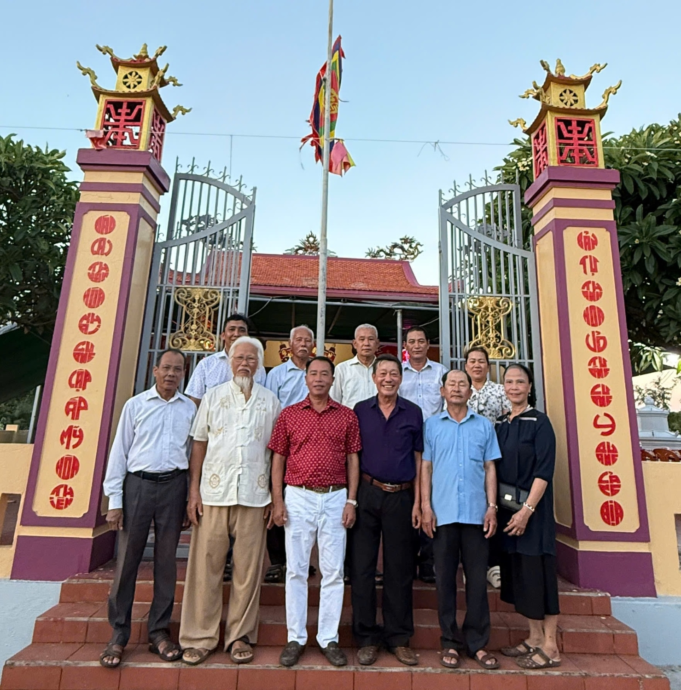
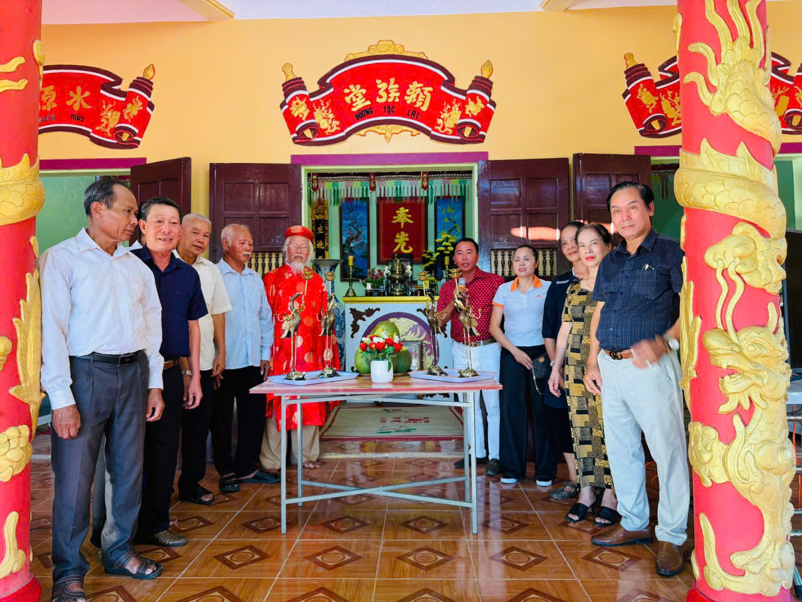
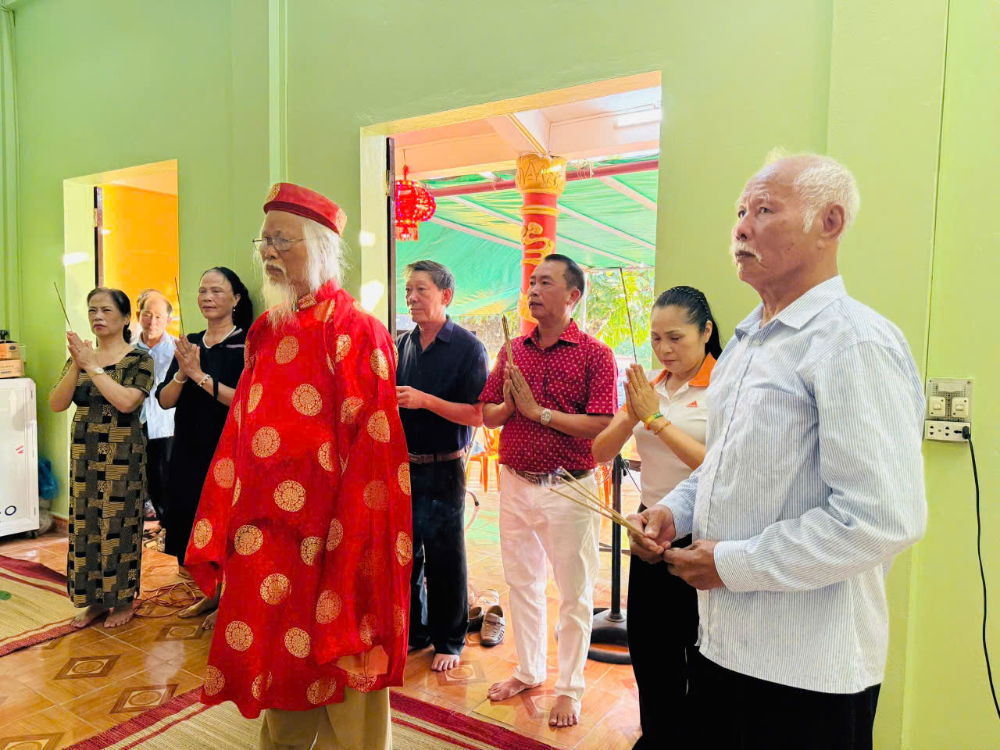
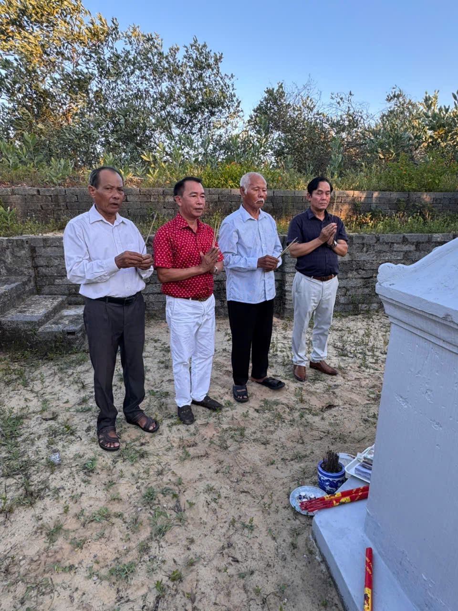

Tại không gian linh thiêng của nhà thờ, Chủ tịch Lại Trọng Tâm đã thành kính dâng hương tưởng niệm Thủy Tổ **Lại Tấn Đá** – vị tổ đời thứ 16 tính từ Đức Triệu Tổ **Lại Thế Tiên**. Nhằm thể hiện lòng tri ân tổ tiên và góp phần tôn tạo sự uy nghiêm cho từ đường, ông đã tiến cúng hai cặp hạc đồng, biểu tượng của sự trường tồn và cao quý trong văn hóa tâm linh Việt.  

 

Sau nghi lễ, Chủ tịch đã tới thăm khu mộ tổ và có buổi gặp gỡ, trò chuyện thân tình cùng đại diện chi họ Lại Bảo Ninh. Không khí ấm cúng, gần gũi đã thể hiện rõ tinh thần đoàn kết và sự gắn bó máu thịt giữa các chi phái trong đại tộc Lại Việt.  
 

Chuyến thăm này không chỉ là hoạt động mang ý nghĩa tâm linh sâu sắc, mà còn là dịp để Hội đồng Gia tộc tăng cường sự kết nối, thắt chặt tình thân giữa các chi họ trên toàn quốc – đúng với tôn chỉ mà Hội đã khẳng định trong các định hướng phát triển gần đây: **“Gìn giữ cội nguồn – Kết nối dòng tộc – Phát triển vững bền.”** Sự kiện cũng nối tiếp chuỗi hoạt động thường niên của Hội đồng Gia tộc Họ Lại Việt Nam, trong đó luôn chú trọng việc bảo tồn và phát huy giá trị văn hóa, tinh thần của dòng họ.

Chuyến thăm tại Quảng Bình lần này của Chủ tịch Lại Trọng Tâm chính là lời khẳng định rõ ràng cho cam kết của Hội đồng Gia tộc trong việc **gìn giữ truyền thống, phát huy giá trị văn hóa tổ tiên** và đồng hành cùng sự phát triển bền vững của cộng đồng Họ Lại Việt Nam trên mọi miền đất nước.

*Theo: Tony Lại (TBT Ban TTTT)*
