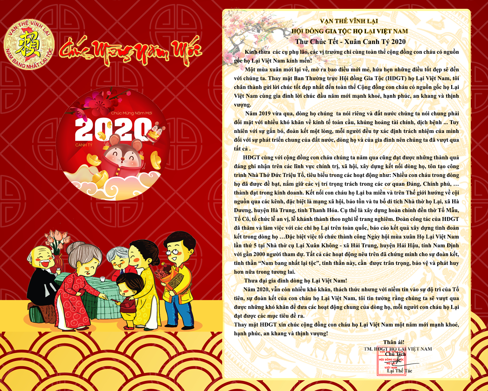

Năm 2019 vừa qua, dòng họ chúng ta nói riêng và đất nước chúng ta nói chung phải đối mặt với nhiều khó khăn về kinh tế toàn cầu, khủng hoảng tài chính, dịch bệnh ... Tuy nhiên với sự gắn bó, đoàn kết một lòng, mỗi người đều tự xác định trách nhiệm của mình đối với sự phát triển chung của đất nước, dòng họ và của gia đình nên chúng ta đã vượt qua tất cả . HĐGT cùng với cộng đồng con cháu chúng ta năm qua cũng đạt được những thành quả đáng ghi nhận trên các lĩnh vực chính trị, xã hội, xây dựng kết nối dòng họ, tôn tạo công trình Nhà Thở Đức Triệu Tổ, tiêu biểu trong các hoạt động như: Nhiều con cháu trong dòng họ đã được đề bạt, nắm giữ các vị trí trọng trách trong các cơ quan Đảng, Chính phủ, … thành đạt trong kinh doanh. Kết nối con cháu họ Lại ba miền và trên Thế giới hướng về cội nguồn qua các kênh, đặc biệt là mạng xã hội, bảo tồn và tu bổ di tích Nhà thờ họ Lại, xã Hà Dương, huyện Hà Trung, tỉnh Thanh Hóa. Cụ thể là xây dựng hoàn chỉnh đền thờ Tổ Mẫu, Tổ Cô, tổ chức lễ an vị, lễ khánh thành theo nghi lễ trang nghiêm. Đoàn công tác của HĐGT đã thăm và làm việc với các chi họ Lại trên toàn quốc, báo cáo kết quả xây dựng tình đoàn kết trong dòng họ …Đặc biệt việc tổ chức thành công Ngày hội mùa xuân Họ Lại Việt Nam lần thứ 5 tại Nhà thờ cụ Lại Xuân Không - xã Hải Trung, huyện Hải Hậu, tỉnh Nam Định với gần 2000 người tham dự. Tất cả các hoạt động nêu trên đã chứng minh cho sự đoàn kết, tinh thần **“Nam bang nhất lại tộc”**, tinh thần này, cần được trân trọng, bảo vệ và phát huy hơn nữa trong tương lai.  Thưa đại gia đình dòng họ Lại Việt Nam!  Năm 2020, vẫn còn nhiều khó khăn, thách thức nhưng với niềm tin vào sự độ trì của Tổ tiên, sự đoàn kết của con cháu họ Lại Việt Nam, tôi tin tưởng rằng chúng ta sẽ vượt qua được những khó khăn để đưa các hoạt động chung của dòng họ, mỗi người con cháu họ Lại đạt được các mục tiêu đề ra.  Thay mặt HĐGT xin chúc cộng đồng con cháu họ Lại Việt Nam một năm mới mạnh khoẻ, hạnh phúc, an khang và thịnh vượng!  Thân ái!

                                                                                             CHỦ TỊCH HĐGT  

                                                                                                     
Lại Thế Tác
