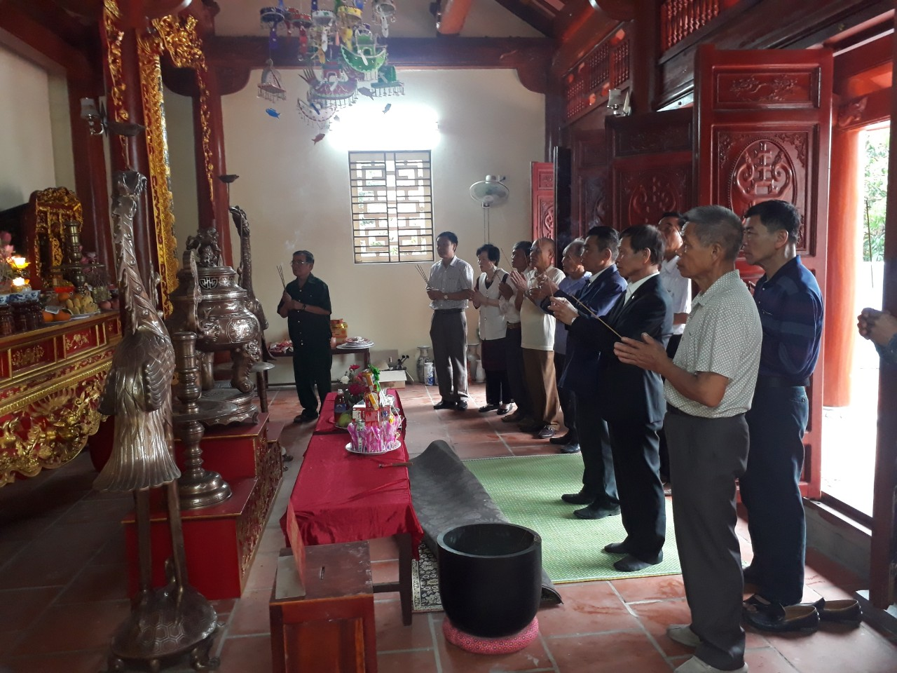
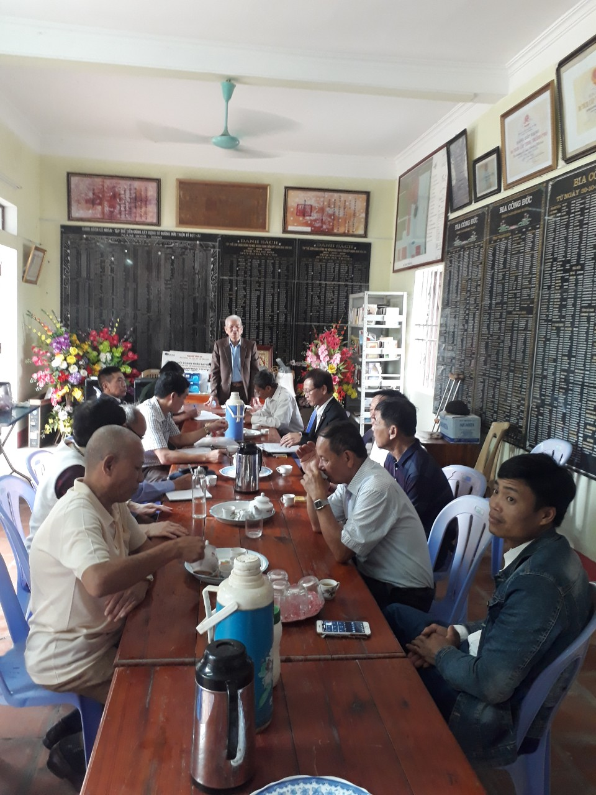
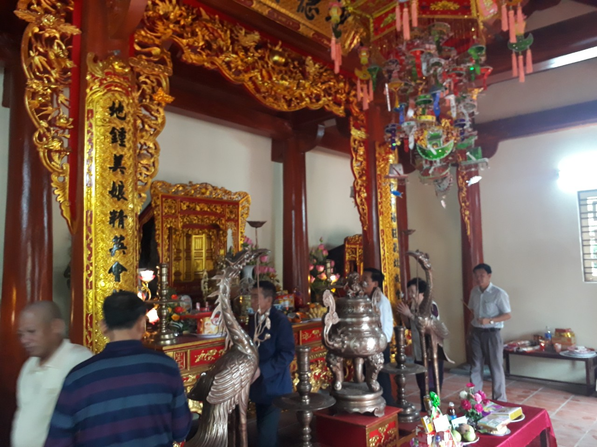

| **BAN THÔNG TIN TRUYỀN THÔNG**    **HỌ LẠI VIỆT NAM**    __________ | **CỘNG HÒA XÃ HỘI CHỦ NGHĨA VIỆT NAM**       **Độc Lập – Tự Do – Hạnh Phúc**     **_______________________________________** |
| --- | --- |
| Số: 02/TB/BTTTT | *Thanh Hóa, ngày 22 tháng 3 năm 2021* |

 **THÔNG BÁO**

NỘI DUNG NGHỊ QUYẾT CỦA HỘI ĐỒNG GIA TỘC HỌ LẠI VIỆT NAM

NGÀY 20/3/2021   ________________  

Ngày 20 tháng 3 năm 2021 tại Nhà thờ Họ Lại, xã Hà Dương (nay là xã Yên Dương), huyện Hà Trung, tỉnh Thanh Hóa, Hội đồng gia tộc họ Lại Việt Nam (viết tắt là HĐGT) đã tổ chức Hội nghị tổng kết việc tổ chức Lễ giỗ Đức Triệu Tổ năm 2021, bàn kế hoạch năm 2021. Hội nghị do Chủ tịch HĐGT Lại Thế Tác chủ trì; đại biểu tham dự có đại diện: các chi họ; các tổ chức trực thuộc HĐGT. Sau khi Chủ tịch HĐGT thay mặt Thường trực HĐGT trình bày báo cáo, các đại biểu đã thảo luận những nội dung nói trên. Chủ tịch HĐGT đã kết luận 02 nội dung, hội nghị đã biểu quyết ban hành Nghị quyết để làm căn cứ triển khai thực hiện, giao Ban Thông tin truyền thông Họ Lại Việt Nam (viết tắt là Ban TTTT) thông báo Nghị quyết đến các chi họ và các tổ chức thuộc HĐGT biết, thực hiện.   Thực hiện Nghị quyết của HĐGT, Ban TTTT xin thông báo tổng hợp các nội dung, cụ thể như sau:  

**I. Đánh giá** **việc tổ chức Lễ giỗ Đức Triệu Tổ năm 2021**  

Thực hiện chỉ đạo của các cấp chính quyền, HĐGT Họ Lại Việt Nam, trong mùa dịch covid - 19, Ban Thường trực HĐGT đã triển khai thực hiện tốt việc tổ chức Lễ giỗ Đức Triệu Tổ năm 2021, như: Ban tổ chức đã chuẩn bị khẩu trang, dung dịch sát khuẩn tay, hướng dẫn cộng đồng con cháu về dâng hương kính tổ thực hiện nghiêm việc đeo khẩu trang và giữ khoảng cách quy định, đảm bảo sức khỏe, an toàn, vì vậy, chính quyền địa phương đã đánh giá cao việc tổ chức thực hiện Lễ giỗ Đức Triệu Tổ của Họ Lại.  

**II.** **Xây dựng kế** **hoạch năm 202****1**  **và triển khai thực hiện**  

***1. Đánh giá chung về hoạt động của HĐGT và cộng đồng con cháu Họ Lại nhiều năm qua***  

Để nối tiếp, phát huy những thành quả của nhiều thế hệ cộng đồng con cháu Họ Lại, nhiều năm qua HĐGT họ Lại Việt Nam, các chi họ, các tổ chức trực thuộc HĐGT đã làm được nhiều việc như kết nối các chi họ, phát triển dòng họ ngày một lớn mạnh, tôn tạo, nâng cấp, xây dựng mới một số hạng mục công trình, khuôn viên Nhà thờ Đức Triệu Tổ, được công nhận xếp hạng di tích lịch sử văn hóa cấp tỉnh. Kết quả đạt được này, HĐGT đánh gia cao về tinh thần trách nhiệm, cũng như sự đóng góp quý báu về vật chất của mỗi người con Họ Lại trong nước và Quốc tế trên các cương vị công tác trong các cơ quan quản lý nhà nước, trong hoạt động kinh doanh…. Tuy vậy, mỗi chúng ta luôn phải nỗ lực phấn đấu để đạt được những thành tích cao hơn nữa trong thời gian đến.  

***2. Về kế*** ***hoạch năm 202******1 và tổ chức thực hiện***  

Trong thời gian qua, với nguyện vọng của các tổ chức, công đồng con cháu Họ Lại mong muốn, kiến nghị HĐGT xem xét hoàn chỉnh quần thể Nhà thờ Đức Triệu Tổ: một là việc triển khai di tu, sửa chữa khu Lăng mộ Đức Triệu Tổ (bao gồm ngôi mộ, tường bao và cồng), vì đã xuống cấp, để xứng tầm của dòng họ chúng ta; hai là làm mới cánh cửa gỗ Cổng Tam Quan Nhà thờ Đức Triệu Tổ (thay vì hiện nay là cửa sắt) để hoàn thiện đồng bộ Cổng Tam quan Nhà thờ.   HĐGT xét thấy, nguyện vọng nêu trên của cộng đồng con cháu là thực tế, chính đáng và cấp thiết, do đó quyết định đưa 02 việc trên vào kế hoạch năm 2021 (gọi là 02 công trình xây dựng), tổ chức triển khai thực hiện ngay trong năm 2021, cụ thể:  

**a)** **Công trình xây dựng**   1) Di tu, sửa chữa khu Lăng mộ Đức Triệu Tổ (bao gồm ngôi mộ, tường bao và cồng).  2) Làm mới cánh cửa gỗ Cổng Tam Quan Nhà thờ Đức Triệu Tổ.  

**b)** **Tổ chức thực hiện**  HĐGT Họ Lại Việt Nam thành lập Ban xây dựng, cụ thể các ông:  1) Ông Lại Thế Tác - Chủ tịch HĐGT - Trưởng ban  2) Ông Lại Ngọc Thư - Phó Chủ tịch HĐGT - Phó ban  3) Ông Lại Thế Lịch - Thường trực HĐGT - TV  4) Ông Lại Quốc Tuấn - Thường trực HĐGT - TV  5) Ông Lại Xuân Đức - Thường trực HĐGT - TV  Ban xây dựng chịu trách nhiệm triển khai thực hiện công trình sau hội nghị này như thủ tục cần thiết để bảo đảm đầu Quý IV/2021 khởi công và thực hiện theo đúng quy định của HĐGT, Quy ước của Gia tộc họ Lại Việt Nam.  

**c) Về kinh phí xây dựng công trình**  

1) Ban xây dựng chịu trách nhiệm lập dự toán ban đầu 02 công trình nêu trên báo cáo Thường trực và HĐGT họ Lại Việt Nam để kêu gọi cộng đồng con cháu ủng hộ, công đức để xây dựng công trình.  

2) HĐGT họ Lại Việt Nam ban hành văn bản kêu gọi cộng đồng con cháu ủng hộ, công đức để xây dựng công trình.   3) Chủ tịch, Trưởng chi, Trưởng Ban trị sự (HĐGT các địa phương, các ngành, các ban trị sự) họ Lại trong và ngoài nước chịu trách nhiệm tuyên truyền, vận động theo văn bản kêu gọi này của HĐGT họ Lại Việt Nam đến cộng đồng con cháu thuộc địa bàn của mình (mức ủng hộ, công đức tối thiểu 01 hộ gia đình là 100 ngàn đồng), trực tiếp nhận ủng hộ, công đức và gửi vào tài khoản của dòng họ do HĐGT họ Lại Việt Nam quản lý (*).   4) Trưởng các tổ chức trực thuộc HĐGT họ Lại Việt Nam chịu trách nhiệm tuyên truyền, vận động theo văn bản kêu gọi này của HĐGT họ Lại Việt Nam đến cộng đồng con cháu họ Lại thuộc tổ chức của mình (mức ủng hộ, công đức tối thiểu 01 cá nhân là 100 ngàn đồng và tùy theo tấm lòng của các nhà hảo tâm, các doanh nhân sinh sống trên khắp vùng miền đất nước và sinh sống và lập nghiệp ở nước ngoài,...), trực tiếp nhận ủng hộ, công đức và gửi vào tài khoản của dòng họ do HĐGT họ Lại Việt Nam quản lý (*).   5) Ngoài mức kêu gọi như đã nêu trên, HĐGT còn có quy định: nếu “cá nhân” ủng hộ, công đức từ trên 100 ngàn đồng đến 01 triệu đồng thì được ghi danh trong Sổ Vàng công đức của Nhà thờ và từ trên 01 triệu đồng thì được ghi danh trong Bia đá tại Nhà thờ.  Ban Thông tin truyền thông họ Lại Việt Nam xin thông báo để các chi họ, các tổ chức thuộc Hội đồng gia tộc họ Lại Việt Nam biết, thực hiện./.  ****Ghi chú:***  Số tài khoản của dòng họ do HĐGT Họ Lại Việt Nam quản lý:  Lại Quốc Tuấn: 50512 0000 10420 Ngân hàng đầu tư và phát triển Việt Nam chi nhánh Bỉm Sơn Thanh Hóa.  Điện thoại chủ tài khoản: 0988 625 219  Điện thoại Ban Thường trực HĐGT: 085 797 6533 - ông Lại Thế Tác  
 

| ***Nơi nhận:***    - Chủ tịch, các PCT      HĐGTHLVN,    - Các TV HĐGTHLVN,    - Các chi họ, các tổ chức thuộc      HĐGTHLVN,    - Lưu: Ban TTTT. | **BAN THÔNG TIN TRUYỀN THÔNG** **HỌ LẠI VIỆT NAM**   **TRƯỞNG BAN**			 *(Đã ký)*    **Lại Xuân Cương** |
| --- | --- |

Một số hình ảnh của buổi họp:  
 

**Hội đồng gia tộc dâng hương trước khi vào họp**

 

**Ông Lại Thế Tác (Chủ tịch HĐGT) phát biểu trong cuộc họp**

 

**các thành viên HĐGT Dâng hương tại đền thờ Tổ Mẫu, Tổ Cô.**
