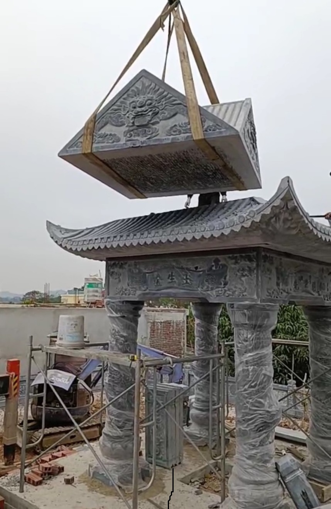
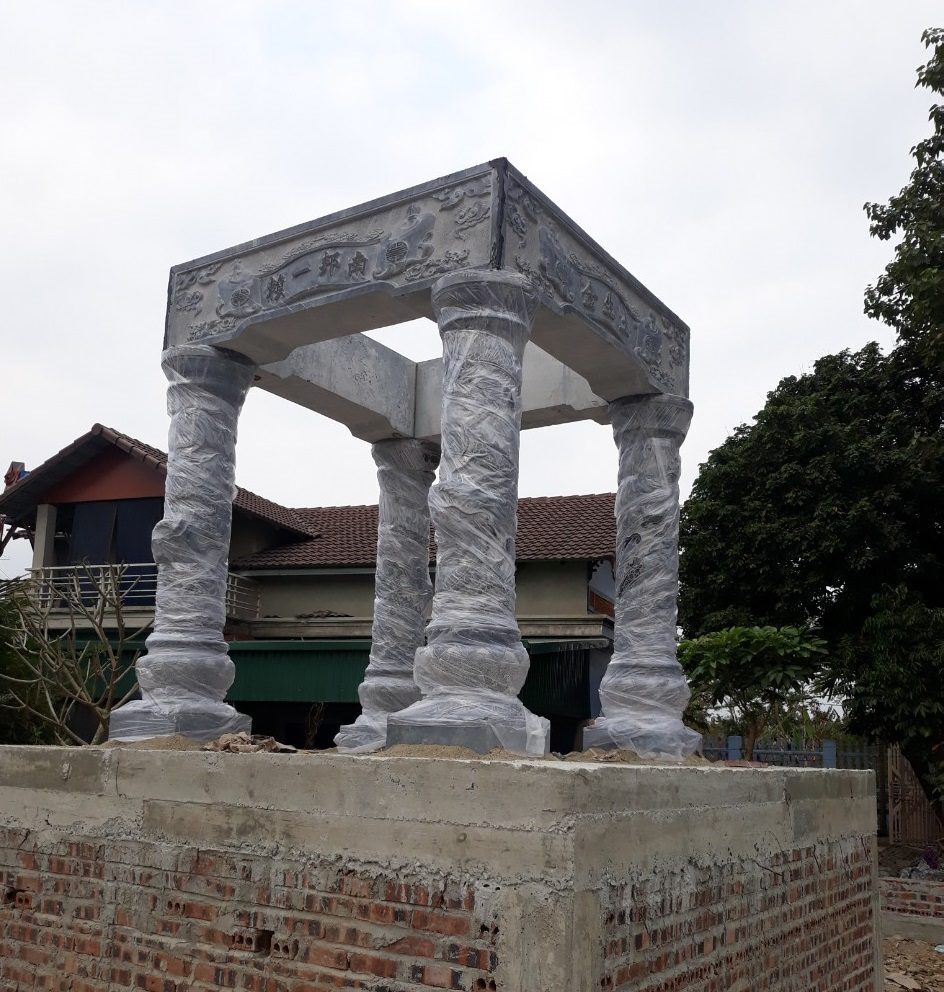
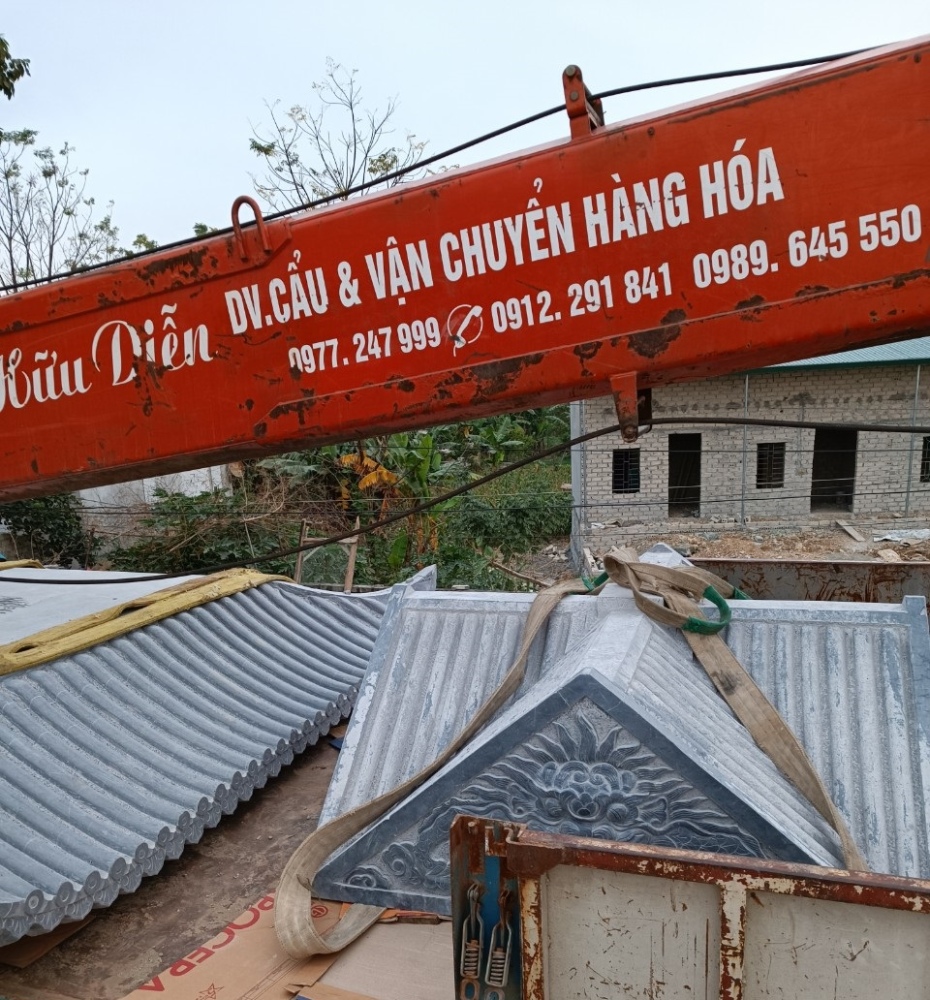
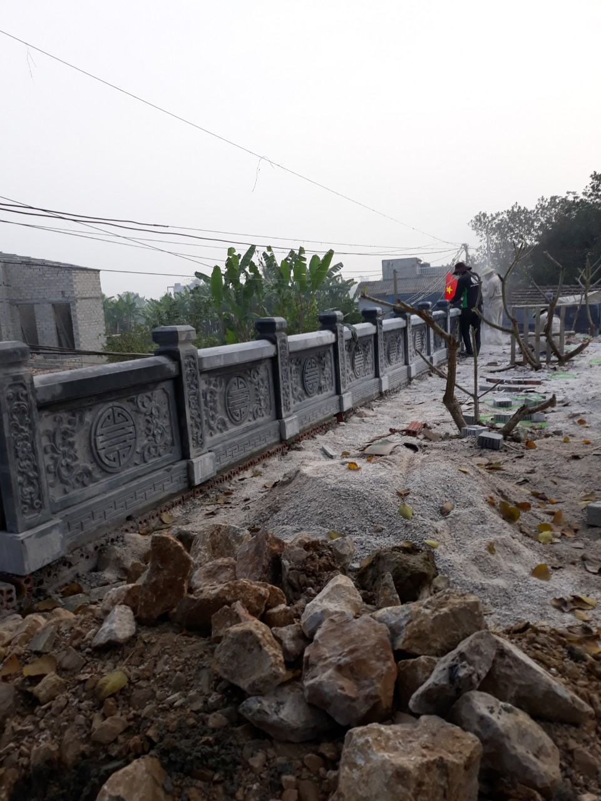

# Ngày 14 tháng 10 năm 2021 (tức ngày 09 tháng 09 năm Tân Sửu) HĐGT đã tổ chức Lễ động thổ công trình Cải tạo khuôn viên Lăng Mộ Đức Triệu Tổ họ Lại Việt Nam.  Ngày 28 tháng 12 năm 2021 (tức ngày 25/11 năm Tân Sửu) vào hồi 8h15', HĐGT đã cử hành Lễ cất nóc lăng mộ Đức Triệu Tổ họ Lại Việt Nam.  Như vậy, đến nay, dưới bàn tay khéo léo của các nghệ nhân tài hoa và sự đốc thúc, giám sát thường nhật, kỹ lưỡng của các chú, các bác trong Thường trực HĐGT, công trình đã dần đến giai đoạn hoàn thiện, nghiệm thu.  Để có được kết quả, thành công, nhanh chóng như nêu trên là ngoài sự đảm bảo tiến độ, chất lượng, kỹ thuật của các nghệ nhân, những người thợ đá lành nghề, trong đó có trách nhiệm, sự vất vả, giám sát sát sao của các chú, các bác trong Thường trức HĐGT, đồng thời HĐGT đã ghi nhận có sự chung sức chung lòng, đặc biệt là sự đóng góp về tài chính, vật chất của tổ chức, các chi họ, con cháu thuộc dòng Họ Lại khắp mọi miền đất nước và trên thế giới đã công đức, gửi về HĐGT lo việc tâm linh này để Tổ tiên trên cao được an lòng.  Tuy nhiên, đến nay Thường trực HĐGT đã tổng hợp kinh phí, để thanh toán cho công trình khi nghiệm thu vẫn còn thiếu nhiều.  Vì vậy, HĐGT Họ Lại Việt Nam tiếp tục ra lời kêu gọi các chi họ, các cá nhân, các doanh nhân, doanh nghiệp có nguồn gốc Họ Lại Việt Nam trong và ngoài nước tiếp tục chung tay chung sức và chung lòng phát tâm công đức về kinh phí, vật chất, trí tuệ để hoàn thành công trình theo đúng kế hoạch. HĐGT dự kiến khánh thành công trình vào ngày Giỗ Đức Triệu Tổ, ngày 15 tháng Giêng năm 2022 âm lịch.

# **Mọi đóng góp xin vui lòng gửi về:  - Ông Lại Quốc Tuấn (UVHĐGT họ Lại Việt Nam, Phó ban xây dựng)  - STK: 50512000010420  - Ngân hàng đầu tư và phát triển - chi nhánh Bỉm Sơn, Thanh Hóa  - Nội dung CK: Họ Và Tên, Số ĐT, Công đức xây dựng Lăng Mộ tổ  - Số ĐT liên hệ: 0988.625.219  Một số hình ảnh lễ cất nóc mộ Đức Triệu Tổ**

 

 

 

 

