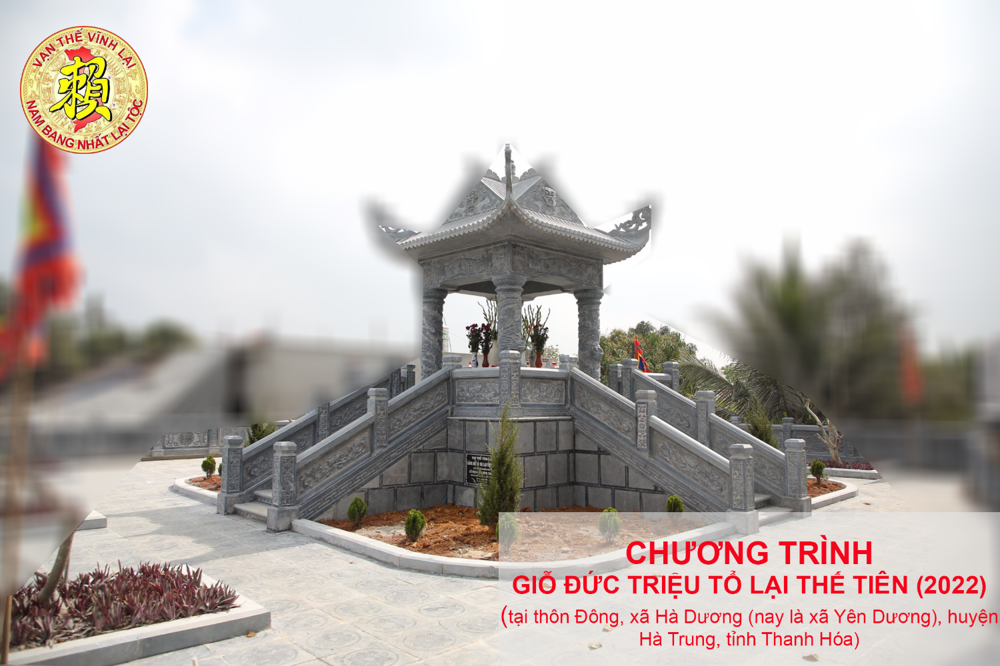

**[Vạn thế Vĩnh Lại]**

Ban TT Truyền thông xin thông báo một số nội dung trong kế hoạch tổ chức lễ giỗ Đức Triệu Tổ Họ Lại Việt Nam theo chỉ thị của HĐGT Họ Lại Việt Nam như sau:

**CHƯƠNG TRÌNH GIỖ ĐỨC TRIỆU TỔ LẠI THẾ TIÊN**  
(tại thôn Đông, xã Hà Dương (nay là xã Yên Dương), huyện Hà Trung, tỉnh Thanh Hóa)

* **Ngày 10,11,12,13 Và sáng 14/ 01 /2022 (Âm lịch)**  
+ Ban TTHĐGT đón con cháu Họ Lại Việt Nam về dâng hương cúng tổ.  
*** Ngày 14/01/2022 (Âm lịch)  
+ 14h05 :** HĐGT dâng hương cáo tổ.  
*** Ngày 15/01/ 2022 (Âm lịch)**  
**+ 7h 30 :** Cáo tổ và đón các đoàn đại biểu, cộng đồng con cháu Lại tộc về viếng tổ.  
**+ 11h15 :** Con, cháu Lại tộc thụ lộc tổ.  
**+ 13h30:** Họp tổng kết  

**Lưu ý: Hiên nay, tình hình dịch Covid vẫn đang diễn biến khó lường. Theo chỉ thị của nhà nước và cũng là đảm bảo sức khỏe của cộng đồng con cháu Họ Lại Việt Nam, HĐGT yêu cầu con cháu về dâng hương giỗ Tổ phải thực hiện tốt quy định 5k phòng dịch covid và theo sự sắp xếp, chỉ đạo của ban tổ chức.**  

***Trân trọng kính báo!***
