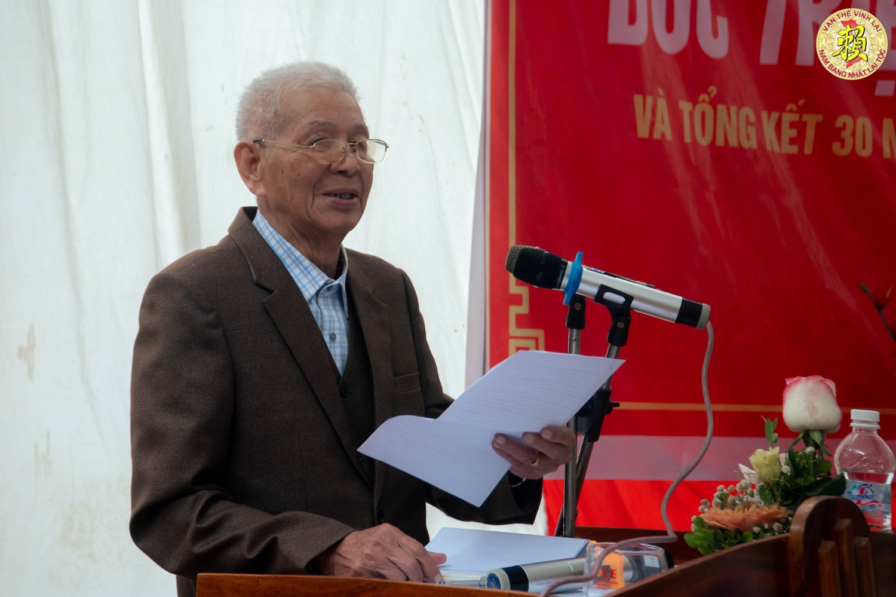

| **VẠN THẾ VĨNH LẠI**    **HỘI ĐỒNG GIA TỘC HỌ LẠI VIỆT NAM**  **___________** |
| --- |
| *Thanh Hóa**, ngày 15*  *tháng giêng*  *năm 2023* |

**LỄ GIỖ TỔ LẠI THẾ TIÊN**  **VÀ BÁO CÁO TỔNG KẾT TRÊN 30 NĂM HOẠT ĐỘNG CỦA**   **HỘI ĐỒNG GIA TỘC HỌ LẠI VIỆT NAM**   **HOẠT ĐỘNG TRONG THỜI GIAN TỚI**

**________________________**  

**Phần thứ nhất:**  **LỄ GIỖ TỔ LẠI THẾ TIÊN**

Kính thưa các vị khách quý đại diện Đảng, chính quyền, tổ chức đoàn thể xã Yên Dương, huyện Hà Dương, tỉnh Thanh Hóa,  Kính thưa các vị cao niên cùng ông, bà, cô, dì, chú, bác, anh chị em, con, cháu, dâu, rể họ Lại Việt Nam,  Tôi là Lại Thế Tác - Chủ tịch Hội đồng gia tộc họ Lại Việt Nam, thay mặt Hội đồng gia tộc, xin kính chào quý khách, các vị cao niên cùng ông, bà, cô, dì, chú, bác, anh chị em, con, cháu, dâu, rể họ Lại Việt Nam  Căn cứ hệ thống gia Phả họ Lại Việt Nam được lưu truyền và tu chỉnh 19 lần, đã tồn tại trên 700 năm với trên 30 đời và cụ tổ là Đức triệu Tổ Lại Thế Tiên, mất vào ngày 15 tháng Giêng năm Ất Sửu (năm 1445), an táng tại thôn Quang Lãng Đông, Tống Sơn, Thanh Hóa (nay là thông Đông, xã Yên Dương, huyện Hà Trung, tỉnh Thanh Hóa);  Hội đồng Gia tộc họ Lại Việt Nam ban hành Quy ước của Gia tộc họ Lại Việt Nam (năm 2020), tại Điều 9 quy định tổ chức Giỗ Đức Triệu Tổ. Năm 2023 không phải là năm chẵn. Tuy nhiên, những năm qua do dịch Covid 19 bùng phát nên không tổ chức được theo quy định. Ngày 25 tháng 12 năm 2022, Hội đồng gia tộc Họ Lại Việt Nam đã tổ chức Hội nghị tổng kết hoạt động năm 2022, triển khai công việc năm 2023. Tại Hội nghị này, Hội đồng Gia tộc đã quyết định hình thức tổ chức Giỗ Đức Triệu Tổ từ ngày 13 đến ngày 15 tháng Giêng năm 2023 *(Chương trình Giỗ Tổ, Thường trực Hội đồng Gia tộc đã có thông báo trên trang website của dòng họ)*.   Ông cha ta thường nói, chim có tổ, con người có tông, con cháu nhớ về cội nguồn:

## Cây có gốc mới nở ngành xanh ngọn

## Nước có nguồn mới bể rộng sông sâu

## Người ta nguồn gốc từ đâu

## Có tổ tiên trước rồi sau có mình

Như vậy, Ban Tổ chức đến nay đã đón các con cháu không có điều kiện về ngày 14 và 15 dâng hương Kính Tổ trước; thay mặt Ban Tổ chức, tôi cám ơn các Đội Tế nam Hải Hậu-Nam Định, Ninh Bình và Đội Tế nữ Tiên Mai-Hà Nội, Thái Bình cùng Đội múa Rồng Tiên Mai-Hà Nội, Đội khiêng Kiệu Ninh Bình và các con chàu trong Họ rước Đức Triệu Tổ Lại Thế Tiên từ Lăng mộ về Nhà Thờ. Giờ phút long trọng này tất cả chúng ta khắp mọi miền đất nước về đây dự lễ giỗ cụ và tổ chức mít tinh gặp mặt con cháu về Nhà thờ Kính Tổ.   ***(Kính mời các vị đại biểu và các vị cao niên cùng ông, bà, cô, dì, chú, bác, anh chị em, con, cháu, dâu, rể họ Lại Việt Nam đứng dậy, dành 1 phút tưởng nhớ Đức Triệu Tổ và các bậc tiền nhân, bà mẹ Việt Nam anh hùng, liệt sỹ thuộc dòng họ Lại Việt Nam)***  

Kính thưa quý vị!  Như chúng ta đã biết, Tín ngưỡng thờ cúng Tổ Tiên có vị trí đặc biệt trong văn hóa tâm linh của người Việt Nam ta. Mỗi gia đình Việt, dù giàu, dù nghèo, dù khó đến đâu thì tại tư gia, tại nơi định cư, hay nơi tạm trú đều có bàn thờ Tổ Tiên, ông bà cha mẹ. Trên khắp mọi miền đất nước từ cụ cao niên, đến các cháu ấu nhi, nếu được hỏi, thì tất cả đều trả lời: nhờ công ơn bố mẹ - ba má sinh thành dưỡng dục, nhờ ân đức của ông bà, tổ tiên, họ tộc mới có được ngày hôm nay. Ở Việt Nam, dòng họ đã gắn liền với lịch sử dựng nước, giữ nước, gắn liền với vận mệnh dân tộc, gắn liền với đời sống thăng trầm của nhân dân. Như vậy có thể khẳng định: dòng họ có vai trò rất quan trọng trong xã hội của mỗi Quốc gia. Dòng họ luôn là thành tố cấu thành Quốc gia, gắn liền với sự nghiệp của Quốc gia, dân tộc. Biết phát huy vai trò của dòng họ ở mọi nơi, mọi lúc là biết phát huy sức mạnh, nguồn lực trong sự nghiệp phát triển Kinh tế - xã hội của đất nước. Chúng ta, những cháu con họ Lại nhận thức được điều này, đoàn kết, sẻ chia, đồng tâm, hợp lực dưới mái Nhà thờ Đức Triệu Tổ Lại Thế Tiên, trong dòng hào khí, công đức Tổ tiên, cùng nhau góp sức xây dựng đất nước. Đó là nghĩa vụ thiêng liêng, đó cũng chính là mục đích tín ngưỡng ngàn đời cha ông ta để lại. Đó cũng là sự trường tồn vĩnh hằng Văn hóa dòng họ trong văn hóa tâm linh của người Việt.  

Kính thưa quý vị!  Sự gắn kết tình huyết tộc trong xã hội là một lẽ tự thân, tự nguyện, chân thành không gì ngăn cản nổi của mỗi người con trong dòng họ. Họ Lại chúng ta là một dòng họ tuy không lớn so với dòng họ khác nhưng người họ Lại gặp nhau là tay bắt mặt mừng, cuốn hút như từ trường như những thanh Nam châm, gắn kết, sẻ chia giúp đỡ lẫn nhau trong tình huyết tộc. Trong lịch sử Việt Nam, họ Lại chưa một lần làm Vua, nhưng có bà mẹ họ Lại là vợ Vua. Có nghĩa, trong huyết thống những vị kế Vua anh minh của đất nước có huyết thống họ Lại. Thành ngữ có câu: “Phúc đức tại Mẫu”, từ đây suy ra: các vị Vua có công cao, đức dầy của dân tộc có nguyên ân phúc đức từ những Mẫu thân họ Lại.  

Trong lịch sử Việt nam, thời đại nào cũng có người họ Lại làm rạng danh đất nước. Cùng với Thời Lý là Lại Linh, Thời Ngô là Lại Văn Thanh, Thời Lê là Lại Thế Tương, Thời Mạc là Lại Mẫn, Lại Thế Vinh, Lại Thế Khanh, ... có nhiều người con họ Lại đã, đang giữ các trọng trách trên nhiều lĩnh vực của đất nước. Những người con họ Lại đã nỗ lực cống hiến tài năng, trí, đức, được dân tin, dân kính, mỗi khi nhắc đến, chúng ta đều thấy tự hào. Trong nhiều lĩnh vực xã hội, họ Lại đều có nhân tài,... tôi không thể nào thống kê hết được, còn biết bao những người họ Lại nổi danh, còn biết bao người họ Lại tuy không nổi danh, nhưng đã thầm lặng hy sinh ... cho tổ quốc (hàng ngàn liệt sỹ đã hy sinh trên chiến trường và tiêu biểu là họ Lại Phù Vân, thành phố Phủ Lý, tỉnh Hà Nam có phong trào tòng quân trong thời kỳ chống Mỹ cứu nước, đã được Chủ Tịch Hồ Chí Minh có thư khen ngợi), ngày đêm lao động quên mình trên nhiều lĩnh vực, còn biết bao những người họ Lại bình thường, nhưng không tầm thường, còn biết bao cháu, con, dâu, rể họ Lại chúng ta đã, đang đồng hành cùng hàng trăm dòng họ anh em làm nên lịch sử vẻ vang của đất nước và tôi khẳng định hôm nay, chúng ta có quyền tự hào về dòng dõi họ Lại trên đất nước Việt nam.  

Kính thưa quý vị!  Vạn Thế Vĩnh Lại, có nghĩa là họ Lại Việt Nam trường tồn cùng lịch sử dân tộc và tôi cũng nhận thấy rằng, Đức Triệu Tổ ta ở nơi chín suối xa xăm đã, đang rất đỗi vui mừng khi thấy cháu con tề tựu, tụ quần, đoàn kết yêu thương dưới mái Nhà thờ Đức Triệu Tổ Lại Thế Tiên. Thành ngữ có câu: “Sống vì Tổ vì Tiên, chứ đâu phải vì tiền, vì của”, với tinh thần này, tôi mong rằng, từ nay, chúng ta gắn kết hơn xưa, đồng tâm hiệp lực hơn xưa, giúp đỡ sẻ chia hơn xưa về những thuận lợi, khó khăn, về những bí quyết sản xuất, kinh doanh, cùng sẻ chia trí tuệ, áo cơm trong dòng tộc và trong xã hội. Họ Lại tiếp tục kết nối, giúp nhau xóa đói giảm nghèo, khuyến tài khuyến học, phục dựng Gia phả, xây dựng từ đường, tu chỉnh mồ mả Tổ Tiên, ông bà, cha mẹ. Họ Lại quyết không làm việc xấu, việc ác, con cháu không mắc tệ nạn xã hội, không vi phạm pháp luật, không phụ lòng Tổ Tiên, dòng tộc.   Hôm nay - kỳ Húy nhật Đức Triệu Tổ Lại Thế Tiên, chúng ta hội tụ tại Nhà thờ Đức Triệu Tổ hãy cùng nhau kính cẩn dâng nén hương thơm cầu thỉnh linh vong Người về phù hộ độ trì cho con cháu trong dòng họ khỏe mạnh bình an, Kính xin đức Triệu tổ xóa điểm mực, tăng điểm son cho con cháu làm ăn phát đạt, thăng quan tiến chức, các công ty của con cháu trong nước cũng như nước ngoài liên tục phát triển, buôn thuận bán may, doanh thu năm sau tăng gấp năm gấp mười năm trước, lộc tài vượng tiến, các con cháu trong tuổi đi học học hay hơn bạn, học giỏi hơn người, gia đạo hưng long, bốn mùa không hạn ách tai ương, ba tháng hè, chín tháng đông được xanh như lá, đẹp như hoa, anh chị em con cháu trong dòng họ đoàn kết thương yêu nhau như nước chảy một dòng, như trăm sông đổ về một bến, tiêu trừ bệnh tật tai ương, đi ra đường tham gia gia thông, đi đường biển, đường sông, đường hàng không, đường tàu hỏa, ôtô, xe máy, xe đạp hay đi qua đường đều được an toàn đi đến nơi về đến chốn.  

**Phần thứ hai: BÁO CÁO TỔNG KẾT TRÊN 30 NĂM HOẠT ĐỘNG CỦA HỘI ĐỒNG GIA TỘC HỌ LẠI VIỆT NAM**  

Đáp ứng với sự phát triển của đất nước trong tình hình mới, các tổ chức xã hội, các dòng họ cũng luôn thay đổi về tổ chức, hoạt động cho phù hợp để cùng phát triển. Vì vậy, năm 1989 họ Lại Việt Nam đã thành lập Hội đồng gia tộc họ Lại Việt Nam, cho đến nay đã hoạt động trên 30 năm. Hoạt động của Hội đồng gia tộc là bao gồm những vấn đề lớn quan trọng của dòng họ Lại. Để triển khai thực hiện nhứng vấn đề lớn này, Hội đồng gia tộc đã quyết định xây dựng chiến lược, quy hoạch phát triển dòng họ; ban hành nhiều Nghị quyết, kế hoạch cụ thể từng năm để thực hiện những vấn đề lớn, các nội dung quan trọng của họ Lại trên toàn quốc; Đặc biệt là những việc đã thực hiện tại khuôn viên Nhà thờ Đức Triệu Tổ Lại Thế Tiên và Lăng mộ trên 30 năm qua, tại Lễ Giỗ Tổ hôm nay,  

Tôi xin phép được báo cáo tóm tắt kết quả đạt được, cụ thể như sau:  **I. Tổng hợp những hoạt động chính của Hội đồng gia tộc họ Lại Việt Nam:**   1. Hội đồng gia tộc họ Lại Việt Nam được các chi họ thành lập năm 1989  2. Thành lập Ban Thường trực Hội đồng gia tộc họ Lại Việt Nam năm 1989  3. Thành lập các Tổ chức thuộc Hội đồng gia tộc   Thành lập 03 tổ chức trực thuộc Hội đồng gia tộc: Ban liên lạc con cháu họ Lại VN (năm 2013), Hội doanh nhân Lại Việt (năm 2017) và Ban Thông tin truyền thông họ Lại VN (năm 2018)   4. Hội đồng gia tộc họ Lại Việt Nam đã phối hợp với các địa phương thành lập Hội đồng gia tộc các tỉnh Thái Bình, Hà Nam, Hội đồng gia tộc các ngành Thượng Hữu Nam Vân (tỉnh Nam Định), Hội đồng gia tộc khu vực thành phố Hồ Chí Minh, Tây Nguyên,... (những năm gần đây)  5. Đã tuyên truyền, kết nối giữa các chi họ với ngành A, B, kể cả các cá nhân dòng họ Lại tìm về với cội nguồn, tổ tiên về với Nhà thờ Tổ (Thường xuyên)  6. Tu phả Họ Lại Việt Nam: lần thứ 18 (năm 2003) và lần thứ 19 (năm 2013)   7. Năm 2001 hoàn tất thủ tục trình các cấp và đã được Cấp Bằng di tích lịch sử - văn hóa cấp tỉnh và tổ chức đón Bằng di tích đối với Nhà thờ Đức Triệu Tổ Lại Thế Tiên   8. Năm 2020 Ban hành Quy ước dòng họ Lại Việt Nam   9. Năm 2015 Hội đồng gia tộc họ Lại Việt Nam chỉ đạo Ban liên lạc con cháu họ Lại Việt Nam lập và đã phê duyệt quy hoạch tổng thể Nhà thờ Đức Triệu Tổ Lại Thế Tiên và Lăng mộ   10. Năm 2018 tổ chức hoạt động cầu an cầu siêu, tương thân tương ái trong dòng họ Lại, 05 lần hội thao dòng họ Lại, Tổ chức Ngày hội xuân: 02 lần tại địa phương (Hải Hậu Nam Định, và tại Phù Vân, thành phố Phủ Lý, tỉnh Hà Nam) và nhiều năm tại Thủ Đô Hà Nội...  **II. Về những công trình nâng cấp và xây dựng mới đã thực hiện**   Thay mặt Hội đồng gia tộc họ Lại Việt Nam tôi báo cáo tóm tắt các nội dung, công việc thực hiện trên 30 năm qua, cụ thể:   1. Năm 1990 xây dựng mới hạng mục công trình Nhà Trung đường  2. Năm 1998 nâng cấp và xây dựng mới (lần thứ nhất) các hạng mục công trình Lăng mộ Đức Triệu Tổ Lại Thế Tiên bằng bê tông cốt thép  3. Năm 1999 xây dựng mới hạng mục công trình Nhà làm việc của Hội đồng gia tộc. Nay là Nhà truyền thống dòng họ Lại   4. Năm 2002 xây dựng mới hạng mục công trình Lăng mộ ông bà cụ Khanh  5. Năm 2005 xây nhà Bia ghi Tên nhứng người con họ Lại là các bậc Tiền nhân, Bà Mẹ Việt Nam anh hùng, các Liệt sỹ, Thư khen ngợi của Chủ Tịch Hồ Chí Minh đối với dòng họ Lại Phù Vân, thành phố Phủ Lý, tỉnh Hà Nam có phong trào tòng quân trong thời kỳ chống Mỹ cứu nước   6. Năm 2007 xây dựng: đường bê tông dài 300 mét trước cống chính Nhà thờ; nhà làm việc của Hội đồng gia tộc.  7. Năm 2010 chuộc lại đất xung quanh Nhà thờ.  8. Năm 2012 xây lại Cung chính của Nhà thờ; đúc tượng các cụ: Đức Triệu Tổ Lại Thế Tiên, Lại Thế Lạc, Lại Xuân Không   9. Năm 2014 mua đất làm bãi đỗ xe ô tô.  10. Năm 2015 mua lại đất phía nam Nhà thờ để xây Cổng Tam Quan và Nhà ăn   11. Năm 2015 – 2016 lát gạch toàn bộ sân trong khuôn viên và dựng Núi Non Bộ.   12. Năm 2017 – 2018 mua và chuộc lại đất phía Đông của Nhà thờ, để Xây Nhà thờ Mẫu, Tổ Cô, Bà Mẹ Việt Nam anh hùng, tường bao khuôn viên Nhà thờ Tổ   13. Năm 2019 đổ bê tông sân đỗ xe ô tô của Nhà thờ.  14. Năm 2020 - 2021 xây dựng mới Lăng mộ Đức Triệu Tổ Lại Thế Tiên hoàn toàn bằng đá xanh và khuôn viên Lăng mộ (lần thứ 2).  15. Năm 2022 xây dựng mới: đường của thôn vào Nhà thờ; công trình vệ sinh; lắp hệ thống nước sạch; lắp các cây đèn điện chiếu sáng trong khuôn viên Nhà thờ và cải tạo hệ thống mương trước cổng chính có lắp bê tông chảy ra hướng Trạm bơm   16. Năm 2022 phối hợp với chính quyền địa phương nâng cấp đường đoạn dài 1.800 mét từ Lăng mộ Tổ về thôn Đông, phía trước Nhà thờ Tổ họ Lại đóng góp với xã kinh phí xây dựng.  17. Năm 2022 phối hợp với Tỉnh đầu tư công trình xây dựng mới Nhà thờ cụ Lại Thế Khanh và các hạng mục phù trợ  18. Lên kế hoạch xây dựng mới trong khuôn viên Nhà thờ Tổ hạng mục công trình nhà Truyền thống dòng họ Lại và mái che phía trước Nhà Bái đường trong khuôn viên Nhà thờ Tổ  19. Hội đồng gia tộc họ Lại Việt Nam đã giao Thường trực Hội đồng gia tộc kiểm kê tài sản hiện có của Nhà thờ Đức Triệu Tổ đầy đủ; việc xây dựng quỹ của Hội đồng gia tộc: nguồn thu từ các nguồn hợp pháp như kinh phí đóng góp từ các chi họ, công đức của cá nhân, doanh nghiệp; chi phí cho xây dựng cơ bản và cho việc tổ chức các sự kiện và công việc của Họ đã tổng hợp đầy đủ, công khai, có Ban kiểm soát thuộc Hội đồng gia tộc thẩm định,...  **III.** **Dự kiến các hoạt động của Hội đồng gia tộc trong thời gian tới**  Như tôi đã báo cáo tóm tắt trên về kết quả những hoạt động của Hội đồng gia tộc họ Lại Việt Nam và của các Hội đồng gia tộc các địa phương, thời gian trên 30 năm là một thời gian tuy không dài nhưng chũng ta đã làm được nhiều việc có ý nghĩa với dòng họ. Tuy nhiên, cũng từ những hoạt động này chúng ta cũng cần xem xét từng việc, đánh giá mặt được, mặt chưa được để điều chỉnh trong thời gian tới hoạt động tốt hơn, có ý nghĩa sâu, rộng, tăng sự đoàn kết bền vững để hòa nhập đáp ứng với sự phát triển của đất nước, cụ thể:  1. Hội đồng gia tộc họ Lại Việt Nam sớm ban hành văn bản hướng dẫn thực hiện Quy ước gia tộc họ Lại Việt Nam và tuyên truyền để các chi họ, các tổ chức và cá nhân biết thực hiện.  2. Hội đồng gia tộc họ Lại Việt Nam sẽ phân công đại diện dành thời gian đến tiếp xúc, tiếp tục tuyên truyền đến với các chi họ, tổ chức, cá nhân về truyền thống, lịch sử dòng họ Lại; thành lập Ban Tu Phả để tiếp tục cập nhật đầy đủ, chính xác các thông tin tìm về cội nguồn, từ các chi họ, ngành để kết nối về Nhà Thờ Đức Triệu Tổ. Tiếp tục việc Tu phả Họ Lại Việt Nam lần thứ 20 sẽ thực hiện theo quy định tại Quy ước gia tộc họ Lại Việt Nam.  3. Về nâng cấp, xây dựng mới các nhà thờ đối với các bậc tiền nhân, người có công với đất nước thuộc các chi họ địa phương, Hội đồng gia tộc họ Lại Việt Nam sẽ tổng hợp, theo dõi, thống nhất quản lý tất cả các nơi thờ tự các bậc tiền nhân họ Lại được Nhà nước và các địa phương từ cấp tỉnh (hay huyện) vinh danh, đồng thời khuyến khích, ủng hộ động viên con cháu các chị họ trên cả nước xây dựng, từ tạo nơi thờ tự tổ tiên ngày càng khang trang.  4. Về kiện toàn tổ chức Hội đồng gia tộc họ Lại Việt Nam, Hội đồng gia tộc họ Lại các địa phương là cần thiết để điều chỉnh, bổ sung cho phù hợp với thực tế với sự phát triển của dòng họ và đất nước. Việc kiện toàn tổ chức sẽ thực hiện sớm theo quy định tại Quy ước gia tộc họ Lại Việt Nam.  5. Về tổ chức Giỗ Tổ, Ngày hội mùa Xuân, Hội thao dòng họ, ... cần tổ chức long trọng, trên tinh thần tiết kiệm, tăng tình đoàn kết gắn bó giữa các chi họ, cá nhân trong dòng họ và từng bước điều chỉnh phù hợp theo quy định về niên hạn tổ chức, quy mô tổ chức, tiết kiệm, an toàn theo quy định tại Quy ước gia tộc họ Lại Việt Nam.  Năm 2023, Hội đồng gia tộc họ Lại Việt Nam đã có nghị quyết về tổ chức Ngày hội mùa Xuân 2023 vào cuối quý I/2023 tại Xã Đông Vinh, huyện Đông Hưng, tỉnh Thái Bình (Ngành A - Nhà thờ cụ Lại Thế Lạc) và Tổ chức kỷ niệm 30 năm thành lập Hội đồng gia tộc họ Lại Việt Nam. Ban Tổ chức sẽ có thông báo cụ thể việc này đến các chi họ và toàn thể gia tộc họ Lại biết và tham gia.  6. Về kế hoạch thực hiện xây dựng mới trong khuôn viên Nhà thờ Tổ, hạng mục công trình Nhà Truyền thống dòng họ Lại và mái che phía trước Nhà Bái đường trong khuôn viên Nhà thờ Tổ, Hội đồng gia tộc họ Lại Việt Nam tiếp tục kêu gọi, các chi họ đóng góp, các tổ chức, cá nhân quan tâm công đức để có kinh phí thực hiện công trình trong năm 2023, các đóng góp này sẽ được ghi nhận theo quy định tại Quy ước gia tộc họ Lại Việt Nam.  Như vậy, Hội đồng gia tộc họ Lại Việt Nam và Hội đồng gia tộc họ Lại các địa phưng cần có kế hoạch triển khai thực hiện các nội dung hoạt đông nêu trên và tiếp tục chỉ đạo thực hiện nhưng việc khác,... căn cứ thực tế của từng địa phương. Và có sự gắn kết giữa HĐGT và các chi họ trong cả nước và các chi họ ở nước ngoài.  

**IV.** **Khen thưởng các chi họ, tập thể, các nhân có thành tích trong hoạt động của Hội đồng gia tộc họ Lại Việt Nam**  1. Khen thưởng Chữ Đức đối với các cá nhân (có danh sách kèm theo) đã có tâm, có đức, có công, tham gia với Hội đồng gia tộc tu Phả họ Lại Việt Nam lần thứ 18 (năm 2003) và lần thứ 19 (năm 2013)   2. Khen thưởng Chữ Đức đối với các tổ chức, doanh nghiệp, gia đình, cá nhân (có danh sách kèm theo) đã có tâm công đức về Nhà thờ Triệu tổ Tổ từ 50 triệu đồng trở lên   3. Ghi Tên trên bia đá và sổ vàng tại Nhà thờ Tổ đối với các tổ chức, doanh nghiệp, gia đình, cá nhân đã có tâm công đức từ 50 triệu đồng trở xuống.  Kính thưa các vị đại biểu khách quý!  Một lần nữa, thay mặt Hội đồng gia tộc họ Lại Việt Nam tôi xin nhấn mạnh mấy ý kiến như sau:  Thứ nhất tôi trân trọng cám ơn chính quyền địa phương, thôn Đông, xã Yên Dương, huyện Hà Trung (tỉnh Thanh Hóa) về việc phối hợp, giúp đỡ có hiệu quả Hội đồng gia tộc họ Lại Việt Nam để có những con đường vào Nhà thờ Đức Triệu Tổ Lại Thế Tiên được thuận lợi, môi trường trong sạch như hôm nay. Đặc biệt là đã Quyết định Cấp Bằng di tích lịch sử - văn hóa cấp tỉnh Nhà thờ Đức Triệu Tổ Lại Thế Tiên (năm 2001) và tôi cũng cám ơn UBND, HĐND và các đơn vị chức năng của huyện Hà Trung và UBND, HĐND, Sở Văn hóa - Thể thao - Du lịch và các cơ quan, ban ngành tỉnh Thanh Hóa đã đầu tư công trình xây dựng mới Nhà thờ cụ Lại Thế Khanh và các hạng mục phù trợ, công trình đã được khánh thành cuối năm 2022.  Thứ hai tôi trân trọng cám ơn Hội đồng gia tộc các chi họ một số địa phương cũng như Ban trị sự của Ngành B, đã chủ động huy động kinh phí nâng cấp, xây dựng mới Nhà thờ, Lăng mộ của các bậc tiền nhân thuộc dòng họ Lại có công với đất nước trên mọi lĩnh vưc quân sự, kinh tế xã hội gắn với các thời đại, lịch sử Việt Nam, như: Nhà thờ của cụ Lại Xuân Không thuộc Ngành B, Nhà thờ họ Lại chi Giao Thủy - huyện Xuân Trường, tỉnh Nam Định, Nhà thờ họ Lại khu vực Tây Nguyên, Nhà thờ họ Lại chi lớn, bé - Thủy Nguyên, TP Hải Phòng, Nhà thờ họ Lại chi Yên Viên, TP Hà Nội,...   Riêng đối với Nhà thờ Đức Triệu Tổ Lại Thế Tiên và Lăng mộ, đã được Hội đồng gia tộc chỉ đạo, quyết định từ chủ trương đến triển khai nhiệm vụ hàng năm tại các hội nghị của Hội đồng gia tộc. Về kinh phí xây dựng, đồ thò, Hội đồng gia tộc đã kêu gọi đóng góp, công đức từ các chi họ, các tổ chức, doanh nghiệp, gia đình, cá nhân. Về nội dung này, Tôi trân trọng cám ơn Hội đồng gia tộc họ Lại Việt Nam đã chỉ đạo quyết liệt có hiệu quả Công trình Nhà thờ Đức Triệu Tổ Lại Thế Tiên và Lăng mộ, đặc biệt là việc đóng góp, công đức từ các chi họ, các tổ chức, doanh nghiệp, gia đình, cá nhân (Thường trực HĐGT đã tổng hợp danh sách đầy đủ) để có kinh phí xây dựng công trình nâng cấp và xây dựng mới từ khuôn viên đến các hạng mục công trình trong Nhà thở nay đã được hoàn thành  

Tôi xin thay mặt cho con cháu cầu nguyện Tổ Tiên, các bậc tiền nhân, Ông Bà phù hộ độ trì cho con cháu dòng họ Lại chúng ta được hồng ân phúc ấm, cát tường như ý!  Thành Kính gửi đến các quý vị đại biểu, các vị khách quý lời chúc sức khoẻ, hạnh phúc và thành đạt!  Chúc các vị cao niên cùng ông, bà, cô, dì, chú, bác, anh chị em, con, cháu, dâu, rể họ Lại Việt Nam trong nước và nước ngoài mạnh khoẻ, đoàn kết, thân ái. Chúc cho sự đoàn tụ của Đại gia tộc chúng ta ngày thêm bền vững, phát triển và hạnh phúc.  

Xin trân trọng cảm ơn !
