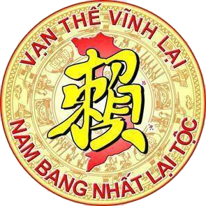

| **BAN THÔNG TIN TRUYỀN THÔNG**    **HỌ LẠI VIỆT NAM**    __________ | **CỘNG HÒA XÃ HỘI CHỦ NGHĨA VIỆT NAM**      **Độc Lập – Tự Do – Hạnh Phúc**    **________________________________________** |
| --- | --- |
| Số: 03/TB/BTTTT | *Hà Nội, ngày 24* *tháng 6*  *năm 2023* |
 

**THÔNG BÁO**  **Kết luận của Chủ tịch, Trưởng Ban Thường trực**   **Hội đồng gia tộc họ Lại Việt Nam** **về công tác tổ chức**   _____________________

Ngày 24 tháng 6 năm 2023 tại thành phố Hà Nội (Nhà hàng Sen Hồng - số 28 Nguyễn Hy Quang, quận Đống Đa), Ban Thường trực Hội đồng gia tộc Họ Lại Việt Nam (viết tắt là HĐGTHLVN) đã triệu tập phiên họp bất thường để tiếp tục triển khai thực hiện Nghị quyết ngày 04 tháng 6 năm 2023 của HĐGTHLVN về công tác tổ chức (Mục III - Thông báo số 02/TB/BTTTT ngày 04/6/2023 của Ban Thông tin truyền thông họ Lại Việt Nam). Cuộc họp do ông Lại Thế Tác - Chủ tịch, Trưởng Ban Thường trực HĐGTHLVN chủ trì phiên họp để giải quyết một số nội dung quan trọng (tham dự có 10 Ủy viên Ban Thường trực HĐGTHLVN, riêng ông Lại Ngọc Thư có lý do không dự phiện họp này).   Hội nghị đã tập trung trao đổi, thảo luận, xem xét các nội dung như: về sự phát triển dòng họ Lại Việt Nam, bổ sung các chi họ kết nối về với Đức Triệu Tổ Lại Thế Tiên, do đó cần tăng cường nhiệm vụ, hoạt đông của HĐGTHLVN, trên cơ sở đó, xem xét việc cần thiết bổ sung một số thành viên HĐGTHLVN, một số Ủy viên Ban thường trực HĐGTHLVN, một số Phó Chủ tịch; phân công nhiệm vụ cụ thể đối với các UV và các Phó Chủ tịch.  Sau khi nghe những ý kiến, trao đổi, đề xuất của các Ủy viên Thường trực HĐGTHLVN, Chủ tịch, Trưởng Ban TTrHĐGTHLVN - Lại Thế Tác kết luận 02 nội dung sau, giao Ban Thông tin truyền thông họ Lại Việt Nam ban hành văn bản thông báo nội dung kết luận hội nghị, cụ thể:  **I. Đồng ý bổ sung các ông có tên sau tham gia Thành viên HĐGTHLVN:**   1) Ông Lại Thế Long – Tỉnh Ninh Bình – Thành viên HĐGTHLVN  **II. Đồng ý bổ sung các ông có tên sau tham gia Ban Thường trực HĐGTHLVN:**  1) Ông Lại Văn Đức (Đại Đức Thích Thanh Độ) - Tỉnh Nam Định - Ủy viên Ban Thường trực HĐGTHLVN  2) Ông Lại Xuân Tôn – Tỉnh Vĩnh Phúc - Ủy viên Ban Thường trực HĐGTHLVN  **III. Đồng ý bổ sung các ông có tên đảm nhiệm chức danh Phó Chủ tịch HĐGTHLVN:**  1) Ông Lại Xuân Cương – Tỉnh Hưng Yên - Phó Chủ tịch HĐGTHLVN   2) Ông Lại Trọng Tâm – Tỉnh Bắc Ninh - Phó Chủ tịch HĐGTHLVN   3) Ông Lại Huy Quân – Tỉnh Thái Bình - Phó Chủ tịch HĐGTHLVN   **IV. Phân công các Ủy viên Ban Thường trực đảm nhiệm các chức danh Chủ tịch, các Phó Chủ tịch HĐGTHLVN, các lĩnh vực công việc khác:**  1) Ông Lại Thế Tác, Tỉnh Thanh Hóa, Ủy viên Ban Thường trực, Chủ tịch HĐGTHLVN – Chỉ đạo chung các lĩnh vực hoạt động của HĐGTHLVN  2) Ông Lại Quốc Tuấn, Tỉnh Thanh Hóa, Ủy viên Ban Thường trực, Phó Chủ tịch thường trực HĐGTHLVN – Trưởng Ban xây dựng cơ bản, Quản lý tài sản nhà thờ Tổ và khu lăng mộ Đức Triệu Tổ.   3) Ông Lại Ngọc Thư – Tỉnh Thái Bình - Ủy viên Ban Thường trực, Phó Chủ tịch HĐGTHLVN, phụ trách chung về tổ chức của gia tộc HLVN, Trưởng Ban Khánh tiết, Chủ tịch HĐGT HL tỉnh Thái Bình.  4) Ông Lại Hữu Nhiên – Tỉnh Thanh Hóa - Ủy viên Ban Thường trực, Phó Chủ tịch HĐGTHLVN  5) Ông Lại Thế Lịch – Tỉnh Nam Định - Ủy viên Ban Thường trực, Phó Chủ tịch HĐGTHLVN, Trưởng Ban Hành lễ của HĐGTHLVN.   6) Lại Xuân Cương – Tỉnh Hưng Yên - Ủy viên Ban Thường trực, Phó Chủ tịch HĐGTHLVN, Trưởng Ban Thông tin -Truyền thông của HĐGTHLVN.  7) Lại Vi Nghị - Tỉnh Hà Nam - Ủy viên Ban Thường trực, Phó Chủ tịch HĐGTHLVN, Trưởng Ban Tổ chức của HĐGTHLVN, Chủ tịch HĐGT HL tỉnh Hà Nam.  8) Ông Laị Văn Quán – Tỉnh Thái Bình - Ủy viên Ban Thường trực, Phó Chủ tịch HĐGTHLVN, Trưởng Ban Kiểm Soát hoạt động của HĐGTHLVN, phụ trách kết nối con cháu Lại Việt Nam khu vực thành phố Hà Nội  9) Ông Lại Trọng Tâm - Tỉnh Bắc Ninh - Ủy viên Ban Thường trực, Phó Chủ tịch HĐGTHLVN, Trưởng Ban Tài chính của HĐGTHLVN, phụ trách kết nối con cháu họ Lại tỉnh Bắc Ninh và các tỉnh khu vực phía Nam, Phụ trách Hội Doanh nhân.   10) Ông Lại Huy Quân – Tỉnh Thái Bình - Ủy viên Ban Thường trực - Phó Chủ tịch HĐGTHLVN, Trưởng Ban Kết nối và phát triển dòng họ Lại Việt Nam, Trưởng Ban liên lạc cộng đồng con cháu họ Lại Việt Nam.  11) Ông Lại Văn Đức (Đại Đức Thích Thanh Độ) - Tỉnh Nam Định - Ủy viên Ban Thường trực HĐGTHLVN, phụ trách lĩnh vực tâm linh của HĐGTHLVN.  12) Ông Lại Xuân Tôn – Tỉnh Vĩnh Phúc - Ủy viên Ban Thường trực HĐGTHLVN, phụ trách các tỉnh khu vực phía Bắc.  13) Ông Lại Thế Sáu – Tỉnh Thanh Hóa - Ủy viên Ban Thường trực HĐGTHLVN, phụ trách các tỉnh khu vực miền Trung.  14) Ông Lại Xuân Đức – Tỉnh Thanh Hóa - Ủy viên Ban Thường trực HĐGTHLVN, phụ trách công tác Thư ký, lưu trữ hồ sơ của HĐGTHLVN.  **III. Phân công triển khai các công việc theo Kết luận của Chủ tịch, Trưởng Ban Thường trực HĐGTHLVN - Lại Thế Tác**   1) Căn cứ Nghị quyết của HĐGTHLVN ngày 04/6/2023 và Kết luận tại hội nghị này, giao Phó Chủ tịch HĐGTHLVN, trưởng Ban Tổ chức của HĐGTHLVN, phối hợp với Phó Chủ tịch Thường trực HĐGTHLVN dự thảo các Quyết định đối với các tổ chức, cá nhân nêu trên theo quy định, trình Chủ tịch HĐGTHLVN ký, ban hành.  2) Giao Phó Chủ tịch HĐGTHLVN, Trưởng Ban Thông tin truyền thông họ Lại Việt Nam chỉ đạo việc đăng tin trên các trang Thông tin truyền thông của HĐGTHLVN để các: chi, tổ chức và cá nhân thuộc HĐGTHLVN biết, thực hiện./.     

| ***Nơi nhận:***    - Chủ tịch,    - Các UV TTr HĐGTHLVN,    - Các chi họ, các tổ chức,      cá nhân liên quan thuộc      HĐGTHLVN, (biết, thực hiện),    - Lưu: Ban TTTT. | **BAN THÔNG TIN TRUYỀN THÔNG**     **HỌ LẠI VIỆT NAM**    **TRƯỞNG BAN**        *(Đã ký)*         **Lại Xuân Cương** |
| --- | --- |
