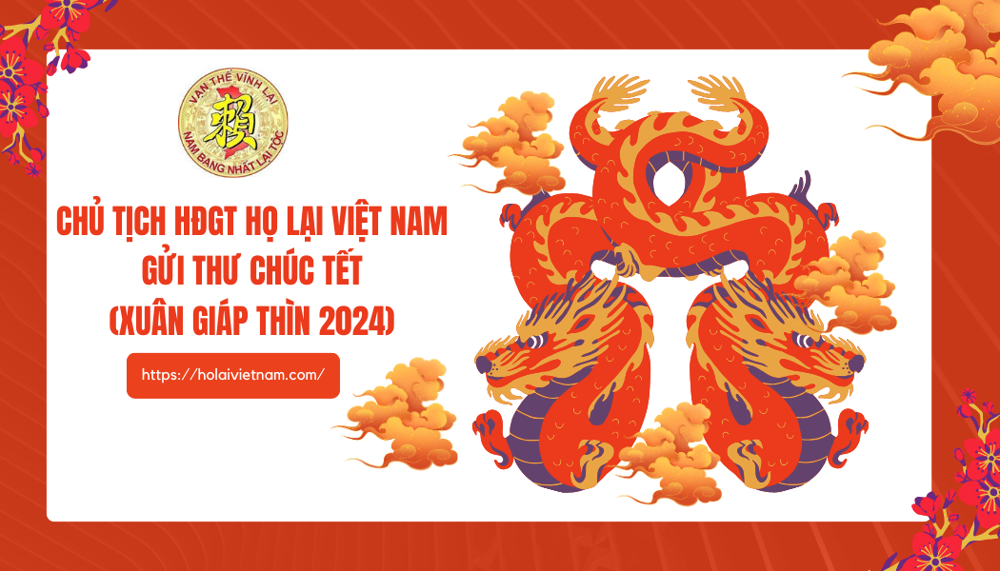

*Kính thưa các cụ phụ lão, các vị Trưởng chi cùng toàn thể cộng đồng con cháu có nguồn gốc họ Lại Việt Nam kính mến!*Một mùa xuân mới lại về, trong thời khắc thiêng liêng chuyển giao giữa năm cũ và năm mới chào đón tết cổ truyền của dân tộc Xuân Giáp Thìn 2024. Thay mặt Ban Thường trực Hội đồng Gia Tộc (HĐGT) họ Lại Việt Nam, tôi chân thành gửi lời chúc tốt đẹp nhất đến toàn thể Cộng đồng con cháu có nguồn gốc họ Lại Việt Nam cùng gia đình lời chúc đầu năm mới mạnh khoẻ, hạnh phúc, an khang và thịnh vượng.

Trong năm Quý Mão 2023 vừa qua, cùng với nhân dân cả nước, cộng đồng con cháu họ Lại Việt Nam đã luôn phát huy truyền thống của người họ Lại luôn đoàn kết, trách nhiệm, bản lĩnh và tự hào, đã đạt được nhiều thành tựu trong lao động, học tập, đóng góp vào sự phát triển của đất nước, sự hưng thịnh của gia đình và dòng họ. Trong công tác hoạt động dòng họ, HĐGTHLVN cùng các tổ chức trực thuộc Hội đồng, đã nhận được sự ủng hộ và tin tưởng của bà con anh chị em trong dòng họ, với một lòng tận tâm phụng sự Tổ tiên vì sự phát triển của dòng tộc, đã có nhiều hoạt động có hiệu quả, tiêu biểu, đạt được nhiều thành cao như: Nhiều con cháu trong dòng họ được đề bạt, nắm giữ các vị trí trọng trách trong các cơ quan Đảng, Chính phủ, các bộ, ngành và thành đạt trong kinh doanh. Kết nối con cháu họ Lại ba miền và trên Thế giới hướng về cội nguồn qua việc tham dự các sự kiện của các chi họ và đặc biệt là kết nối qua các kênh mạng xã hội do Ban Thông tin truyền thông vận hành. Đoàn công tác của HĐGT đã thăm và làm việc với các chi họ Lại trên toàn quốc, báo cáo kết quả xây dựng tình đoàn kết trong dòng họ … Đặc biệt việc tổ chức thành công Ngày hội mùa xuân họ Lại Việt Nam lần thứ 6 và Lễ kỷ niệm 30 năm thành lập HĐGTHLVN tại xã Vũ Ninh, huyện Kiến Xương, tỉnh Thái Bình với trên 3000 người tham dự, Tổ chức thành công Đại hội Hội doanh nhân Lại Việt lần thứ 2 tại Hà Nội và bầu ra 33 thành viên tâm huyết vào ban chấp hành hội. Tất cả các hoạt động nêu trên đã chứng minh cho sự đoàn kết, tinh thần **“Nam bang nhất lại tộc”**, tinh thần này, cần được trân trọng, bảo vệ và phát huy hơn nữa trong tương lai.   *Thưa các cụ phụ lão, các vị Trưởng chi cùng toàn thể cộng đồng con cháu có nguồn gốc họ Lại Việt Nam!*  Bước sang năm 2024, đón xuân Giáp Thìn, HĐGTHLVN kêu gọi bà con, anh chị em trong dòng họ tiếp tục phát huy truyền thống tốt đẹp của người họ Lại đoàn kết, hiếu học, cần cù, sáng tạo, bản lĩnh và tự hào, đóng góp tâm, tài, trí và lực vào công cuộc xây dựng, phát triển đất nước, dòng họ và gia đình ngày càng phồn vinh, hạnh phúc.   Trước thềm xuân năm mới, HĐGTHLVN kính gửi đến các cụ phụ lão, các vị Trưởng chi cùng toàn thể cộng đồng con cháu có nguồn gốc họ Lại Việt Nam  trong nước, trên Thế giới lời chúc mừng năm mới dồi dào sức khỏe, thành đạt, hạnh phúc, an khang, thịnh vượng./.

                                                                                   
 **T/M HỘI ĐỒNG HỌ LẠI VIỆT NAM**  **CHỦ TỊCH**  

 **Lại Thế Tác**
