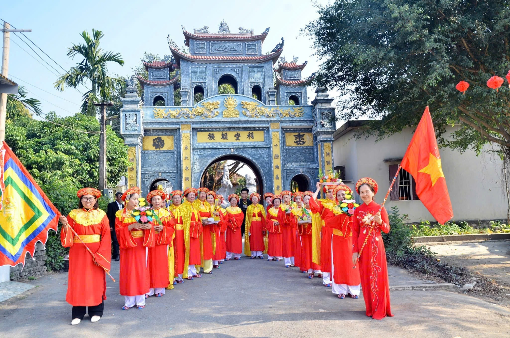
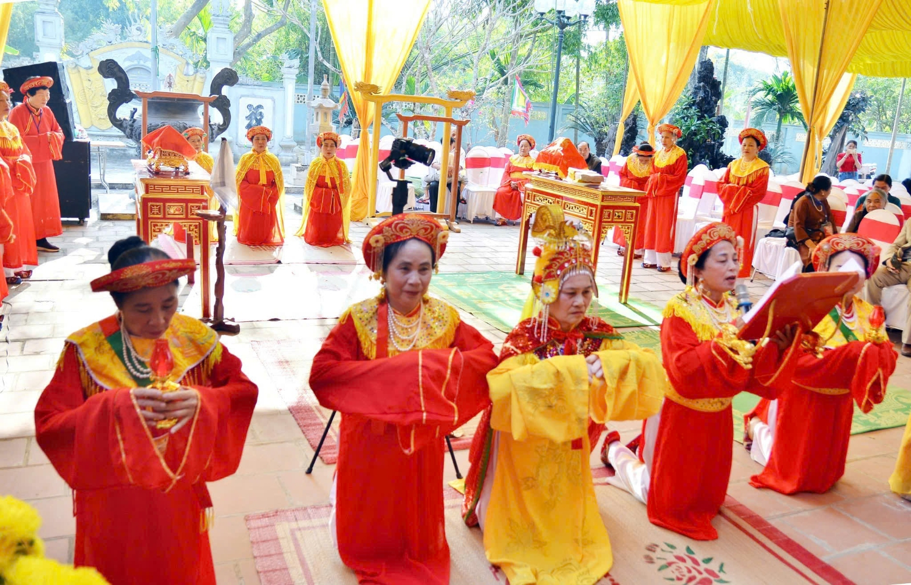
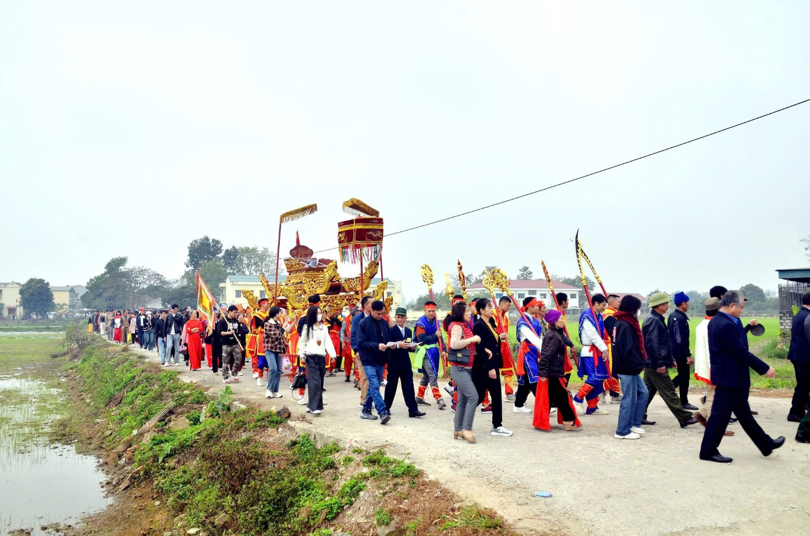
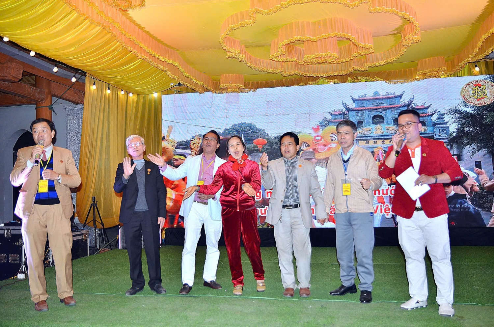
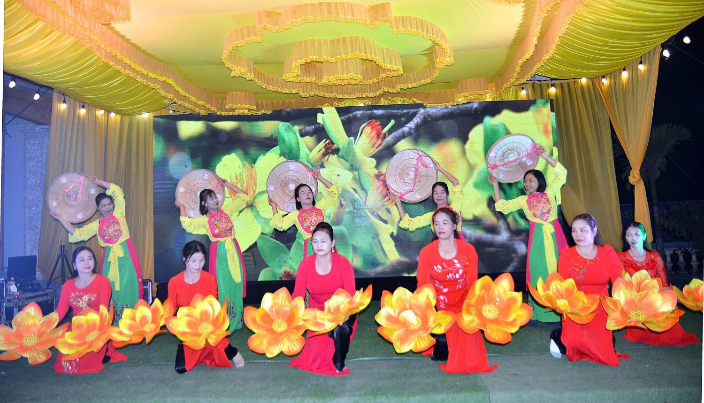
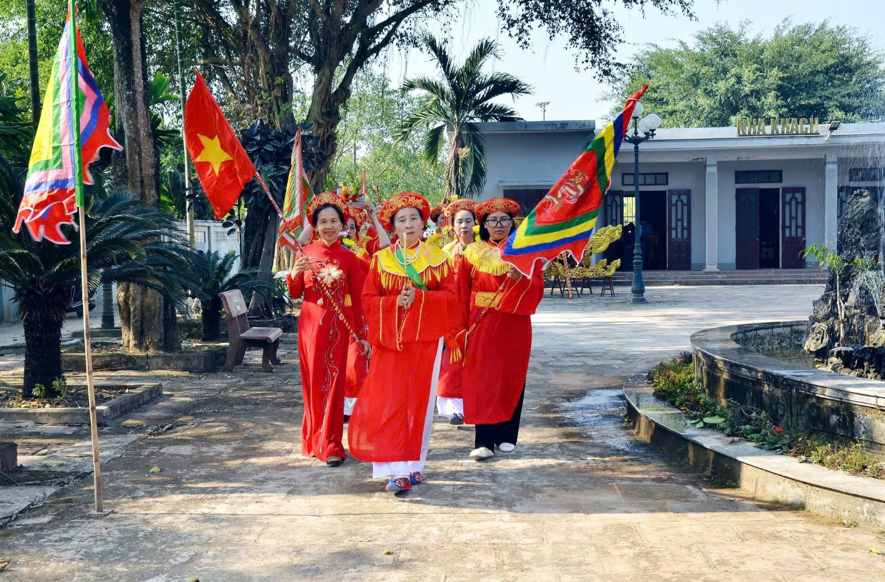

Đây là dịp Đại Lễ Giỗ Tổ diễn ra 5 năm một lần, thể hiện truyền thống "Uống nước nhớ nguồn", gắn kết dòng tộc và tôn vinh công lao tổ tiên. Ngay từ những ngày đầu tiên, không khí tại Nhà thờ Họ Lại đã ngập tràn sự trang nghiêm và thành kính. Ngày 09/02/2025 (12 tháng Giêng), con cháu và quan khách lần lượt đến dâng hương, bày tỏ lòng biết ơn sâu sắc đối với Đức Triệu Tổ. Đặc biệt, đội Nam tế và đội Nữ tế đến từ huyện Hải Hậu, Nam Định đã thực hiện nghi thức tế hầu Tổ, mang đến không khí linh thiêng và thiêng liêng hơn bao giờ hết.

Những ngày tiếp theo của Đại lễ, các hoạt động dâng hương, tế lễ, và chương trình giao lưu văn nghệ với chủ đề "Hướng về đất Tổ" đã thu hút đông đảo con cháu trong họ cùng tham gia. Đặc biệt, sáng ngày 12/02/2025 (15 tháng Giêng), nghi thức rước chân linh cụ Tổ từ Lăng mộ về Nhà thờ đã diễn ra trang trọng với sự tham gia của đội múa Long - Lân - Quy - Phụng và đội rước gần 100 người họ Lại Nam Đinh, Ninh Bình.

Đây là một trong những điểm nhấn quan trọng, thể hiện sự đoàn kết, đồng lòng, gắn kết và tình cảm thiêng liêng của dòng họ. Khoảnh khắc trọng đại nhất của Đại lễ chính là Lễ giỗ Đức Triệu Tổ, diễn ra vào lúc 09h30 ngày 12/02/2025. Buổi lễ diễn ra trong không khí trang nghiêm, thành kính với sự hiện diện của Hội đồng gia tộc Họ Lại Việt Nam, các vị khách quý cùng đông đảo bà con, con cháu của Đức Triệu Tổ. Sau đó, cộng đồng con cháu cùng nhau thụ lộc Tổ và tham gia buổi tổng kết Đại lễ, đánh dấu sự thành công viên mãn của một kỳ lễ hội truyền thống.

 

 

 

Đại lễ Giỗ Đức Triệu Tổ Lại Thế Tiên không chỉ là dịp để tưởng nhớ tổ tiên, mà còn là cầu nối để con cháu gần xa thêm hiểu biết về cội nguồn, cùng nhau xây dựng và phát huy truyền thống tốt đẹp của dòng họ. Ban tổ chức xin trân trọng cảm ơn toàn thể con cháu của Đức Triệu Tổ đã về tham dự và góp phần làm nên một kỳ Đại lễ đầy ý nghĩa và thành công tốt đẹp.

*Theo: Ban TTTT Họ Lại Việt Nam*
