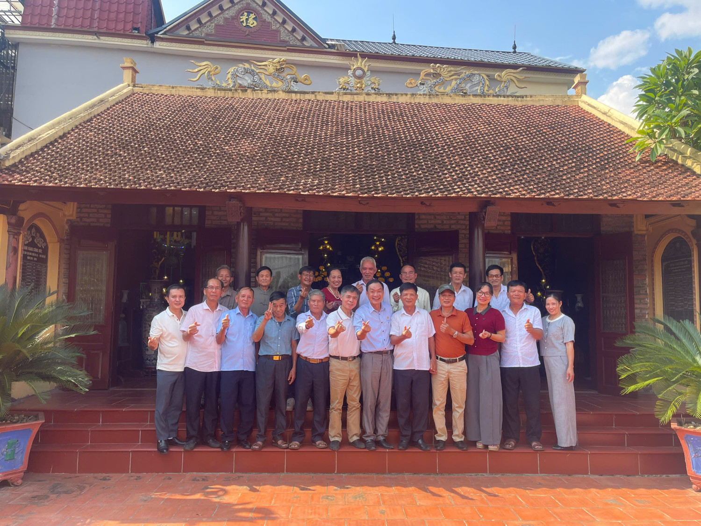
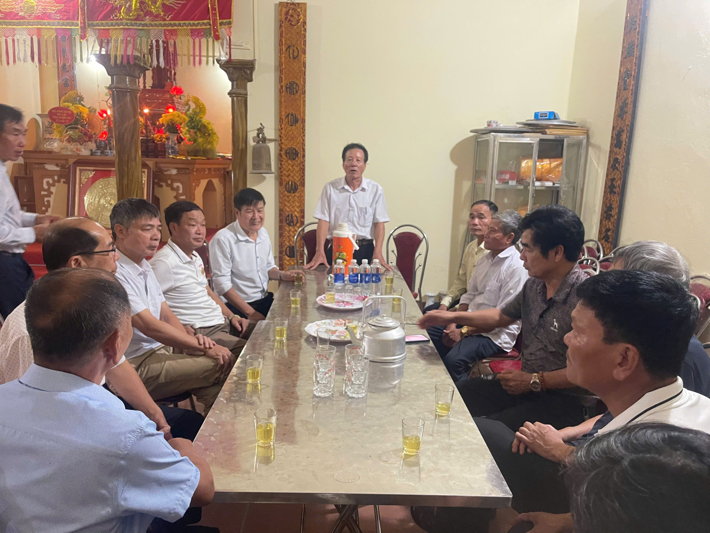
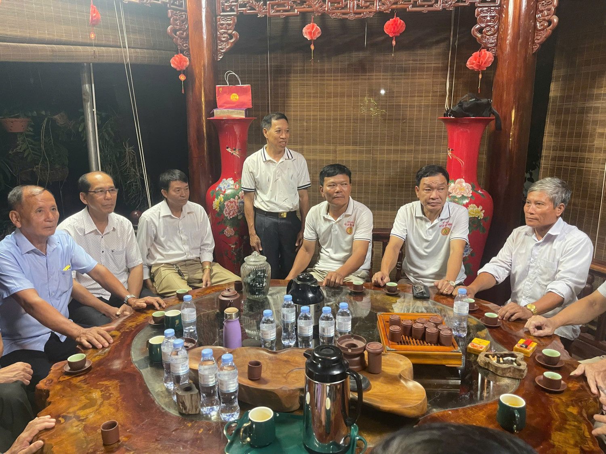

Trong không khí đoàn kết, ấm áp nghĩa tình dòng tộc, ngày 18 tháng 10 năm 2025, Đoàn đại biểu Hội đồng Gia tộc họ Lại tỉnh Thanh Hoá đã có chuyến giao lưu, gặp gỡ thân mật với Hội đồng Gia tộc chi họ Lại tỉnh Vĩnh Phúc.  
Chương trình diễn ra trong tinh thần “Kết nối nguồn cội – Lan tỏa tinh hoa – Phát triển họ Lại Việt Nam thời đại mới”, thể hiện rõ quyết tâm gắn kết, trao đổi kinh nghiệm, cùng hướng tới mục tiêu xây dựng cộng đồng họ Lại Việt Nam đoàn kết – nghĩa tình – thịnh vượng.  

Cuộc gặp gỡ đã thành công tốt đẹp với nhiều nội dung ý nghĩa: hai Hội đồng đã cùng chia sẻ về truyền thống dòng họ, công tác tri ân tiền nhân, phát triển con cháu học hành, lập nghiệp, và đặc biệt là định hướng phối hợp trong các hoạt động kết nối họ Lại toàn quốc thời gian tới.  
Không khí buổi giao lưu diễn ra đầm ấm, chân tình, thắm đượm tinh thần đồng tộc – như gặp lại người thân lâu ngày.  

Ngay sau chương trình tại chi Vĩnh Phúc, đoàn đại biểu họ Lại tỉnh Thanh Hoá đã tới dâng hương, cúng lễ tại Nhà thờ chi Hữu Bổ – Phú Thọ, nơi linh thiêng thờ tự các bậc tiên tổ họ Lại.  
Tại đây, đoàn đã được các vị trưởng lão, đại diện Hội đồng Gia tộc chi Hữu Bổ đón tiếp trang trọng, nồng hậu, cùng dâng nén hương thành kính tưởng nhớ tổ tiên, cầu cho dòng họ hưng long, con cháu khang ninh, thịnh đạt.  

Buổi lễ kết thúc trong không khí trang nghiêm mà ấm áp, thắm tình đồng tộc. Các đại biểu hai bên cùng chụp ảnh lưu niệm, ghi lại những khoảnh khắc đáng nhớ của một hành trình ý nghĩa — hành trình nối liền các miền quê Lại Việt bằng tấm lòng tri ân và niềm tự hào dòng tộc.  

Hội đồng Gia tộc họ Lại tỉnh Thanh Hoá xin trân trọng cảm ơn Hội đồng Gia tộc họ Lại chi Vĩnh Phúc và Hội đồng Gia tộc chi Hữu Bổ – Phú Thọ đã đón tiếp trọng thị, chân tình.  
Chuyến đi đã mở ra những cầu nối vững chắc trong công cuộc gắn kết – phát triển – lan tỏa tinh hoa họ Lại trên mọi miền Tổ quốc.  

Một số hình ảnh trong buổi giao lưu, gặp gỡ giưa Hội đồng Gia tộc họ Lại Thanh Hoá và Vĩnh Phúc  

  

