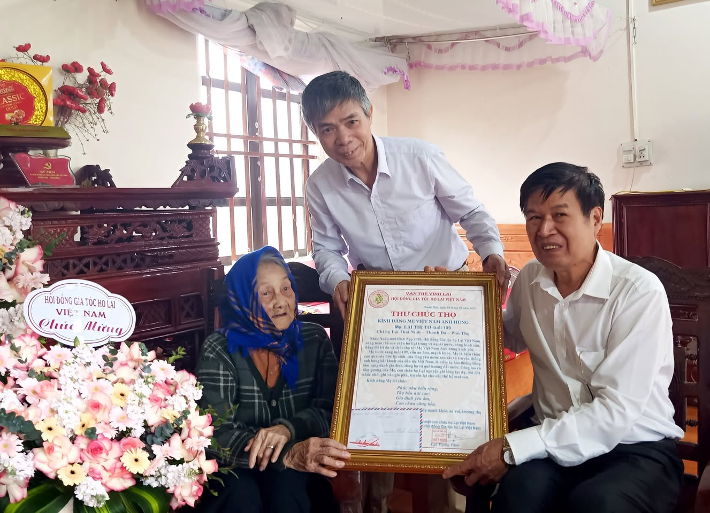

Ngày 21/3/2026, được sự quan tâm và ủy quyền của Chủ tịch Hội đồng Gia tộc họ Lại Việt Nam, đoàn đại diện Hội đồng Gia tộc đã đến thăm hỏi, chúc thọ và trao quà tri ân tới Mẹ Việt Nam Anh hùng Lại Thị Tơ, thọ 109 tuổi, thuộc chi họ Lại Thái Ninh, xã Quảng Yên, tỉnh Phú Thọ. Đoàn đại diện gồm ông Lại Phương Tuấn – Phó Chủ tịch Hội đồng Gia tộc họ Lại Việt Nam và ông Lại Xuân Tôn – Phó Chủ tịch Hội đồng Gia tộc họ Lại Việt Nam.

Trong không khí trang trọng và ấm áp nghĩa tình, đoàn đã ân cần thăm hỏi sức khỏe, đời sống của Mẹ, đồng thời bày tỏ lòng biết ơn sâu sắc trước những hy sinh, cống hiến to lớn của Mẹ và gia đình cho sự nghiệp đấu tranh, bảo vệ Tổ quốc. Nhân dịp này, đoàn đã trao tặng quà chúc thọ, thể hiện tình cảm tri ân và đạo lý “Uống nước nhớ nguồn” của toàn thể con cháu họ Lại trên mọi miền đất nước.

Hoạt động thăm hỏi, chúc thọ Mẹ Việt Nam Anh hùng là việc làm mang ý nghĩa nhân văn sâu sắc, góp phần gìn giữ và phát huy truyền thống “Đền ơn đáp nghĩa”, “Kính lão trọng thọ” của dân tộc, đồng thời giáo dục thế hệ con cháu về lòng biết ơn và trách nhiệm đối với các thế hệ đi trước, tăng cường sự gắn kết trong cộng đồng dòng họ Lại Việt Nam.

Kính chúc Mẹ Việt Nam Anh hùng Lại Thị Tơ luôn mạnh khỏe, trường thọ, tiếp tục là tấm gương sáng cho các thế hệ con cháu noi theo. Đoàn đại diện Hội đồng Gia tộc họ Lại Việt Nam trân trọng cảm ơn sự đón tiếp chu đáo, tình cảm của Mẹ và gia đình.
