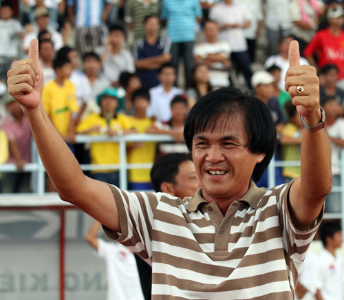
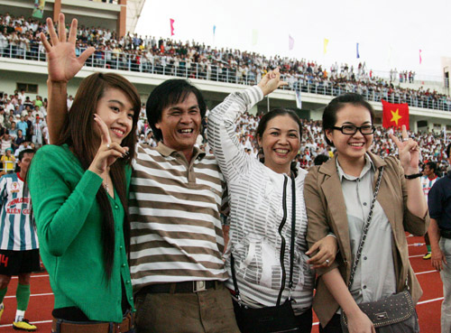

Ông Vân tên thật là Lai Hồng Vân nhưng từ khi còn là cầu thủ, sự nhầm lẫn biến thành thói quen và mọi người đều gọi ông là Lại Hồng Vân. Năm 1998, HLV Lại Hồng Vân làm trợ lý cho HLV Phạm Anh Tuấn ở Đồng Tháp với nhiệm vụ chính là chuyên gia đi xem giò các đối thủ.

Trận đấu cuối cùng của giải A2 toàn quốc tranh vé lên chơi hạng A1 (tiền thân của V-League), đội chủ nhà Đồng Tháp đánh bại người hàng xóm Kiên Giang để lên hạng. Khi ấy, nếu hỏi ai bị người Kiên Giang ghét nhất thì chính là HLV Lại Hồng Vân, người suốt ngày ngồi trên khán đài sân Kiên Giang ghi ghi, chép chép để rồi sau đó truyền đạt lại cho thuyền trưởng Phạm Anh Tuấn để có kế sách đánh bại Kiên Giang.

13 năm sau, từ việc là một "kẻ thù", ông Lại Hồng Vân trở thành người hùng của người dân Kiên Giang. Ông Vân bây giờ được người Kiên Giang gọi với cái tên thân thương "Bác Ba Vân". Chính Bác Ba Vân giúp bóng đá Kiên Giang mở hội, lên V-League sau 13 năm hụt bước.

Là người Bạc Liêu nhưng ông Lại Hồng Vân trưởng thành từ lò đào tạo của bóng đá Đồng Tháp. Ông là một trung vệ xuất sắc cùng Phạm Anh Tuấn, Phạm Công Lộc hay đàn em Trần Công Minh từng lên ngôi vô địch hạng A1 năm 1989. Nhưng sự nghiệp của ông trôi nổi khi lên nắm HLV Đồng Tháp rồi lại trợ lý và cũng có thời gian đưa Đồng Tháp từ hạng Nhất lên V-League. Tuy vậy, cái số lận đận cứ theo ông mãi và chỉ đến năm 2010 khi CLB Nguyễn Hoàng Kiên Giang cần người thay trợ lý Lương Trung Minh thì ông Vân được phía Đồng Tháp cho Kiên Giang "mượn". Tại mùa giải hạng nhì 2010, HLV Lại Hồng Vân dẫn dắt Kiên Giang thi đấu thành công để giành vé thăng hạng nhất.

Tại giải hạng nhất năm nay, dù với bao khó khăn và kinh phí hạn hẹp, nhưng ông Vân đưa các học trò nghèo của mình học giỏi đến mức từ việc chỉ trụ hạng nhưng lại "lên lớp" một cách ngoạn mục. Ông Vân trở thành người hùng của bóng đá Kiên Giang. Sau thành tích hoành tráng, hiện đâu đâu ở các hang cùng ngõ hẻm Kiên Giang, người ta cứ nhắc mãi cái tên "Ba Vân".

|   |
| --- |
|  HLV Lại Hồng Vân và vợ con trong ngày Kiên Giang lên hạng V-League. Ảnh: *Kỳ Lân.* |

Ông Vân tâm sự: "Nhận lời dẫn dắt một đội bóng nghèo của quân tứ xứ như Kiên Giang là nhảy vào chỗ chết. Nhưng tôi chấp nhận thử thách. Bây giờ, nghĩ lại tôi thấy mình liều thật. Nhưng mà tôi hạnh phúc, tôi mừng vì luôn có gia đình ủng hộ, đặc biệt là vợ và hai con gái của tôi".

Ông Lại Hồng Vân hiện có hai con gái lớn, một đang học ngành hàng không và một con gái đang học ngành y. Ông cho biết: "Gia đình, vợ và hai con gái là tài sản lớn nhất của tôi. Nhiều lúc cũng muốn có nếp, có tẻ nhưng như thế là quá hạnh phúc với tôi rồi".

Từ kẻ thù, từ một người bị ghét cay, ghét đắng nay ông Vân trở thành người hùng của bóng đá Kiên Giang. Thế mới biết, trong thể thao chỉ có vinh quang chứ hận thù luôn xóa sạch.

**Thiên Thảo**
