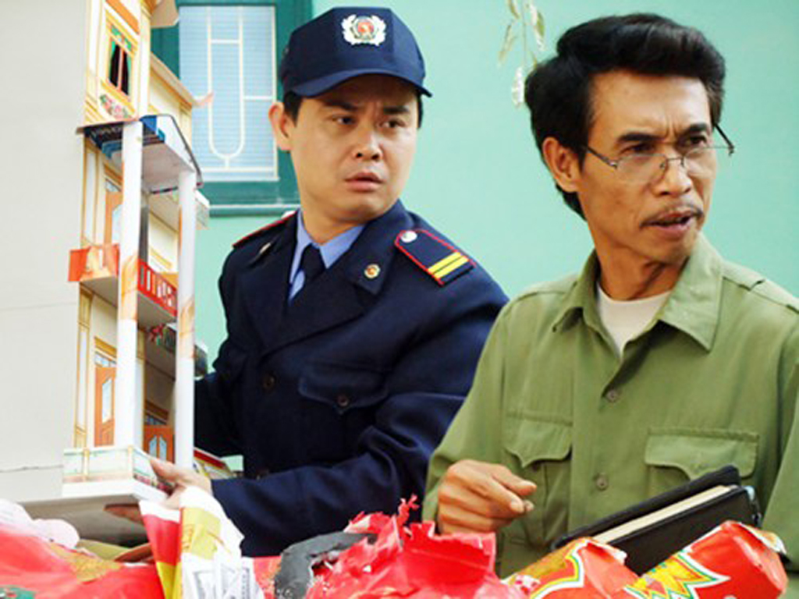
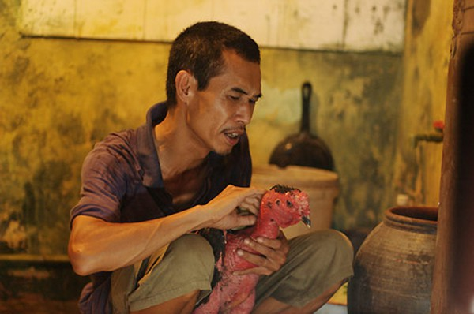
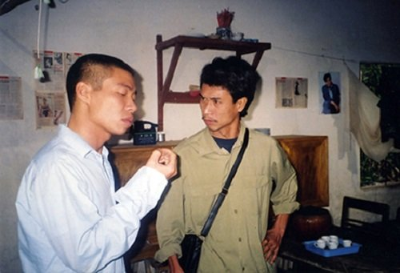

Phú Đôn là lớp diễn viên đầu tiên được đào tạo tại Nhà hát kịch Việt Nam, tính đến nay anh đã tham gia vào đóng hàng trăm bộ phim cũng như các vở hài kịch . Bốn mươi năm gắn bó với nghiệp diễn Phú Đôn đã để lại nhiều dấu ấn với khán giả qua hàng loạt vai diễn với phim truyền hình, phim điện ảnh và sân khấu kịch nói trong đó phải kể đến những vai diễn nổi tiếng một thời như Tivi về làng, Em ở nơi nao, Hai bình làm thủy điện,...  

 

Khi còn nhỏ, anh đã được cha của mình cho đi tham gia đóng kịch cho nhà hát nơi cha anh đóng . Sau khi học xong phổ thông, anh thi đỗ cùng một lúc cả hai trường cảnh sát và nhà hát Tuổi trẻ và anh đã chọn con đường nghệ thuật. Sau khi ra trường, anh gắn bó với Nhà hát kịch Việt Nam mỗi vai diễn anh đóng là những vai mang tới nhiều sự mới mẻ và tạo nên ấn tượng khó phai trong các bộ phim truyền hình với các vai diễn nông dân mộc mạc chất phát lại pha một chút hài hước.

Bên cạnh đóng phim anh còn tham gia vào các vai diễn trong các show hài và với anh mỗi vai diễn giống như một cơ duyên.

Nổi tiếng với những vai nông dân trong các bộ phim truyền hình và mới đây là trưởng thôn trong 'Bão qua làng', ngoài đời nghệ sĩ Phú Đôn giản dị hệt những vai diễn của anh - chất phác, mộc mạc pha chút hài hước. Không sử dụng smartphone, không facebook, không xe sang, hàng ngày, nghệ sĩ Phú Đôn vẫn đến nhà hát bằng chiếc cup 82 màu xanh da trời, quần jeans, áo pull. Anh bảo chắc hôm nào 'trời đi vắng' thì mọi người may ra mới nhìn thấy anh mặc vest, thắt cà vạt.

 

Anh là một trong số những nghệ sĩ lấy vợ khá muộn, 45 tuổi anh mới lấy vợ vợ anh không phải là người làm nghệ thuật mà làm việc tự do, chị kém anh 25 tuổi tuy vậy cuộc sống gia đình hai vợ chồng anh đều rất hạnh phúc. Hiện nay, vợ chồng anh đã có một cậu con trai học lớp 6 và sắp tới chuẩn bị đón chào đứa con thứ hai - con gái của mình.

Theo: Báo người nổi tiếng
